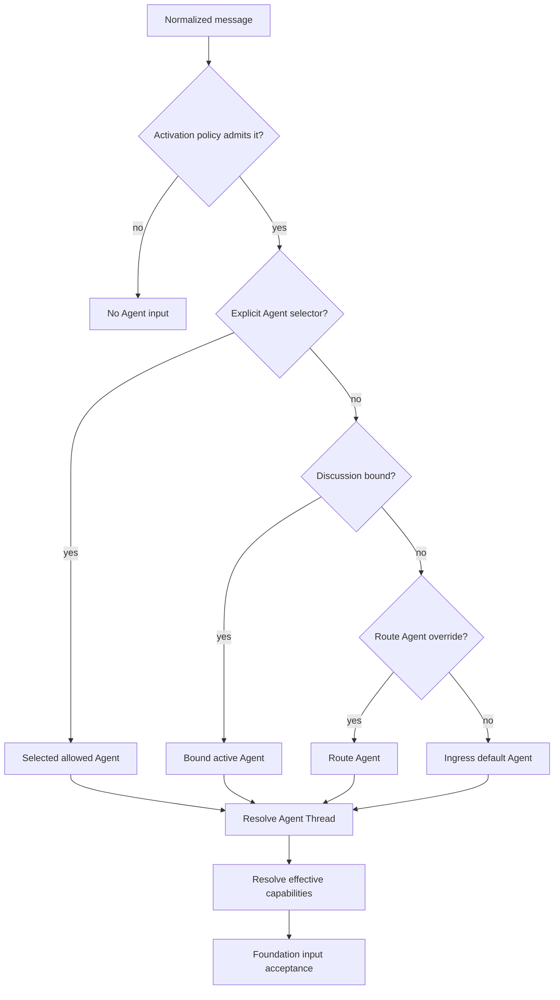

# Messaging Ingress

## Design Position

Slack, Lark, Discord, and Teams use native messaging Ingresses. One installed App or Bot identity can serve several allowed Agents without requiring one external App per Agent. The user configures the external identity once, then chooses its Agents, aliases, default Agent, and per-channel, group, or direct-message routing.

Messaging terminology remains local to this contract. `Conversation` means the provider's channel, group, or direct-message container. `Discussion` means the provider-declared continuation unit inside it, such as a Slack thread, Lark topic/reply chain, Discord thread, Teams reply chain, or the direct-message container itself. Neither term replaces a Foundation Agent `Thread`.

## Provider-Native Identity

The Ingress represents one concrete App installation or Bot identity in one provider tenant, workspace, or guild. Provider credentials, event subscription, permissions, conversation discovery, and identifiers remain provider-specific. An a13n official App definition can back many customer Ingresses; each customer Ingress has independent Agents, routes, permissions, and lifecycle.

Open-source deployments can use a developer-created App. The setup UI can collect App definition and installation data in one flow without merging their identity or lifecycle in the durable model.

Native event receipt and the Bot's basic provider actions belong to this Ingress. Users do not create a second Connector Connection merely so the same Bot can receive or send ordinary messages. A Connector Connection is separate and optional when the Agent needs broader SaaS actions or another account.

## Messaging Policy

One messaging `Route` stores this provider policy inside its base `provider_policy` field. `MessagingPolicy` is embedded Route configuration, not another resource, matcher, or routing layer:

```python
class MessagingPolicy:
    start_mode: Literal["explicit", "automatic"]
    continuation_mode: Literal["explicit", "automatic"]
    reply_mode: Literal["auto", "thread", "main"]
    new_thread_aliases: tuple[str, ...]
```

`start_mode` governs an unbound Discussion. `explicit` requires an App mention or recognized Agent selector; `automatic` admits ordinary messages. A direct message to the App is explicit by construction.

`continuation_mode` governs a bound Discussion. `explicit` still requires an App mention or recognized selector. `automatic` sends ordinary follow-up messages to the bound Agent Thread without requiring another mention.

`reply_mode` is policy for an authorized provider reply action. `auto` permits the Agent and provider action to choose the appropriate placement; `thread` and `main` require the provider-native threaded or main-flow placement respectively. The inbound adapter records this policy but never sends a message.

`new_thread_aliases` are ordinary text recognized by a13n, not provider-native slash-command registrations. A recognized command creates a fresh Agent Thread for the selected Agent and replaces only that Agent's current Thread binding in the Discussion. Providers can still offer native commands independently, but routing correctness does not depend on their registration.

## Agent Selection

The router applies exactly this order:

1. an explicit Agent selector in the message;
2. the Agent in the current `DiscussionBinding`;
3. the matched Route's Agent override; and
4. the Ingress's default Agent.

An App mention without an Agent selector activates routing but does not skip the remaining precedence. A selector resolves only against aliases configured on the Ingress. Unknown, ambiguous, unauthorized, or malformed selectors fail safely and never fall through to a different Agent.

One message selects exactly one Agent. There is no automatic Agent fan-out, competition, or background participation. Selecting another Agent changes the Discussion's active Agent, then resumes that Agent's retained Agent Thread or creates one when no Binding exists. A different Agent never continues another Agent's Thread.



## Discussion and Agent Thread Binding

The provider adapter supplies exact Conversation and Discussion references. It can treat a direct-message container as one Discussion and native thread or reply-chain identities as separate Discussions. A provider-specific Route can also treat a dedicated channel as one Discussion when that provider can supply a stable container reference.

Messaging adds one active-Agent pointer above the per-Agent `AgentThreadBinding` owned by [Ingress and Routing](01-ingress-and-routing.md#agent-and-agent-thread-routing):

```python
class DiscussionBinding:
    ingress_id: IngressId
    discussion_ref: ExternalRef
    active_agent_preset_id: AgentPresetId
    version: int
    created_at: datetime
    updated_at: datetime
```

`(ingress_id, discussion_ref.kind, discussion_ref.id)` is unique. `DiscussionBinding` answers only which Agent is currently active. `AgentThreadBinding` separately maps `(Ingress, external reference, Agent)` to that Agent's current Agent Thread. These facts change independently and do not become a second transcript.

Selecting another Agent atomically changes `active_agent_preset_id` after resolving its existing Binding or accepting its first Agent Thread. Selecting the previous Agent later resumes its retained Thread. A recognized new-Thread command creates a new Agent Thread for the selected Agent and replaces that Agent's Discussion-level `AgentThreadBinding`; other Agents' bindings remain unchanged. Historical provider message references can remain bound to their earlier Agent Threads.

Receiving an event proves only that the App has access to the provider context; it does not prove which Agent Thread should receive it. Discussion and AgentThread bindings supply that exact correlation. Replies to a provider message, topic, or thread can reuse any stable adapter-declared reference already bound to the Agent Thread.

When `continuation_mode="automatic"`, every admitted follow-up is input to the selected Agent. There is no separate hard-coded attention gate. The Agent can decide that no outbound response is appropriate. The Route's common [input batching policy](01-ingress-and-routing.md#input-batching-and-frequency) combines ordered bursts by destination Agent Thread and bounds submission frequency. A compatible current running or current/head waiting Run receives only Steer, and Foundation's Thread inbox remains the only durable active-input authority.

## Capability Resolution

Agent selection and capability resolution are independent:

```text
select one Agent
    -> resolve Ingress and matched Route capability configuration
    -> accept one exact effective Run capability selection
```

The matched base Route can configure different Skills, MCPConnections, Connector Connections, and native Ingress actions for the same Agent in different Conversations through its per-Agent common [Run Capability Overlay](../12-agent-management.md#run-capability-overlay). `inherit_agent`, `include`, and `exclude` are the complete composition controls. An authorized `include` can add a supported managed capability absent from the Agent defaults; message content cannot add one. The accepted Run fixes the resulting effective selection so a replacement RunAttempt cannot observe a different tool surface silently.

Routing a message to another Agent does not copy the prior Agent's capabilities. Changing capabilities does not change which Agent is selected or mutate the Discussion binding.

## Outbound Boundary

Inbound message handling never sends automatically. The Agent responds only by calling the authorized provider-native actions supplied by the [a13n MCP](04-agent-facing-tools.md). Those actions are bound to the accepted Run and current Discussion and expose no model-settable Channel, Chat, Discussion, Thread, Ingress, Connection, or Run identifier. Connector and user Remote MCP tools remain separate from inbound receipt and can fail independently.

For `reply_mode="thread"` or `reply_mode="main"`, the native action enforces placement and omits a placement argument. For `reply_mode="auto"`, the provider reply action can expose a bounded placement choice without permitting another destination. Slack, Lark, Discord, and Teams retain different provider-native tool names and schemas.

## Invariants

1. One messaging Ingress can expose several allowed Agents; one message activates at most one.
2. Explicit Agent selection overrides binding and defaults; no other routing rule overrides an explicit valid selector.
3. Agent selection and capability resolution remain independent.
4. Automatic continuation admits input but does not force an outbound response.
5. Conversation and Discussion are provider-facing messaging terms; Agent Thread remains the only Foundation history identity.
6. Provider-native command registration is not required for a13n text commands.
7. Reselecting an Agent resumes that Agent's retained Agent Thread for the Discussion; a new-Thread command replaces only its current mapping.
8. Inbound handling never sends; provider-native outbound actions require an Agent call through the Run-bound a13n MCP.
