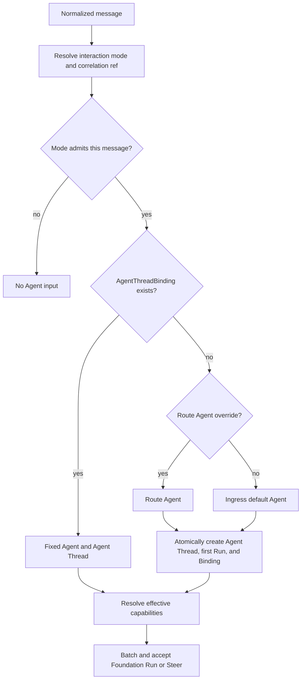

# Messaging Ingress

## Design Position

Slack, Lark, Discord, and Teams use native messaging Ingresses. One installed App or Bot identity can serve several allowed Agents without requiring one external App per Agent. The user configures the external identity once, then chooses its allowed Agents, default Agent, and per-channel, group, or direct-message Routes.

Messaging terminology remains local to this contract. `Conversation` means the provider's channel, group, or direct-message container. `Discussion` means the provider-declared continuation unit inside it, such as a Slack thread, Lark topic or reply chain, Discord thread, Teams reply chain, or a direct-message container. Neither term replaces a Foundation Agent `Thread`.

## Provider-Native Identity

The Ingress represents one concrete App installation or Bot identity in one provider tenant, workspace, or guild. Provider credentials, event subscription, permissions, conversation discovery, and identifiers remain provider-specific. An a13n official App definition can back many customer Ingresses; each customer Ingress has independent Agents, Routes, permissions, and lifecycle.

Open-source deployments can use a developer-created App. The setup UI can collect App definition and installation data in one flow without merging their identity or lifecycle in the durable model.

Native event receipt and the Bot's basic provider actions belong to this Ingress. Users do not create a second ConnectorConnection merely so the same Bot can receive or send ordinary messages. A ConnectorConnection is separate and optional when the Agent needs broader SaaS actions or another account.

## Interaction Policy

One messaging `Route` stores one interaction policy inside its base `provider_policy` field. This is embedded configuration, not another resource, matcher, or routing layer:

```python
class MessagingPolicy:
    interaction_mode: Literal["mention", "discussion", "chat"]
    reply_mode: Literal["auto", "thread", "main"]
```

The three interaction modes are complete alternatives rather than independent start, continuation, and correlation switches:

| Mode         | Group activation                                                                            | Agent Thread correlation                                 |
| ------------ | ------------------------------------------------------------------------------------------- | -------------------------------------------------------- |
| `mention`    | Every admitted message requires a provider-authenticated App mention                        | One provider-native Discussion                           |
| `discussion` | An App mention starts an unbound Discussion; a bound Discussion continues without a mention | One provider-native Discussion                           |
| `chat`       | Every supported human message in the matched Conversation is admitted                       | The complete provider Conversation uses one Agent Thread |

A direct message to the App is addressed by construction. In `mention` and `discussion`, its provider container is the stable Discussion unless that provider supplies a narrower native continuation unit. In `chat`, all messages under the matched Conversation use its stable Conversation reference, including messages surfaced from provider-native subthreads when the adapter declares them part of that Conversation.

`chat` is the explicit full-listening mode for a dedicated Agent room, observer, summarizer, or coordinator. It does not force a response. Every admitted message reaches the fixed Chat Agent Thread through the common bounded batching and Run-or-Steer flow, and the Agent can remain silent by making no outbound action call.

An adapter exposes a mode only when the installed App permissions and event transport can supply the required messages and stable correlation reference. Slack channel subscriptions, Discord message-content access, Teams resource-specific consent, and corresponding Lark permissions remain provider-specific setup. Configuration fails explicitly when the selected mode is unsupported and never silently degrades to mention-only delivery.

`reply_mode` is policy for an authorized provider reply action. `thread` and `main` require provider-native threaded or main-flow placement respectively. `auto` uses the bounded provider-native choice; for a top-level group task it defaults to an available Thread, topic, or reply chain, while a direct message remains in its main flow. The inbound adapter records this policy but never sends a message.

Provider-authenticated App mentions are activation controls, not task content. The normalized event retains the original provider message for protected correlation and audit, while the messaging `EventInputView.text` supplied to Input Mapping excludes the App mention and contains only ordinary content. The remaining message must contain adapter-declared task content, such as non-empty text or a supported attachment. A mention-only message is filtered before durable admission and creates no Binding, Agent Thread, or Run. Every other token is ordinary Agent input; a13n defines no message command, wake word, selector, or Agent-switching grammar.

## Agent and Thread Resolution

The router resolves one correlation reference from `interaction_mode`, then applies exactly this order:

1. an existing `AgentThreadBinding`, which fixes both the Agent and Agent Thread;
2. the matched Route's Agent override; and
3. the Ingress's default Agent.

One message selects exactly one Agent. An existing Binding always wins and message content can neither select nor switch its Agent. Starting another provider-native Discussion creates another correlation target under `mention` or `discussion`; specialist work inside an existing task uses the bound Agent's Skills, Tools, or subagents rather than messaging-level Agent handoff.



The common `AgentThreadBinding` owns the complete fixed mapping:

```python
class AgentThreadBinding:
    ingress_id: IngressId
    external_ref: ExternalRef
    agent_id: AgentId
    agent_thread_id: ThreadId
    version: int
    created_at: datetime
    updated_at: datetime
```

`(ingress_id, external_ref.kind, external_ref.id)` is unique. In `mention` and `discussion`, `external_ref` is the adapter-declared Discussion reference. In `chat`, it is the Conversation reference. Creating the first Binding, Agent Thread, and Run is atomic from the caller's perspective, and a concurrent duplicate reuses the winning identity.

A top-level App mention can supply the future provider thread root before the Bot replies, so its first input creates the Foundation Agent Thread without requiring an empty external thread. A later App mention inside the same bound provider Discussion continues the existing Agent Thread. Route edits never silently rebind an existing external reference to another Agent or Thread.

Every message admitted by `discussion` after binding or by `chat` is input to the fixed Agent. There is no hard-coded attention gate. The Agent can decide that no outbound response is appropriate. The Route's common [input batching policy](01-ingress-and-routing.md#input-batching-and-frequency) combines compatible ordered bursts by destination Agent Thread and bounds submission frequency. A compatible current running or current/head waiting Run receives only Steer, and Foundation's Thread inbox remains the only durable active-input authority.

## Capability Resolution

Agent selection and capability resolution are independent:

```text
resolve one fixed Agent
    -> resolve Ingress and matched Route capability configuration
    -> accept one exact effective Run capability selection
```

The matched base Route can configure different Skills, MCPConnections, ConnectorConnections, and native Ingress actions for the same Agent in different Conversations through its per-Agent common [Run Capability Overlay](../28-agent-management.md#run-capability-overlay). `inherit_agent`, `include`, and `exclude` are the complete composition controls. An authorized `include` can add a supported managed capability absent from the Agent defaults; message content cannot add one. The accepted Run fixes the resulting effective selection so a replacement RunAttempt cannot observe a different tool surface silently.

Changing capabilities does not change the bound Agent or Agent Thread.

## Outbound Boundary

Inbound message handling never sends automatically. The Agent responds only by calling the authorized provider-native actions supplied by the [a13n MCP](04-agent-facing-tools.md). Those actions are bound to the accepted Run and current external target and expose no model-settable Channel, Chat, Conversation, Discussion, Thread, Ingress, ConnectorConnection, or Run identifier. Connector and user Remote MCP tools remain separate from inbound receipt and can fail independently.

For `reply_mode="thread"` or `reply_mode="main"`, the native action enforces placement and omits a placement argument. For `reply_mode="auto"`, the provider reply action can expose a bounded provider-appropriate placement choice without permitting another destination. Reply placement never changes, moves, or replaces the inbound AgentThreadBinding. A main-flow message is an outbound notification rather than an implicit migration of the current Discussion; a later provider Discussion follows ordinary inbound binding rules.

## Invariants

01. One messaging Ingress can expose several allowed Agents; one message activates at most one.
02. `mention`, `discussion`, and `chat` are the complete interaction modes; there is no independent start, continuation, or Agent Thread scope cross-product.
03. `chat` admits the complete matched Conversation into one fixed Agent Thread, while `mention` and `discussion` correlate by provider-native Discussion.
04. Message content can neither select nor switch an Agent; only an existing Binding, matched Route, or Ingress default determines it.
05. One external correlation reference binds exactly one Agent and one Agent Thread.
06. Agent selection and capability resolution remain independent.
07. Automatic Discussion continuation and complete Chat listening admit input but do not force an outbound response.
08. Conversation and Discussion are provider-facing messaging terms; Agent Thread remains the only Foundation history identity.
09. Inbound handling never sends; provider-native outbound actions require an Agent call through the Run-bound a13n MCP.
10. Reply placement never changes Agent or Agent Thread correlation.
11. The provider-authenticated App mention is the only messaging activation control and is excluded from Agent input; every other token remains ordinary input.
12. A mention-only message creates no input or Binding state.
