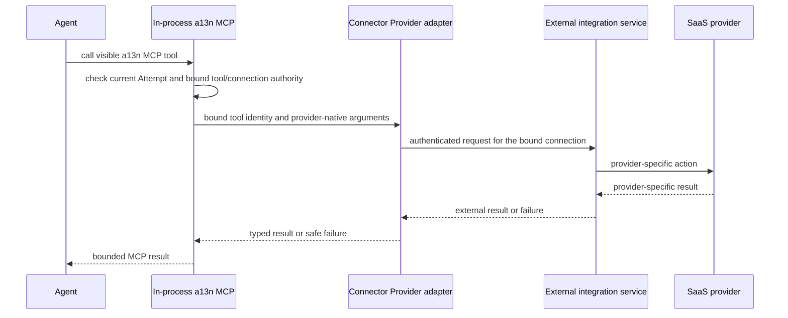

# Connector Providers, Connectors, and Connector Connections

## Design Position

Connector Providers provide general outbound SaaS capabilities. Foundation can configure several accounts or endpoints of the same Provider type, discover the Connectors each one offers, and establish independently authorized Connector Connections. OpenConnector, Composio, and other integrations remain optional Connectivity components rather than Foundation core dependencies.

The external integration service owns third-party account authorization, OAuth callback processing, access and refresh tokens, token rotation, and provider API invocation. Foundation owns its configured Connector Provider, safe discovered Connector values, Connector Connection projection, assignment and authorization, exact Run selection, and Agent-facing a13n MCP boundary.

## Connector Provider definitions

The distribution registers trusted Connector Provider implementations explicitly. Installation alone grants no trust. Each implementation supplies one safe definition:

```python
class ConnectorProviderDefinition:
    type: str
    display_name: str
    configuration_schema: JsonObject
    credential_schema: JsonObject
```

The implementation's strongly typed configuration model is the single authority for both `configuration_schema` and deterministic validation. The schema contains non-secret fields, bounds, defaults, and descriptions. `credential_schema` describes the write-only service-access credential input accepted by the owning create or credential-rotation operation. Foundation stores those values as an encrypted credential bundle on the ConnectorProvider rather than embedding them in configuration or returning them on reads. Connection testing and Connector discovery perform external I/O only after configuration has passed deterministic validation. Type-definition reads inspect safe registered metadata only, never accounts or upstream catalogs.

There is no cross-domain Provider definition or runtime base class. Connector Provider definitions, Model Provider definitions, and Environment Provider specifications have distinct operations and lifecycles even when management surfaces render their schemas similarly.

## Connector Provider

The following schemas are conceptual and are not wire or ORM models:

```python
class ConnectorProvider:
    id: ConnectorProviderId
    organization_id: OrganizationId
    workspace_id: WorkspaceId
    name: str
    type: str
    configuration: JsonObject
    credential_generation: int
    status: Literal["active", "disabled"]
    version: int
    created_by: PrincipalRef
    created_at: datetime
    updated_at: datetime
```

`type` selects one deployment-registered Provider implementation and is not the Provider's identity. A Workspace can configure several Connector Providers of the same type, such as company and personal Composio accounts; they have different IDs, configuration, credentials, and lifecycle. `configuration` is validated by the selected implementation's strongly typed model rather than interpreted as an arbitrary JSON dictionary. Endpoint, deployment mode, and every other non-secret implementation-specific setting live inside that one configuration value rather than in competing top-level fields.

Organization, Workspace, type, and behavior-defining configuration are immutable. Changing one creates another Connector Provider so an accepted Run cannot silently dispatch to a different backend under the same ID. Name, credential rotation, safe observations, and administrative status can change under exact management-version preconditions without changing Connector Provider identity.

`credential_generation` identifies the current Provider-owned encrypted bundle that authenticates Foundation to the external integration service. The bundle can hold a self-hosted access token or BYOK integration-service API key, protected using the [shared credential protection contract](../27-secret-management.md#protection-boundary). Provider authoring supplies write-only values; management reads return safe metadata and never material or a Secret reference. The owning record stores ciphertext, nonce, and encryption-key identifier. Replacement atomically advances the generation and resource version. The bundle never holds a third-party account OAuth token.

`active` means the Connector Provider is administratively enabled; it is not a continuous health claim. Disabling it prevents new setup, discovery, and dispatch without reinterpreting or deleting retained Connector Connections, Run selections, or audit facts. Transient endpoint or credential failures remain bounded safe observations rather than another lifecycle state.

## Connector discovery

A Connector is a transient Provider-scoped catalog value describing one integration offered by a configured Connector Provider:

```python
class Connector:
    connector_provider_id: ConnectorProviderId
    key: str
    name: str
    description: str | None
    setup_schema: JsonObject
    authentication_methods: tuple[str, ...]
```

`discover_connectors` executes against one exact enabled Connector Provider using its current configuration and credential. Results can differ between two Providers of the same type. They are bounded safe values used to choose and prefill setup; they are not Foundation resources, authorization grants, tool catalogs, or proof that setup will succeed. A Connector key is scoped to its Provider and is not assumed equivalent to the same key returned by another Provider.

Installed implementation discovery, Connector discovery, existing Connector Connection reads, and per-Connection tool discovery are four separate operations. An implementation without an upstream enumeration API can return a bounded implementation-owned catalog through `discover_connectors`; it never turns arbitrary caller input into a trusted implementation or Connector.

The selected implementation validates and safely projects upstream catalog metadata. `setup_schema` describes only non-secret setup options, such as a supported authentication configuration selector. It never solicits third-party passwords, API keys, cookies, or OAuth tokens. Authentication-method keys retain Provider-specific semantics, and a method is advertised as usable only when the external service offers the required hosted authorization or credential form. Generic JSON Schema form rendering does not replace the authorization ceremony.

Discovery uses bounded pagination, entry counts, schema size, and total bytes under the [discovery safety bounds](04-agent-facing-tools.md#discovery-and-result-bounds). Cache entries are scoped to the exact Provider and credential generation and are advisory only. Setup revalidates current Provider eligibility, selected Connector, and setup options. A discovery failure reports a bounded error without modifying saved connections or treating an incomplete result as a complete catalog.

## ConnectorConnection

```python
type ConnectorConnectionStatusReason = Literal[
    "reauthorization_required",
    "incompatible",
]


class ConnectorConnection:
    id: ConnectorConnectionId
    organization_id: OrganizationId
    workspace_id: WorkspaceId
    connector_provider_id: ConnectorProviderId
    owner_principal_ref: PrincipalRef | None
    name: str
    connector_key: str
    external_ref: str | None
    safe_metadata: BoundedJsonObject
    status: Literal[
        "pending",
        "ready",
        "action_required",
        "disabled",
    ]
    status_reason: ConnectorConnectionStatusReason | None
    version: int
    created_by: PrincipalRef
    created_at: datetime
    updated_at: datetime
```

`connector_key` identifies the Connector selected from the exact `connector_provider_id`. Foundation can retain a safe display label, but it does not claim that two Connector Providers with similarly named Connectors expose the same actions or semantics.

`external_ref` is absent until setup obtains a verified external connection reference. Once assigned, it is immutable; `ready` requires it. It is protected metadata: public management reads can expose the Foundation ConnectorConnection ID and safe account projection but never disclose this reference to the model. It is not a bearer credential and grants no authority by possession.

A non-null `owner_principal_ref` makes the ConnectorConnection Principal-owned; it can name one same-Workspace User or Service Account. A null value makes the ConnectorConnection Workspace-shared. An external provider actor, username, or account identifier is never a Foundation owner. Ownership, tenant, Connector Provider, and Connector key are immutable. Moving an account between owners or Connector Providers creates another Connector Connection.

A Principal-owned ConnectorConnection is eligible only when the Run's active invoking Foundation Principal exactly matches `owner_principal_ref`. An Ingress-triggered Run uses its configured Service Account, not the external provider actor; it can therefore use a Principal-owned ConnectorConnection only when that Service Account owns it. A Workspace-shared ConnectorConnection remains eligible through current Agent, Route, Principal, ConnectorProvider, and ConnectorConnection grants.

ConnectorConnection status is Foundation's safe eligibility projection, not a continuous claim that an external account or token is healthy. `pending` means setup has not produced a usable external ConnectorConnection, `ready` permits authorized selection and dispatch, `action_required` blocks use until a user repairs authorization or compatibility, and `disabled` is a reversible local decision. `status_reason` is non-null exactly for `action_required` and is one finite safe code; it never contains provider payloads or credentials. Transient ConnectorProvider or provider failures do not change status. Reconciliation or explicit reconnect can move `pending` or `action_required` to `ready` only while the immutable ConnectorConnection identity remains the same; otherwise setup creates another ConnectorConnection. Foundation never repairs a ConnectorConnection by choosing a different external account.

## Credential Custody and Setup

Connector Connection setup begins by committing the pending Foundation resource and its bounded setup attempt before external I/O. The attempt fixes the configured Provider ID, Connector key, intended owner, initiating Principal, and validated non-secret setup options. The external integration service owns the authorization ceremony. Foundation later attaches a verified external reference and safe account metadata and marks the connection ready only on authoritative completion. A timeout retains the same setup identity for inspection or reconciliation rather than blindly creating another account. Interactive setup uses only an external-service-hosted authorization or credential form; no third-party password, API key, cookie, access token, or refresh token passes through a Foundation request.

The control role loads the explicitly registered ConnectorProvider client adapter for setup, safe discovery, revocation, and reconciliation. The executing Worker or Runner loads the same registered adapter contract for in-process MCP tool discovery and Agent-facing dispatch. Both operate the same durable ConnectorProvider and ConnectorConnection facts; they do not call one another through a private Foundation API or introduce a durable operation queue merely to cross process roles.

Foundation does not receive, encrypt, proxy, log, or copy the external account's access token, refresh token, cookie, password, or provider API key. OAuth callback state and token refresh remain private to the external integration service. A redirect or setup handle grants no Foundation authority by possession. An implementation that supports verified callback completion uses the exact browser-User and single-use setup-attempt boundary in [Built-in Connector Provider Adapters](08-built-in-connector-adapters.md#common-setup-and-correlation); a polling implementation inspects the same immutable external reference. Neither path accepts account identity from an unverified browser parameter.

Revocation first makes the Foundation ConnectorConnection unusable, then requests ConnectorProvider cleanup under a stable operation identity. Confirmed external revocation leaves the ConnectorConnection in `action_required` with `reauthorization_required` until an identity-preserving reconnect succeeds or the ConnectorConnection is deleted. A lost or unknown ConnectorProvider response never restores local eligibility. Reconciliation inspects that same external reference instead of creating another ConnectorConnection blindly.

## Provider and connection responsibilities

The domain distinguishes side-effecting setup from pure runtime construction:

| Operation                                                 | Owner and effect                                                                                                                           |
| --------------------------------------------------------- | ------------------------------------------------------------------------------------------------------------------------------------------ |
| Validate Provider configuration                           | Selected Provider implementation; deterministic parsing with no external I/O                                                               |
| Discover Connectors                                       | Configured Provider runtime; safe Provider-scoped catalog observation                                                                      |
| Begin or complete connection setup                        | Provider runtime; explicit external authorization/setup effects under one Foundation setup attempt                                         |
| Build a connection runtime                                | Provider implementation; binds one existing verified reference and fresh collaborators without creating or authorizing an external account |
| Inspect, discover tools, execute, or revoke               | Runtime interface bound to that exact connection; explicit external I/O                                                                    |
| Commit status, enforce ownership, select tools, and audit | Foundation application authority, not the adapter or database entity                                                                       |

Runtime connection construction is not account setup and does not prove that the external connection is usable. Closing a runtime connection releases local clients only and never revokes an account. Revocation is explicit. The database resource remains a serializable fact; a connection-bound runtime interface introduces no additional durable resource or universal connection framework. Every operation revalidates its current authority rather than inheriting trust from a previously constructed client.

## Assignment and Effective Selection

A ConnectorConnection does not carry mutable lists of Agent or Route IDs. The owning Agent or Route capability configuration references the Foundation ConnectorConnection ID; ConnectorConnection reads can expose authorized reverse-assignment projections. This keeps capability configuration authoritative and avoids a second assignment resource that could disagree with it.

Agent-wide configuration makes a ConnectorConnection eligible wherever that Agent runs. A Route uses the common [Run Capability Overlay](../28-agent-management.md#run-capability-overlay) to inherit Agent defaults, include another authorized ConnectorConnection-backed tool selection, or exclude one exact selectable key. Reusable capability configuration can also reference ConnectorConnections under its own owning contract. Effective use always intersects:

- the selected Agent and exact Run capability configuration;
- the current Route when the Run originated from an Ingress;
- current Principal, Workspace, ConnectorConnection, and ConnectorProvider authorization;
- current ConnectorConnection and ConnectorProvider status; and
- the accepted tool scope and current credential-use authority for the call.

The model cannot supply or override a ConnectorProvider ID, external ConnectorConnection reference, or Foundation ConnectorConnection ID in ordinary tool arguments. When two authorized ConnectorConnections expose similar actions, a safe connection display name can be visible so the Agent can distinguish them without seeing either external reference.

The exact ConnectorConnection facts retained by a Run use this conceptual shape:

```python
class ConnectorConnectionRunSelection:
    connector_connection_id: ConnectorConnectionId
    connector_provider_id: ConnectorProviderId
    tools: tuple[str, ...] | None
    defer_loading: bool
```

This accepted selection is the authorization authority for the exact ConnectorProvider, ConnectorConnection, tool scope, and deferred-loading policy. `tools` retains the all-tools or explicit-name semantics of [Agent selection](../28-agent-management.md#agentconfig); it is not expanded into a frozen discovered list. The Provider ID is resolved from the connection, never independently overridden. Their identities fix external binding semantics; mutable management CAS versions are not Run compatibility inputs. [Run Persistence](../12-run-persistence.md) owns durable placement. [Runtime discovery](04-agent-facing-tools.md#discovery-and-recovery) supplies current definitions without a retained catalog digest.

## a13n MCP Boundary

All Connector tools enter the Agent through the Foundation-owned a13n MCP surface:



Foundation preserves each ConnectorProvider's provider coverage, action names, argument schemas, result schemas, and feature limits. It applies collision-safe model-visible naming, authorization, bounded results, audit, and safe errors but does not translate every ConnectorProvider into one common action vocabulary.

Each local MCP handler binds the [current Attempt context](04-agent-facing-tools.md#runtime-composition-and-authority) and one selected ConnectorConnection inside the executing Worker or Runner. It checks current authority before external dispatch without a network MCP service or invocation credential. Authentication and hidden routing context are not model arguments. Caller-supplied IDs, headers, and external references never grant tool authority.

Run acceptance fixes ConnectorConnection choices, tool scopes, and deferred-loading policy. A replacement RunAttempt discovers current tools under the same choices and fails explicitly when a required tool or authority is unavailable. It never discovers a substitute account during recovery.

## Management API

The Provider-type catalog is deployment-scoped and read-only. Configured Provider and Connector discovery routes use the exact resource identity:

```http
GET   /api/v1/connector-provider-types
GET   /api/v1/workspaces/{workspace_id}/connector-providers
POST  /api/v1/workspaces/{workspace_id}/connector-providers
GET   /api/v1/connector-providers/{connector_provider_id}
PATCH /api/v1/connector-providers/{connector_provider_id}
POST  /api/v1/connector-providers/{connector_provider_id}/test
POST  /api/v1/connector-providers/{connector_provider_id}/discover-connectors
```

Provider creation accepts `type`, `configuration`, and separate write-only service credentials validated by `credential_schema` when the selected implementation requires them. Unknown types and configuration fields fail validation. Type, endpoint, and behavior-defining configuration changes require another Provider; mutable updates retain the existing exact management-version precondition. Credential replacement uses the owning management operation and atomically replaces the Provider-owned encrypted bundle. Testing and discovery are explicit bounded operations outside database transactions and never create Connector Connections.

Type-definition and Connector discovery reads require the safe-read authority defined by [IAM](../33-identity-and-access-management.md#stable-action-registry); Provider management and testing require `connector_provider.manage`. Discovery additionally checks the exact Provider's Workspace visibility, current active status, and service credential eligibility. A response contains safe metadata only and never a credential value, external account reference, or import target.

Connector Connection collections remain `/workspaces/{workspace_id}/connector-connections` and details remain `/connector-connections/{connector_connection_id}`. Setup selects `connector_provider_id`, `connector_key`, intended owner, and validated non-secret setup options; none is inferred from a display name or Provider type. Connector catalog entries have no independent create, update, or delete API.

## Failure and Compatibility

| Condition                                                           | Outcome                                                                                                       |
| ------------------------------------------------------------------- | ------------------------------------------------------------------------------------------------------------- |
| ConnectorProvider unavailable before setup or dispatch              | Operation fails safely; no fallback ConnectorProvider is chosen                                               |
| ConnectorProvider response is lost after possible external dispatch | Tool outcome is unknown unless the ConnectorProvider supplies stable receipt or reconciliation evidence       |
| ConnectorConnection requires renewed authorization                  | ConnectorConnection becomes `action_required` with `reauthorization_required`; new calls fail before dispatch |
| Connector tool disappears or its schema is incompatible             | Current discovery reflects the source; unavailable selected tools or invalid arguments fail explicitly        |
| ConnectorConnection or ConnectorProvider is disabled                | New discovery, Run acceptance, and dispatch through it are denied                                             |
| ConnectorProvider reports revocation                                | ConnectorConnection becomes `action_required`; reconnect must preserve its immutable identity                 |

Connector Provider adapters and provider tool contracts version independently from Foundation management CAS versions. Adding another ConnectorProvider or provider tool is additive. Treating one ConnectorProvider's action as semantically interchangeable with another, changing a retained external reference's meaning, or exposing third-party credentials through Foundation is incompatible.

## Invariants

1. No ConnectorProvider implementation is a required Foundation dependency.
2. Connector Providers protect their own access credentials and never hold an externally managed third-party account credential.
3. Every Connector Connection fixes one exact Connector Provider and Connector key; setup assigns at most one verified opaque external reference, and the model never receives that reference.
4. Capability configuration, not a duplicate ConnectorConnection-owned assignment list, is authoritative for Agent and Route use.
5. All Connector tools reach the Agent through the a13n MCP authorization and result-safety boundary.
6. Foundation standardizes safe Connector discovery, MCP exposure, and authorization, not cross-Provider equivalence of Connectors or action schemas.
7. Recovery never substitutes another ConnectorConnection or ConnectorProvider for an accepted Run.
8. Connector discovery never creates a connection, authorizes an account, or changes an accepted Run selection.
9. Provider type selects implementation code; only the configured Provider ID selects the account and configuration.
