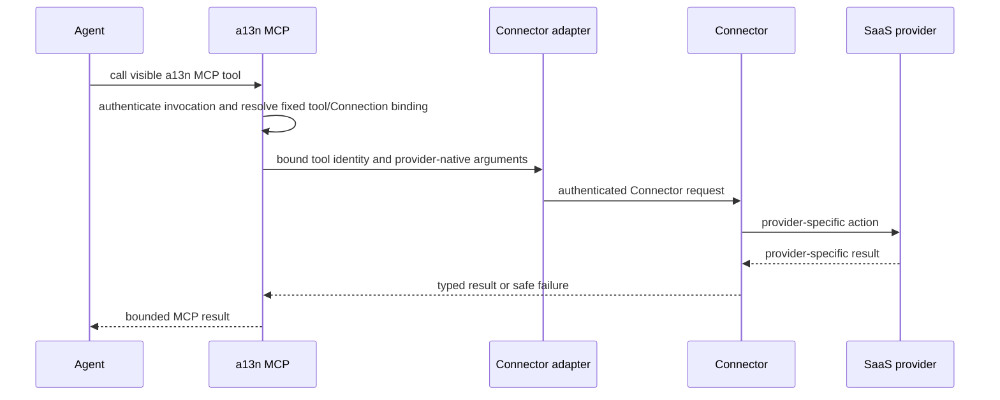

# Connectors and Connector Connections

## Design Position

Connectors provide general outbound SaaS capabilities. Foundation can connect to a self-hosted OpenConnector deployment, OpenConnector Cloud, Composio, or another installed Connector adapter. These products are optional Connectivity components rather than Foundation core dependencies.

The external Connector service owns third-party account authorization, OAuth callback processing, access and refresh tokens, token rotation, and provider API invocation. Foundation owns only its Connector configuration, safe Connection projection, assignment and authorization, exact Run selection, and Agent-facing a13n MCP boundary.

## Connector

The following schemas are conceptual and are not wire or ORM models:

```python
class Connector:
    id: ConnectorId
    organization_id: OrganizationId
    workspace_id: WorkspaceId
    name: str
    driver_key: str
    endpoint: str | None
    config: ConnectorConfig
    credential_secret_id: SecretId | None
    status: Literal["active", "disabled"]
    version: int
    created_by: PrincipalRef
    created_at: datetime
    updated_at: datetime
```

`driver_key` selects one deployment-registered adapter. Package presence does not authorize a driver; the distribution explicitly registers it. `ConnectorConfig` is the adapter's strong typed configuration rather than an arbitrary JSON dictionary. The core contains no fixed OpenConnector or Composio conditionals. Self-hosted and cloud variants differ through adapter configuration, endpoint, and credentials.

Organization, Workspace, driver, endpoint, and behavior-defining adapter configuration are immutable. Changing one creates another Connector so an accepted Run cannot silently dispatch to a different backend under the same ID. Name, credential rotation, safe observations, and administrative status can change under exact management-version preconditions without changing Connector identity.

`credential_secret_id` authenticates Foundation to the Connector service. It can hold a self-hosted access token or BYOK Connector API key through the [Foundation Secret contract](../27-secret-management.md). It never holds a third-party account OAuth token.

`active` means the Connector is administratively enabled; it is not a continuous health claim. Disabling a Connector prevents new setup, discovery, and dispatch through it without reinterpreting or deleting retained Connections, Run selections, or audit facts. Transient endpoint or credential failures remain bounded safe observations rather than another Connector lifecycle state.

## Connection

```python
type ConnectionStatusReason = Literal[
    "reauthorization_required",
    "incompatible",
]


class Connection:
    id: ConnectionId
    organization_id: OrganizationId
    workspace_id: WorkspaceId
    connector_id: ConnectorId
    owner_principal_ref: PrincipalRef | None
    name: str
    provider_key: str
    external_ref: str
    safe_metadata: BoundedJsonObject
    status: Literal[
        "pending",
        "ready",
        "action_required",
        "disabled",
    ]
    status_reason: ConnectionStatusReason | None
    version: int
    created_by: PrincipalRef
    created_at: datetime
    updated_at: datetime
```

`provider_key` is scoped to the selected Connector. Foundation can retain a safe display label, but it does not claim that two Connectors with similarly named providers expose the same actions or semantics.

`external_ref` is the opaque external connection reference issued by the Connector. It is protected metadata: public management reads can expose the Foundation Connection ID and safe account projection but never disclose this reference to the model. It is not a bearer credential and grants no authority by possession.

A non-null `owner_principal_ref` makes the Connection Principal-owned; it can name one same-Workspace User or Service Account. A null value makes the Connection Workspace-shared. An external provider actor, username, or account identifier is never a Foundation owner. Ownership, tenant, Connector, and provider are immutable. Moving an account between owners or Connectors creates another Connection.

A Principal-owned Connection is eligible only when the Run's active invoking Foundation Principal exactly matches `owner_principal_ref`. An Ingress-triggered Run uses its configured Service Account, not the external provider actor; it can therefore use a Principal-owned Connection only when that Service Account owns it. A Workspace-shared Connection remains eligible through current Agent, Route, Principal, Connector, and Connection grants.

Connection status is Foundation's safe eligibility projection, not a continuous claim that an external account or token is healthy. `pending` means setup has not produced a usable external Connection, `ready` permits authorized selection and dispatch, `action_required` blocks use until a user repairs authorization or compatibility, and `disabled` is a reversible local decision. `status_reason` is non-null exactly for `action_required` and is one finite safe code; it never contains provider payloads or credentials. Transient Connector or provider failures do not change status. Reconciliation or explicit reconnect can move `pending` or `action_required` to `ready` only while the immutable Connection identity remains the same; otherwise setup creates another Connection. Foundation never repairs a Connection by choosing a different external account.

## Credential Custody and Setup

Connection setup can begin in Foundation, but the Connector service owns the provider authorization ceremony. Foundation passes only Connector-scoped setup correlation, receives an opaque external connection reference plus safe account metadata, and commits the Foundation Connection after Connector success.

The control role loads the explicitly registered Connector client adapter for setup, safe discovery, revocation, and reconciliation. The connectivity role loads the same registered adapter contract for Agent-facing dispatch. Both operate the same durable Connector and Connection facts; they do not call one another through a private Foundation API or introduce a durable operation queue merely to cross process roles.

Foundation does not receive, encrypt, proxy, log, or copy the external account's access token, refresh token, cookie, password, or provider API key. Provider OAuth callback state and token refresh remain Connector state. A Connector redirect or setup handle grants no Foundation authority by possession.

Revocation first makes the Foundation Connection unusable, then requests Connector cleanup under a stable operation identity. Confirmed external revocation leaves the Connection in `action_required` with `reauthorization_required` until an identity-preserving reconnect succeeds or the Connection is deleted. A lost or unknown Connector response never restores local eligibility. Reconciliation inspects that same external reference instead of creating another Connection blindly.

## Assignment and Effective Selection

A Connection does not carry mutable lists of Agent or Route IDs. The owning Agent or Route capability configuration references the Foundation Connection ID; Connection reads can expose authorized reverse-assignment projections. This keeps capability configuration authoritative and avoids a second assignment resource that could disagree with it.

Agent-wide configuration makes a Connection eligible wherever that Agent runs. A Route uses the common [Run Capability Overlay](../28-agent-management.md#run-capability-overlay) to inherit Agent defaults, include another authorized Connection-backed tool selection, or exclude one exact selectable key. Reusable capability configuration can also reference Connections under its own owning contract. Effective use always intersects:

- the selected Agent and exact Run capability configuration;
- the current Route when the Run originated from an Ingress;
- current Principal, Workspace, Connection, and Connector authorization;
- current Connection and Connector status; and
- the exact model-tool and credential-use grants for the call.

The model cannot supply or override a Connector ID, external Connection reference, or Foundation Connection ID in ordinary tool arguments. When two authorized Connections expose similar actions, a user-managed safe name or alias can be visible so the Agent can distinguish them without seeing either external reference.

The exact Connection facts retained by a Run use this conceptual shape:

```python
class ConnectionRunSelection:
    connection_id: ConnectionId
    connector_id: ConnectorId
    exposure: MCPExposureMode
    allowed_tool_keys: tuple[str, ...]
    tool_catalog_digest: str
```

This selection is the authorization authority for the exact Connector, Connection, exposure mode, and allowlist accepted by the Run. Connector and Connection IDs identify immutable external binding semantics; their mutable management CAS versions are not Run compatibility inputs. `tool_catalog_digest` identifies the validated local source catalog from which the model-facing bindings are derived; it is compatibility evidence, not a credential. The [Run persistence contract](../12-run-persistence.md) owns its durable placement, while [`MCPToolSnapshot`](04-agent-facing-tools.md#mcp-toolsnapshot) is only the immutable model projection derived from this selection.

## a13n MCP Boundary

All Connector tools enter the Agent through the Foundation-owned a13n MCP surface:



Foundation preserves each Connector's provider coverage, action names, argument schemas, result schemas, and feature limits. It applies collision-safe model-visible naming, authorization, bounded results, audit, and safe errors but does not translate every Connector into one common action vocabulary.

Each MCP call uses the [RunAttempt-bound invocation grant](04-agent-facing-tools.md#mcp-invocation-grant) and one pre-resolved tool and Connection binding. Authentication and hidden routing context are not model arguments. A caller-supplied Run ID, Connection ID, header, or external reference never grants tool authority by itself.

Run acceptance fixes the effective tool snapshot and Foundation Connection choices used by that Run. A replacement RunAttempt reuses those choices and fails closed if the Connector, Connection, authorization, or tool contract is no longer compatible. It never discovers a substitute account during recovery.

## Failure and Compatibility

| Condition                                                   | Outcome                                                                                              |
| ----------------------------------------------------------- | ---------------------------------------------------------------------------------------------------- |
| Connector unavailable before setup or dispatch              | Operation fails safely; no fallback Connector is chosen                                              |
| Connector response is lost after possible external dispatch | Tool outcome is unknown unless the Connector supplies stable receipt or reconciliation evidence      |
| Connection requires renewed authorization                   | Connection becomes `action_required` with `reauthorization_required`; new calls fail before dispatch |
| Connector tool disappears or its schema is incompatible     | New discovery reflects the Connector; an already accepted incompatible Run fails closed              |
| Connection or Connector is disabled                         | New discovery, Run acceptance, and dispatch through it are denied                                    |
| Connector reports revocation                                | Connection becomes `action_required`; reconnect must preserve its immutable identity                 |

Connector adapters and provider tool contracts version independently from Foundation management CAS versions. Adding another Connector or provider tool is additive. Treating one Connector's action as semantically interchangeable with another, changing a retained external reference's meaning, or exposing third-party credentials through Foundation is incompatible.

## Invariants

1. No Connector implementation is a required Foundation dependency.
2. Foundation Secrets can protect Connector access credentials but never contain a Connector-managed third-party account credential.
3. Every Connection names one exact Connector and opaque external reference; the model sees neither.
4. Capability configuration, not a duplicate Connection-owned assignment list, is authoritative for Agent and Route use.
5. All Connector tools reach the Agent through the a13n MCP authorization and result-safety boundary.
6. Foundation standardizes MCP exposure and authorization, not Connector provider catalogs or action schemas.
7. Recovery never substitutes another Connection or Connector for an accepted Run.
