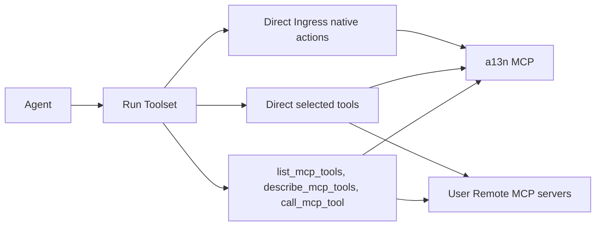
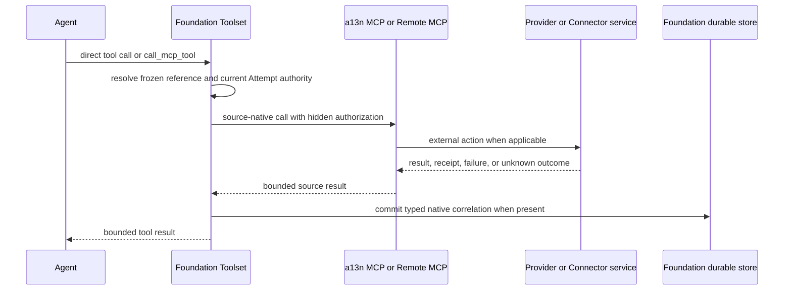

# Agent-Facing External Tools

## Design Position

Foundation composes one exact external-tool surface for every accepted Run. The a13n MCP is the single Foundation-owned MCP server and exposes authorized Ingress native actions plus Connector-backed tools. Each user-configured [`MCPConnection`](06-remote-mcp-connections.md) remains a separate Remote MCP source to which Foundation acts as the client.

Ingress native actions are always presented to the Agent as ordinary direct Tools when the Run has an authorized native action set. `direct` describes model-facing exposure, not process placement: the Worker dispatches every such Tool through the a13n MCP to the Connectivity-owned adapter. Connector tools and user Remote MCP tools can be exposed directly or through one small Foundation-owned catalog interface. Catalog exposure changes only the model-facing presentation; it does not create another MCP server or merge source credentials and authority.

Foundation uses the existing Harness `RunBindings.capabilities` and [`ContextualMCP`](../../agent-harness/03-agent-definition-and-build.md#agentdefinition) seams. Harness owns no Ingress, Connector, MCPConnection, external identifier, credential, or routing rule. The Worker reconstructs a fresh Toolset from the accepted Run selection for every RunAttempt.

## Topology and Ownership



The Agent can therefore use zero or one logical a13n MCP source and zero or more user Remote MCP sources. These are configured sources, not a requirement to retain an equal number of live transport connections. Foundation Service supports the MCP Streamable HTTP transport, whose current protocol requests are independently routable and do not require a durable MCP session.

| Concern                               | Owner                                                                | Boundary                                                                                               |
| ------------------------------------- | -------------------------------------------------------------------- | ------------------------------------------------------------------------------------------------------ |
| Effective managed capability choice   | [Agent Management](../27-agent-management.md#run-capability-overlay) | Selects Ingress actions, ConnectorConnections, MCPConnections, exposure modes, and allowlists          |
| Protected native target and policy    | `IngressRunContext`                                                  | Retains the current provider target without model-settable destination arguments                       |
| Exact model and callable tool surface | `MCPToolSnapshot`                                                    | Freezes source bindings, names, schemas, exposure, and allowlists for one Run                          |
| Fresh a13n MCP invocation authority   | Foundation Worker and a13n MCP                                       | Creates and validates one current RunAttempt-scoped opaque grant                                       |
| User Remote MCP authentication        | [Remote MCP Connections](06-remote-mcp-connections.md)               | Resolves current authorized credentials for the exact selected MCPConnection                           |
| Tool composition and catalog facade   | Foundation Worker                                                    | Presents direct tools or the three catalog tools without proxying arbitrary MCP through the a13n MCP   |
| External action meaning and outcome   | Ingress adapter, Connector, or Remote MCP server                     | Supplies source-specific success, failure, receipt, task, input-required, or unknown-outcome semantics |

## IngressRunContext

A Run created from Ingress input can retain this conceptual protected value:

```python
class IngressRunContext:
    ingress_id: IngressId
    route_id: RouteId | None
    execution_principal_ref: PrincipalRef
    provider_key: str
    provider_context_version: str
    provider_context: BoundedJsonObject
    action_policy: BoundedJsonObject
```

`provider_context` contains the adapter-defined stable target required by the selected native actions, such as a Slack Discussion, Lark chat or topic, Discord thread, Teams reply chain, GitHub pull request, or Gmail thread. It is protected Run metadata, not `AgentInput`, model context, a Tool argument, ordinary event data, a log field, or a trace attribute. `action_policy` contains bounded adapter-validated policy such as messaging `reply_mode`; it grants no additional tool or target.

`IngressRunContext` is not an event history and does not copy external event identities. Durable Ingress admission owns each event's exact Run or Steer acceptance receipt.

The `MCPToolSnapshot` is the sole owner of the exact provider-native action set and callable bindings accepted for the Run; `IngressRunContext` does not carry a second allowlist or action-binding digest. A receive-only Ingress contributes no native action to the snapshot. A replacement RunAttempt reuses the same context and snapshot and fails closed when the Ingress, provider adapter, current credentials, authority, context version, or selected callable binding is no longer compatible.

An Ingress event can Steer a running Run only when its Ingress, stable external target, Agent, and accepted capability surface are compatible with the Run's retained context. A compatible Steer does not replace the context or tool snapshot. An incompatible event remains at the durable Ingress admission boundary until an idle Agent Thread can accept a successor Run.

## MCP Invocation Grant

Foundation creates an unpredictable opaque grant only after the RunAttempt owns the current fence and current IAM, Ingress, optional Route, Connector, ConnectorConnection, tool, and action authority have been checked. The protected server-side binding identifies the exact RunAttempt, Attempt fence, accepted tool snapshot, and optional Ingress context. For Ingress work, IAM uses the protected `execution_principal_ref`, never the external provider actor.

The Worker supplies the grant to the a13n MCP through trusted transport binding outside model input, `AgentContext.metadata`, caller-supplied Run identifiers, and model-settable headers. The grant has no client-readable claims and possession grants authority only after the a13n MCP resolves its protected binding, verifies that the exact Attempt remains current, leased, and effect-authorized, matches the accepted tool snapshot and optional Ingress context, and reauthorizes the requested bound action.

The grant has no independent wall-clock TTL or refresh lifecycle. Its validity follows only the current RunAttempt and its renewable lease: every call requires that exact Attempt to remain selected, non-terminal, and protected by an unexpired lease. Lease renewal does not rotate the grant. Attempt failure, yield, replacement, cancellation, lease expiry, or terminal Run state invalidates it immediately; a replacement Attempt receives a different grant. The representation, storage, lookup, cleanup, and trusted transport mechanism are private implementation choices and cannot weaken these semantics.

User Remote MCP calls do not receive this a13n grant. The Worker selects one accepted MCPConnection, resolves its current authorization internally, and invokes only the tool authorized by the same RunAttempt and tool snapshot. Neither credential path exposes a bearer value to the model.

## Exposure Modes

```python
type MCPExposureMode = Literal["direct", "catalog"]
```

Ingress native actions always use `direct`. This is a bounded current-context set whose availability is material to the Agent's behavior. There is no catalog option for those actions.

Each Connector tool selection and MCPConnection selection independently chooses `direct` or `catalog`; `direct` is the default. Foundation performs no automatic threshold switch. Direct and catalog sources can coexist in one Run.

`direct` exposes the selected source tools as ordinary model tools with collision-safe names fixed by the Run snapshot. Hidden source, account, destination, and credential identifiers are never added as model arguments.

`catalog` exposes exactly these Foundation-owned tools:

- `list_mcp_tools` searches and pages compact tool references, source aliases, names, and summaries from the current Run snapshot;
- `describe_mcp_tools` returns the exact frozen schemas and annotations for selected tool references; and
- `call_mcp_tool` invokes one described or listed tool reference with its arguments.

A catalog tool reference is scoped to the accepted Run and grants no authority by possession. `call_mcp_tool` accepts no endpoint URL, authorization header, Secret, Connector ID, ConnectorConnection ID, MCPConnection ID, Ingress ID, Route ID, Run ID, or arbitrary server selector. Dispatch resolves only the current Run's protected binding and reauthorizes it before external I/O.

The catalog facade belongs to Worker Toolset composition. The a13n MCP does not proxy arbitrary user MCP servers, and catalog exposure does not change the underlying source topology.

## MCPToolSnapshot

Connector and MCPConnection setup, relevant configuration or credential changes, and bounded background reconciliation maintain each source's latest validated durable local tool catalog. They use source cache hints and change notifications when available, but a remote system is never on the Run-acceptance critical path. Run preparation reads those local catalogs, applies the authoritative accepted source selections and exact allowlists, normalizes collision-safe model names and run-scoped catalog references, and creates one protected immutable `MCPToolSnapshot`. A source without a current compatible catalog fails Run acceptance rather than triggering synchronous remote discovery.

```python
class MCPToolSnapshotRef:
    digest_sha256: str
    size_bytes: int
    content_type: Literal["application/vnd.a13n.mcp-tool-snapshot+json"]
    schema_version: str
```

The ConnectorConnection and MCPConnection Run selections are the authorization authority for exact sources, accounts, versions, exposure modes, and allowlists. The snapshot is their derived immutable model projection: it records the resulting complete allowed tool names and schemas, source-qualified model names or catalog references, opaque callable bindings, and compatibility evidence sufficient to verify that derivation. Repeated source metadata in the snapshot cannot select, add, or authorize a source independently. Snapshot content uses a protected immutable Run object at a key derived from the owning Run and digest; the Run row retains `MCPToolSnapshotRef` rather than embedding unbounded schemas or a caller-supplied object key.

Preparation reads local validated catalogs and publishes the snapshot object without an open relational transaction. The short Run-acceptance transaction rechecks immutable source identity, current authorization and status, authoritative source selections, catalog compatibility, and the prepared snapshot identity before committing the Run. Mutable management CAS versions are not Run compatibility inputs. Tool incompatibility discovered during dispatch fails the current call and schedules catalog refresh for later Runs; it never rewrites the accepted snapshot.

The snapshot is immutable for the Run:

- direct exposure always reconstructs the same model tool definitions;
- catalog `list`, `describe`, and `call` operate only on the snapshot;
- a source tool addition, deletion, rename, or schema change affects later Runs, never expands an accepted Run; and
- if the external source can no longer execute the frozen contract, the call or RunAttempt fails explicitly rather than silently rebinding to another tool or schema.

Credential refresh and revocation are not part of the snapshot. Every call resolves current credentials and eligibility; refresh can preserve access, while disablement or revocation blocks dispatch immediately.

## Native Current-Context Actions

A current-context native action contains no model-settable Ingress, Workspace, Channel, Chat, Conversation, Discussion, Thread, Message, Run, ConnectorConnection, external account, or credential identifier. It accepts only action content and bounded safe behavior choices. For a forced messaging `reply_mode`, the provider reply action omits placement. For `auto`, it can expose one bounded provider-appropriate placement choice that cannot select another destination.

Inbound processing never calls these actions automatically. The Agent decides whether to respond and invokes the action like any other tool. Provider-specific actions and schemas remain separate, so Slack, Lark, Discord, Teams, GitHub, and Gmail do not require a lossy common reply model.

## Dispatch and Provider Receipts



A native Ingress adapter returns a typed internal receipt when the provider supplies stable message, Discussion, thread, issue, pull-request, or mail references. Before reporting a continuity-establishing success, Foundation commits the exact `AgentThreadBinding` only when that action's contract explicitly establishes a new correlated external target. An ordinary messaging reply retains the inbound Binding; changing between threaded and main-flow placement never moves or replaces it. Other native actions record only the exact correlation their provider receipt supports. The model never parses an arbitrary tool result to establish Binding authority. Connector and user Remote MCP results do not create Ingress bindings merely because they contain similarly named fields.

If an external effect may have occurred but its response or subsequent correlation commit is unknown, the Tool result is unknown unless the source supports the same stable operation identity, idempotency key, outbound echo, task identity, or reconciliation evidence. Foundation never fabricates a receipt, automatically repeats a non-idempotent action, or reports rollback.

## Failure Semantics

| Condition                                                                                   | Outcome                                                                                                |
| ------------------------------------------------------------------------------------------- | ------------------------------------------------------------------------------------------------------ |
| a13n MCP grant is absent, stale, forged, or names a non-current Attempt                     | Call is rejected before dispatch                                                                       |
| Tool reference, source binding, or snapshot digest differs from the accepted Run            | Worker preparation or dispatch fails closed                                                            |
| Model supplies a hidden routing or credential identifier                                    | The schema has no such field and validation rejects the call                                           |
| Ingress, Connector, ConnectorConnection, MCPConnection, credential, or authority is invalid | Call fails before external dispatch                                                                    |
| External tool changed incompatibly after the snapshot                                       | Current Run receives an explicit incompatibility failure; no new schema or substitute tool is selected |
| Native adapter returns a typed stable receipt                                               | Correlation commits before continuity-establishing success is returned                                 |
| External effect may exist without reliable evidence                                         | Tool reports an unknown outcome under the source's reconciliation contract                             |
| Replacement RunAttempt starts                                                               | Old grants are invalid; the new Attempt reconstructs the same snapshot and resolves fresh credentials  |

## Invariants

1. The a13n MCP is the only Foundation-owned MCP server and serves only Ingress native actions and Connector tools.
2. User Remote MCP servers remain separate sources selected through MCPConnections; the a13n MCP never becomes their generic proxy.
3. Every Ingress native action is directly visible when authorized and contains no model-settable destination or credential identifier.
4. Connector and user Remote MCP tools independently use direct or catalog exposure; catalog mode exposes exactly three Foundation tools.
5. Every accepted Run fixes one exact MCP tool snapshot, while every call resolves fresh current authority and credentials.
6. A caller-supplied Run ID, source ID, tool name, reference, or ordinary header never grants MCP authority.
7. Typed native receipts, not model parsing, establish provider correlation.
8. Recovery creates fresh invocation authority and never changes the accepted source, account, endpoint, tool snapshot, or native target.
