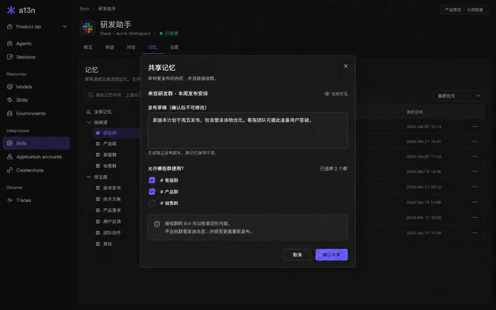
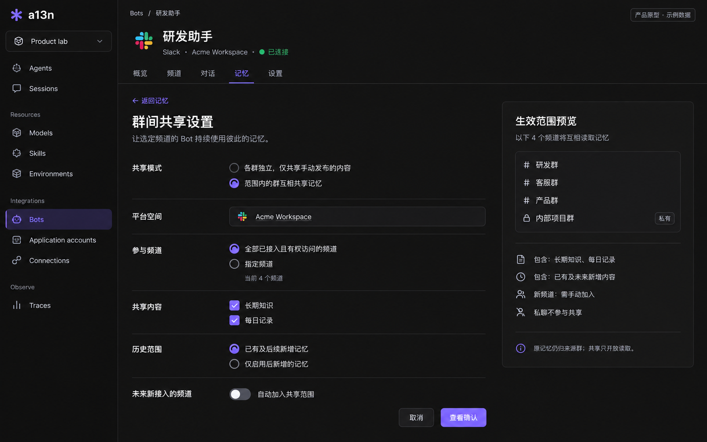
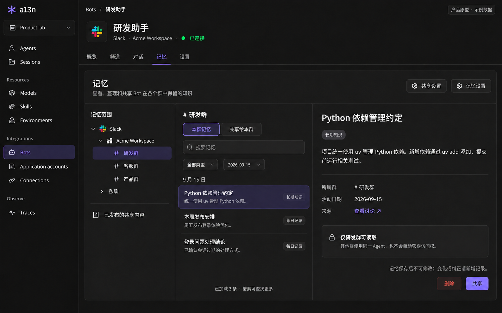
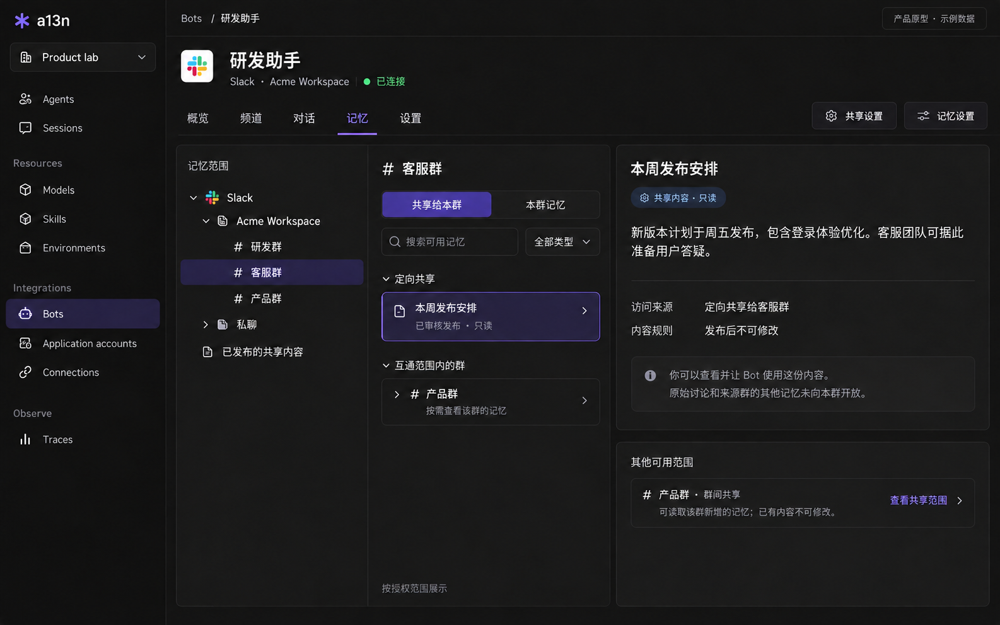

# Bot Memory

## Design Position

Bot Memory provides scoped, inspectable records for collaborative conversations, with explicit publication and continuing group-sharing controls. [Bots Integration](bots.md) owns the Account-backed Bot and platform onboarding. This contract owns the product model, browsing, sharing interactions, and the requirements those interactions place on backend integration. [Service Long-Term Memory](../a13n-service/42-memory.md) owns Providers, current content APIs, authorization dispatch, and operation completion.

The product model does not imply that the current backend supplies every required operation. Metadata, group subjects, publication authority, and date traversal must be supported and validated before dependent controls are enabled. This document declares no wire schema or new persistence owner.

## 1. Product Outcome and Backend Boundary

People can inspect what a Bot remembers for a Slack channel or Feishu group, browse by date and kind, add corrections or delete records, and control which other groups can use that knowledge. Bots remain usable without Memory. Memory is opt-in; groups are isolated by default even when they use the same Agent or belong to the same enterprise.

The three-pane browser presents memory records with controlled metadata. A daily heading is a view over records, not a Markdown file or a generated summary. No file tree, virtual `.md` names, `MEMORY.md`, or document revision browser is required.

The current [Service Memory contract](../a13n-service/42-memory.md) provides managed Memory Providers, authorization, Agent selection, and CRUD/search through the neutral Harness MemoryBackend. Its built-in adapters are Mem0 OSS and Mem0 Platform. Backends own content; Service stores Provider resources rather than a memory-content mirror.

Current adapters write exact text with inference disabled and supply only trusted thread/agent/user subject fields. Requests, the backend contract, and responses do not expose custom metadata. Current scopes do not represent groups or publication audiences. These product capabilities require coordinated backend, Service, SDK, and Console support; frontend filtering alone cannot implement them.

## 2. Ownership and Scope Identity

| Concept                   | Responsibility                                                                                 |
| ------------------------- | ---------------------------------------------------------------------------------------------- |
| a13n Workspace            | Resource ownership and IAM boundary                                                            |
| Bot / Application Account | External installation and application identity, following Bots Integration                     |
| Platform space            | Slack Workspace or Feishu enterprise; external context, not another a13n Workspace             |
| Group scope               | Memory for one exact channel/chat, shared across its ordinary discussions                      |
| Direct-conversation scope | Memory for one exact private conversation, isolated from group sharing                         |
| Memory record             | Immutable saved text and metadata; independently readable, shareable, and deletable            |
| Publication               | Separately approved content with explicit recipient groups and a protected source relationship |
| Group-sharing policy      | Continuing read access between participating group scopes                                      |
| Thread / Run              | Existing conversation and execution evidence; no second transcript store                       |

Memory follows the group rather than its selected Agent. Renaming a group, rotating credentials for the same Account, or changing the target Agent preserves scope identity. Stable Account and provider conversation IDs identify the location; display names and external sender-supplied metadata do not.

A Bot is a view of one Application Account, as defined by Bots Integration. Memory introduces no independent `bot_id`. Logical group identity includes the a13n Workspace, Account, and external conversation ID; accepted Organization and Memory Provider namespace boundaries remain in force. The Service and neutral backend contracts own group subject representation; a group is not encoded as a fabricated Agent or User.

The sharing boundary is one Bot and its external installation. Cross-Bot, cross-platform, cross-tenant, and cross-a13n-Workspace sharing are outside this contract. A Bot page shows its selected platform/installation branch; illustrations containing both Slack and Feishu describe the reusable navigation pattern, not a new multi-account Bot identity.

Re-creating a target for the same Account/group can reconnect retained memory only after current authorization and explicit re-enablement. Replacing an Account or Memory Provider does not silently inherit or migrate its predecessor's memory.

### Account-Owned Memory Provider Selection

An Account references one explicitly selected Memory Provider when its Bot memory is enabled. The Provider owns the endpoint, implementation type, and encrypted credentials; Account configuration stores only the reference and Bot memory policy. Multiple Accounts may select the same visible Provider. The relationship is not one Provider per Account, and sharing an endpoint or Provider never grants access to another Account's records.

Group settings inherit the Account's Provider and control memory enablement, use, save behavior, and sharing. The initial product offers no per-group Provider override. Provider selection belongs to the Account rather than its current Agent; switching the Agent leaves the group's storage binding unchanged. There is no separate Bot record with duplicate identity, credentials, or enabled state. Whether Account-owned memory configuration is stored in Account fields or a one-to-one configuration resource is owned by the Service persistence contract, not a second product identity.

The logical isolation boundary retains Organization, a13n Workspace, Memory Provider, Account, and stable provider conversation identity. Trusted ingress determines write ownership. Service authorizes and adds scope restrictions before retrieval; a model-supplied group ID or metadata filter cannot choose another group's records. Group/date display labels are not the authorization boundary.

Changing the selected Provider explicitly changes the storage target. The UI previews that existing records remain on the old Provider; it performs no automatic migration, namespace reassignment, deletion, or fallback. Account/group disablement retains records while preventing the affected future operations. Accepted Run bindings follow the existing retained-selection principle: later configuration changes do not silently redirect an in-flight or retried operation to a different Provider. Current eligibility and sharing authority still apply, and child Agents cannot expand the parent Bot's authorized conversation scope.

## 3. Daily Records and Long-Term Knowledge

| Kind      | Content                                                                           | Presentation                                              |
| --------- | --------------------------------------------------------------------------------- | --------------------------------------------------------- |
| Daily     | Relevant outcomes, decisions, changes, and handled problems from a dated activity | Date filter or date grouping in the record list           |
| Long-term | Stable background, procedures, preferences, and decisions useful across days      | Topic/title or text excerpt, with optional date filtering |

A daily record may say that a discussion chose uv on September 15; a long-term record states the dependency policy and retains an authorized source association. Multiple records can belong to one day. Neither kind implies one complete document per day or topic.

A controlled activity date is interpreted in the conversation's configured time zone and is distinct from creation time. Both are fixed when the record is saved. A later correction has its own dates and never moves the earlier record to a different date group. The backend defines activity attribution and time-zone handling; filters identify the date and time zone they use. The UI must not guess missing date semantics or silently re-bucket history after a time-zone change. Legacy records without date/type metadata remain explicitly unclassified rather than receiving fabricated values.

Only content admitted and processed by a13n under appropriate retention authority is eligible. This is not an archive of all platform messages or an automatic import of historical conversations. Reading a Connector document for a task does not by itself authorize retaining it for the whole group. Source links do not grant access to private discussions or external documents.

### Immutable Records and Corrections

A saved Bot memory is a record of past information, not a mutable knowledge document. Its text, optional title, kind, activity date, source associations, trusted ownership, creation time, and correction references are fixed at successful creation. This applies equally to daily records, long-term records, and saved publication content. No human role, Agent, background job, or shared recipient can modify these values through a13n after saving.

Creation, reading, deletion, and sharing are supported product actions. There is no Edit action or saved-record update permission. Bot-facing routes, tools, backend facades, and any generic Memory API capable of addressing Bot-owned records must reject update/reclassification/ownership changes before dispatching a provider mutation. Hiding a button or omitting an update tool is insufficient. Mem0 inference or consolidation must not overwrite existing Bot records. The general MemoryBackend update capability remains usable for ordinary non-Bot memory under its existing contract.

Changed circumstances and corrections create a new record with its own ID and trusted creation time. A correction can explicitly reference an authorized earlier record in immutable source metadata; this is not an update to the older record or an automatic deletion. For example, retain “Release planned for Friday” and add “The release was moved to Monday.” Retrieval uses the available chronology and explicit correction relationships for current-state questions while retaining historical context. A later timestamp alone does not prove that one statement supersedes another. Referencing a record never grants access to its text, source, or audience; deleted or inaccessible evidence remains unavailable.

Deletion is permitted under the owning scope's delete authority and uses confirmed completion. It is not an edit or an undeclared delete-and-recreate replacement under the same ID. Sharing audiences and access-policy state may be administered independently of immutable memory content, with their own audit/completion semantics. Removing access or deleting a record does not erase content already delivered in a conversation.

## 4. Recall and Authoring Controls

Group controls are independent; Bot defaults and target inheritance must be coordinated with the reception policy:

| Control                | Behavior                                                                           |
| ---------------------- | ---------------------------------------------------------------------------------- |
| Use memory             | Permit authorized recall and active lookup                                         |
| Save on request        | Permit explicit remember requests when the execution principal has write authority |
| Automatic organization | Extract eligible daily/long-term records from completed work; default is off       |
| Read-only preset       | Enable reads and disable both conversational save paths                            |

Disabling reads/writes retains stored content. Console creation and deletion use management authorization. In-chat correction adds a new record with a protected source association; forgetting deletes an authorized record. Current standard model tools support search/list/add, not delete, so a forget action requires its own supported operation. Neither Console nor model tools expose a saved-record edit action.

The host resolves allowed memory from the authenticated Account, conversation audience, execution authority, and current sharing policies. Local writes target the current conversation. The model cannot choose raw scope IDs, arbitrary filters, destination groups, or credentials.

A Bot invocation must not automatically union the Agent's ordinary agent/user memories with group context. Root and delegated executions remain within the authorized Bot boundary; choosing another Agent cannot widen it. Integration with MemorySelection, child execution, and recovery belongs in the owning runtime contracts.

## 5. Sharing Selected Records



Figure 2: Review the publication text and select recipient groups before confirming. Implement the dialog over the common browser in Figure 1; the dimmed background in this image does not introduce additional navigation or filters.

Record detail exposes **Share**. Sharing does not require creating or joining a shared collection.

1. Select a local record. A future multi-select action may combine explicitly selected records, but never the whole date group implicitly.
2. Open Share and review a draft for a new publication. Redaction or an excerpt changes only this unsaved draft; the source memory is never modified. The UI identifies the result as separately published content rather than a rewritten historical record.
3. Select recipient groups from the eligible, authorized list.
4. Confirm content and audience. Confirmation publishes an independently managed copy; it sends no chat message.
5. Recipients can retrieve the published content under **Shared with this group**. Source conversation names, links, and evidence require independent authorization; publication can use safe attribution.

The source detail shows recipients and **Manage sharing**. Management can change the audience or withdraw the publication; these are access-policy operations. Published text and provenance are immutable. Changed information requires a new memory and a separately confirmed new publication, with an authorized correction association where applicable. There is no overwrite, edit, or synchronize-original action. Withdrawing an earlier publication is explicit rather than an automatic side effect of publishing another.

A publication is independently retained, immutable content, not a live grant to its source. Read access does not grant deletion or resharing authority, and no role can edit a saved publication through Bot Memory. Publication identity, protected source/correction associations, confirmation, and visibility activation need an implementation contract; a provider ID or arbitrary metadata field alone is insufficient.

Publication from direct conversations is excluded. Source deletion previews derived publications. The deletion flow defaults to withdrawing them too; retaining them requires an explicit choice. Multi-object deletion must report partial/unknown outcomes rather than claim an unsupported atomic operation.

## 6. Continuing Sharing Between Groups



Figure 3: Configure participants, content kinds, history, and future enrollment with an audience preview. The illustrated form is an unsaved selection; **Review confirmation** opens the final confirmation before applying a policy.

**Sharing settings** configures continuous read access to source records. Unlike selected publication, this policy grants access to qualifying source records in their owning groups. New records become available under the policy without per-record publication; existing records are never edited. Deletion and authorization changes affect availability, not historical text.

| Setting        | Choices and meaning                                                                           |
| -------------- | --------------------------------------------------------------------------------------------- |
| Mode           | Independent groups with explicit publications only; or mutual sharing within a selected range |
| Platform space | The Bot's Slack Workspace or Feishu enterprise, distinct from its a13n Workspace              |
| Participants   | All eligible connected groups with an exact preview; or selected groups                       |
| Content kinds  | Long-term knowledge, daily records, or both                                                   |
| History        | Existing and future records; or only records newly saved after activation                     |
| Future groups  | Explicit opt-in to auto-enroll newly connected, eligible groups; default is off               |

“All groups” means those this Bot has connected and is authorized to access, not every Slack channel or enterprise group. Private channels are clearly marked in the preview. Direct conversations are excluded. Unknown or unsupported audience visibility cannot become eligible through this setting. Future enrollment follows the reviewed eligibility policy, records added audiences, and never bypasses initial-participant access checks.

Confirmation states the exact participants, kinds, history choice, and future enrollment behavior. Every participant can read qualifying records from the others; new records remain local and source ownership controls deletion. Removing a participant ends its reading and contribution through that policy, while local content remains stored.

“Only new records” uses a trusted save boundary rather than activity date, access-policy update time, or a provider last-update timestamp. Existing records cannot become new through mutation because saved-record updates are prohibited. Corrections are separate newly saved records, not replacements under the earlier ID. A persisted cutoff and reliable creation evidence are required. The owning policy API supplies the effective creation cutoff and eligibility for later entrants, reactivation, and overlapping policies. The UI previews those effects before confirmation. This control cannot be offered without that contract or with guessed timestamp semantics.

Publications and continuing policies can coexist. Effective shared reads are the union of independently valid grants, subject to scope eligibility. The UI explains why a record is available. Removing one grant does not claim full revocation when another still permits access. Disabling a policy leaves explicit publications in force unless also withdrawn.

## 7. Metadata and Storage Direction

The integration extends the existing provider-neutral Memory path, with Mem0 adapters evaluated against the required metadata operations. Records remain the authoritative content unit. These are conceptual metadata needs, not committed JSON names or an accepted schema:

| Information                                                  | Purpose and authority                                                               |
| ------------------------------------------------------------ | ----------------------------------------------------------------------------------- |
| Trusted Account/conversation association                     | Group routing and isolation; assigned and checked by Service                        |
| Kind and activity date/time zone                             | Daily/long-term browsing, with controlled validation                                |
| Optional title                                               | Display label; otherwise use a bounded excerpt without a model call                 |
| Source category and protected Thread/Run/message association | Attribution and authorized evidence lookup                                          |
| Trusted creation evidence                                    | Display and future-only policy evaluation when supported                            |
| Immutable publication/correction source relationship         | Track separately saved copies and corrections without disclosing private provenance |

Organization, Workspace, Provider, conversation ownership, and audience checks remain authorization boundaries. Models cannot mutate these through arbitrary metadata. Shared audiences are Service policy, not an untrusted list of group IDs on a record. Retrieval restricts authorized namespaces and qualifying records before content enters results; global search followed by frontend filtering is unacceptable.

Harness and Service currently expose no custom metadata. Evaluate both adapters separately: Mem0's general metadata support does not prove that the deployed native OSS HTTP server can create and return every required field, filter records safely, and enforce the required creation/read/deletion semantics. [Mem0 metadata filtering](https://docs.mem0.ai/open-source/features/metadata-filtering) is a capability reference, not proof that this integration exists.

Preserve backend-owned content without a second Service memory-content table or replicated body store. Service owns policy; provenance/publication associations require an explicit contract for protected access and consistency. This product model requires no PostgreSQL document store, filesystem, revision history, or chunking pipeline.

Legacy records without metadata are not automatically attached to a group or shared. Missing metadata is not evidence of an empty collection. Backfill/import and Provider replacement require explicit scope and data handling decisions.

## 8. Frontend and Request Behavior

### Prototype reference

The four embedded prototypes are development references for layout, information hierarchy, and the main interaction paths. The tracked WebP assets are lossless encodings of the generated images. Images are illustrative example data, not screenshots of implemented functionality or permission evidence. Use the written contract for behavior, supported fields, and authorization; use Figure 1 for the common browser shell across screens. Keep shared tabs and controls in consistent positions even where individual generated images differ.

The examples show Slack under the one-Account-per-Bot model. Feishu reuses the same interactions with enterprise/group labels. Implementation also covers the responsive, accessibility, localization, and non-success states specified below; the prototypes do not replace those requirements.

### 8.1 Three-pane browser

Entry: **Integrations -> Bots -> Bot detail -> Memory**. Group detail links to the same view with its exact scope selected.



Figure 1: Select a group in the scope tree, filter its records by kind/date, and inspect a selected record with its visibility and authorized actions. Dates group records in the middle pane; no file or date tree is implied.

```text
Memory scope                  Memory list                      Detail
Slack                         Search                           Dependency policy
  Acme Workspace              Kind | Activity date
    #engineering                                               Python dependencies use uv.
    #support                  Dependency policy
    Direct conversations      Release schedule                 Source, when authorized
                                                               Activity date
Published content                                              Who can read / why
                                                               Delete | Share
```

The left pane is a scope tree: platform, external installation, readable groups/direct conversations. Published content is a management entry, not mandatory shared-store enrollment. No file tree, year/day directory tree, or invented file names are shown.

The middle pane uses titles or bounded excerpts, type/date filters, and optional date grouping. It distinguishes **Local memory**, **Shared with this group**, and **Other groups in the sharing range**. The latter is a lazy scope chooser or search target, not a reason to load all source groups. Search targets the current group or all authorized memory. Selection/filter state survives opening and closing detail.

The right pane shows text, available provenance/date metadata, effective visibility, and authorized actions. It exposes no raw namespace, credentials, fabricated metadata, file paths, or unsupported history. Shared records identify ownership and read-only status. Loading, no matches, bounded results, forbidden access, missing metadata, disabled memory, and dependency failure have distinct states. Narrow layouts retain the selection flow without three simultaneous columns. English/Chinese labels, keyboard use, and focus restoration follow Console conventions.

### Receiving shared memory



Figure 4: A receiving reader sees approved publications separately from source groups available through continuing policies. Record detail explains the access reason and immutable-content rule. No Edit action exists; shared-read authority alone also exposes no Delete or Share action and grants no access to private source evidence. Keep **Local memory** before **Shared with this group** in the common tab order, matching Figure 1.

### 8.2 Lazy loading and bounded results

| Interaction           | Data behavior                                                                             |
| --------------------- | ----------------------------------------------------------------------------------------- |
| Open scope navigation | Reuse authorized Account/target information; no per-group Mem0 calls for counts           |
| Choose date           | Local date control; no scan to discover every populated date                              |
| Select group/filter   | Bounded request scoped to that group and filters                                          |
| Open record           | Reuse authorized loaded text when sufficient; fetch only missing detail                   |
| Search                | Explicit submission or bounded debounce; cancel superseded calls and ignore stale results |
| Model recall          | Independent semantic retrieval, not recall from the Console's loaded subset               |

Grouping returned rows is presentation work. Rendering a date group does not invoke an LLM or generate a summary. A saved summary, if later introduced, comes from an explicit content workflow and is displayed as a record.

Current OSS lists are bounded without native continuation/completeness guarantees. Search top-k is not complete date enumeration. Local paging states loaded counts rather than claiming a total, export, or complete day. Complete date browsing and metadata filters require native API validation; missing support is disclosed rather than emulated by unbounded scans.

Short-lived data caching and duplicate-request coalescing are optional, not authorization caches. Keys bind the principal/access context, Workspace, Account, Provider, query/source scope, sharing-policy state, and filters. Each request follows canonical authorization. Content changes invalidate affected views; permission/sharing changes prevent reuse under revoked access. Clients clear protected views after loss of access. Revocation is not delayed until cache expiry.

No persisted daily counts, background scan of every group, or second full-content index is initially required. A lightweight catalog can be considered later only with measured need and an explicit synchronization/reconciliation design.

## 9. Authority, Completion, and Failures

Reading, creation, deletion, publication, and sharing administration are distinct permissions. Saved-record editing is not an available permission. Safe Account reads or Agent invocation rights do not grant private memory access. Sharing administration requires Workspace administrator or explicitly delegated scoped authority under the owning IAM contract. Account metadata visibility alone never grants this authority; exact actions and role bindings belong to IAM. Console authority and authenticated external audience eligibility are enforced server-side.

A group/topic with narrower visibility cannot read or contribute to a broader scope unless the adapter establishes compatible audience authority. Bot removal, Account disablement, or unknown audience eligibility blocks affected runtime access. Public/private transitions never automatically publish old records. Recall is optional for execution; authorization is mandatory. Unavailable memory is not presented as retrieved evidence or an empty store.

Current explicit writes persist when called, independently of final Run success. A later Run failure does not roll back a completed write. Readback confirmation is required; uncertainty is `memory_write_unconfirmed`, and callers inspect before repeating. The product must not claim idempotent Mem0 writes, blind retries, transactional multi-record sharing, nor historical record-version replay.

Automatic organization is available only through a lifecycle capability that consumes authorized, durably completed work. Scheduling, duplicate events, unknown writes, deletion fencing, and preservation of correction relationships require design before enablement. Automatic extraction and consolidation create new records rather than updating, merging into, or reclassifying existing Bot memories. A post-commit job does not by itself make provider writes exactly-once. The lifecycle capability owns these completion guarantees; the browser does not implement a second job runner.

Management preserves unsaved creation/publication drafts on failure. Body and immutable metadata must be confirmed together at creation. Concurrent deletion/publication and correction-source validation require backend/Service checks; immutable content does not make these independent operations atomic. Publication becomes available only after approved content and audience activation are confirmed. Partial/unknown operations are visible without automatic repetition.

Revocation or withdrawal prevents subsequent authorized retrieval through that grant. Content deletion, provider cleanup, and erasing old transcripts are separate completion boundaries. Content already delivered in a reply, trace, export, or active model context cannot be retroactively withdrawn. Retention and cleanup duration remain owning-contract decisions, not an implied unlimited archive.

## 10. Acceptance Scenarios

01. A saved record is available across eligible discussions of the same group; changing its Agent does not change its owner.
02. The same Agent, enterprise, or Provider endpoint does not cause sharing by default, including through delegated execution.
03. Group rename/credential rotation preserve identity; replacement Accounts or Providers do not silently inherit content.
04. Multiple daily records display beneath an activity date without creating files, summaries, or model requests. Saved dates and classifications cannot be changed.
05. Scope navigation does not read every group's content or fabricate counts. Selecting a group/date loads only its bounded view.
06. Unsupported pagination, missing metadata, and failed requests differ from a complete empty day. Search is never labeled exhaustive.
07. Selected-record sharing previews exact text and recipients, exposes no private evidence implicitly, and sends no chat message.
08. Saved memories and publications reject content/metadata updates through the UI, generic API paths, Bot tools, and automatic processing before backend mutation. Recipients cannot delete or reshare merely because they can read.
09. Mutual sharing controls all eligible/selected groups, kinds, history, and future enrollment. Private channels are marked; direct conversations are excluded.
10. Future-only sharing uses immutable creation evidence. An authorized correction receives a new ID and does not overwrite its source or grant access to inaccessible evidence. Unsupported creation semantics block the feature rather than widen access.
11. Removing a group ends mutual reading/contribution through that policy; other valid grants remain visible with their access reasons.
12. Forged metadata, changed Account IDs, external user IDs, direct links, cached results, and source links cannot bypass authorization.
13. Optional recall failure does not fabricate memory or block ordinary execution. Uncertain writes/publications do not claim success or trigger blind retries.
14. Disabling memory preserves content. Deletion/withdrawal exposes partial outcomes and explains already-delivered-content limits.
15. Before automatic organization ships, test duplicate completion, cancellation, uncertain writes, append-only corrections, attempted automatic updates, and deleted-source resurrection under its separately adopted lifecycle contract.
16. An authorized deletion removes a record from subsequent retrieval after confirmed completion; an uncertain deletion does not claim success. Ordinary non-Bot Memory update behavior remains unchanged.

## 11. Capability and Compatibility Requirements

A control is enabled only when its backend contract supports its complete observable behavior. The implementation validates these requirements against the selected native OSS HTTP or Platform API rather than inferring them from general Mem0 SDK support:

| Capability             | Required integration behavior                                                                                                                               |
| ---------------------- | ----------------------------------------------------------------------------------------------------------------------------------------------------------- |
| Group memory           | Trusted group subjects, Provider selection independent of target Agent changes, authorized root/child execution and recovery                                |
| Metadata browsing      | Validated immutable creation/read fields, protected provenance, clear date/time-zone semantics, and explicit handling of legacy records                     |
| Filtered listing       | Subject-safe group/date/kind filtering and truthful pagination/completeness reporting; no full-store scan fallback                                          |
| Selected publication   | Immutable approved-body identity, recipient authority, source/correction associations, confirmed activation, revocation, and partial-outcome reconciliation |
| Mutual sharing         | Server-owned participant eligibility, content predicates, reliable historical cutoffs, and reviewed future enrollment                                       |
| Management writes      | Confirmed creation/deletion, immutable body/metadata, and rejection of every saved-record update path; uncertain outcomes do not trigger blind retries      |
| Automatic organization | Durable completion eligibility, duplicate handling, deletion fencing, and append-only correction handling                                                   |

Ordinary non-Bot Agent thread/agent/user memories keep their accepted semantics, including their existing authorized update operations. Existing records without group metadata receive no implicit group membership or shared audience. Provider replacement and historical imports do not silently migrate content. A new Bot memory binding cannot change ordinary Agent memory behavior or widen child execution authority.

Revision history, filesystem operations, complete exports, and saved daily summaries are not implied by the record browser. Backend content remains authoritative, and storage changes require their owning contract rather than a frontend decision.

## Related Contracts

- [Bots Integration](bots.md)
- [Service Long-Term Memory](../a13n-service/42-memory.md)
- [Harness Memory Integration](../a13n-harness/09-context-and-memory.md#memory-integration)
- [Application Accounts](../a13n-service/40-connectivity/01a-application-accounts.md)
- [Messaging Reception](../a13n-service/40-connectivity/02-messaging-ingress.md)
- [Identity and Access Management](../a13n-service/33-identity-and-access-management.md)
- [Console](console.md)
