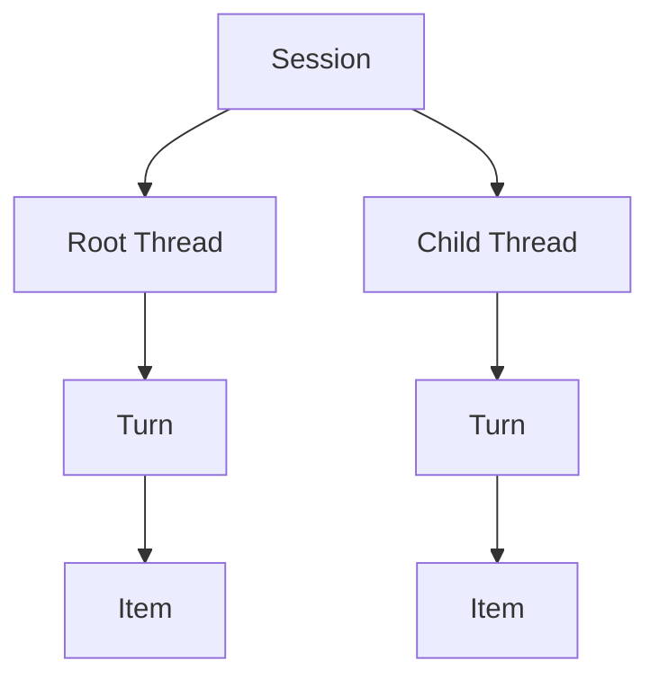

# Platform Interaction Model

## Design Position

Agent Foundation uses four shared public interaction concepts: `Session`, `Thread`, `Turn`, and `Item`. They describe Host-owned interaction scope, independently advancing Agent history, accepted advancement, and user-visible semantic output. Subsystems use these names consistently instead of defining competing session, lineage, conversation, or run hierarchies.

This contract owns the cross-platform meaning and relationships of the four concepts. Each Host owns its concrete persistence schema and lifecycle transitions. Process-local Harness execution remains separate from a Host's durable Turn and worker-attempt contracts.

## Public Concepts

| Concept   | Meaning                                                                                                                                 | Identity owner                                                 |
| --------- | --------------------------------------------------------------------------------------------------------------------------------------- | -------------------------------------------------------------- |
| `Session` | One Host-owned interaction tree and work scope that groups root and child Threads with product state, presentation state, and policy    | Host                                                           |
| `Thread`  | One independently advancing Agent history and continuation lineage                                                                      | Created with Harness continuation state; persisted by the Host |
| `Turn`    | One Host-accepted input-driven advancement of exactly one Thread, from acceptance to a terminal or explicitly waiting state             | Host                                                           |
| `Item`    | One user-visible semantic unit within a Turn, such as a message, reasoning unit, tool call, command, file change, plan update, or error | Projection or Host layer that materializes the unit            |

Identifiers correlate records but grant no authority. A Host validates every selector against current ownership, policy, and state before use.

## Relationships and Identity

The following invariants define the shared model:

01. A Session contains one root Thread and zero or more child Threads.
02. Every Thread persisted in a Host interaction store belongs to exactly one Session; a directly embedded Harness Thread need not have a Host Session record.
03. A Thread owns one independently advancing history and continuation lineage.
04. Resume preserves `thread_id`; fork creates a new `thread_id`.
05. Root, inline-child, background-child, and sibling histories use distinct Thread identities.
06. Every Turn advances exactly one Thread and records that Thread's `thread_id`.
07. A Turn can exist before execution starts and can remain waiting across execution boundaries; process-local execution identity never replaces `turn_id`.
08. Every Item belongs to exactly one Turn and therefore one Thread and Session.
09. Item identity remains stable across retained presentation replay; transport sequence and replay cursor are separate identities.
10. `session_id`, `thread_id`, `turn_id`, and `item_id` are distinct and are never derived from one another.

## Ownership Boundaries

| Boundary                           | Contract                                                                                                                                                                                      |
| ---------------------------------- | --------------------------------------------------------------------------------------------------------------------------------------------------------------------------------------------- |
| Session creation, fork, and policy | The Host creates and persists Sessions, selects the root Thread, groups child Threads, and owns product and presentation state.                                                               |
| Thread continuation                | [`HarnessState`](agent-harness/10-snapshot-and-resume.md) carries the stable `thread_id` and complete Harness continuation data for one Thread.                                               |
| Turn acceptance and completion     | The Host accepts input, allocates `turn_id`, selects or initializes the Thread state advanced by the Turn, correlates execution, and commits the outcome under its owning lifecycle contract. |
| Item projection and retention      | Agent Stream Protocol or another Host projection maps public execution observations into semantic Items; the Host decides whether and how those Items persist.                                |
| Provider-native session state      | A model/provider integration owns any provider-specific selector. It does not replace the platform Thread identity.                                                                           |

A Turn can span zero or more process-local Harness Runs, including Host-owned waiting and durable recovery transitions. A concrete Host owns whether authenticated waiting feedback continues the same Turn or advances the Thread through another Turn. One Harness Run belongs to exactly one Thread and can optionally be correlated to one Host Turn. Embedded Harness callers are not required to create a Session, Turn, or Item store.

## Invariants

1. Session scope groups hosted Threads but never substitutes for Thread continuation identity.
2. Thread identity follows independently advancing continuation state, not a workload instance, process, provider session, or execution attempt.
3. Turn identity records Host acceptance and completion, not merely entry into process-local execution.
4. Item identity names semantic user-visible content, not a generic stream envelope or transport event.
5. Forking a Session creates a new Session and root Thread while preserving an explicit source reference; it never advances the source Thread.
6. Public schemas use explicit `session_id`, `thread_id`, `turn_id`, and `item_id` fields where those concepts apply rather than an ambiguous combined reference.
