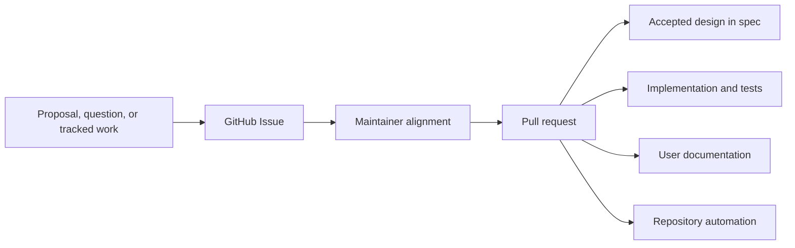

# Repository Model

## Purpose

This document defines the normative content and workflow boundaries of the Agent Foundation repository. It separates published documentation, accepted design, collaborative discussion, implementation, and contributor operations so that each durable fact has one clear home.

## Repository Surfaces

| Surface           | Responsibility                                                                                        | Excludes                                                                                                          |
| ----------------- | ----------------------------------------------------------------------------------------------------- | ----------------------------------------------------------------------------------------------------------------- |
| `docs/`           | User-facing documentation written as Markdown and published as the project documentation site         | Design drafts, issue history, progress tracking, and implementation planning                                      |
| `spec/`           | The current accepted product and architecture design                                                  | Discussions, RFC drafts, alternatives still under debate, meeting notes, issue transcripts, and progress tracking |
| GitHub Issues     | Primary venue for proposals, open questions, design discussion, coordination, and progress tracking   | Normative design or implementation state                                                                          |
| Pull requests     | Reviewed mechanism for changing specifications, documentation, code, tests, and repository automation | Long-running discussion that belongs in an issue                                                                  |
| `CONTRIBUTING.md` | Contributor setup, local development, validation, and pull-request workflow                           | Product or architecture design                                                                                    |
| `DEVELOPMENT.md`  | Repository-wide code quality principles and engineering conventions with explicit component scope     | Product semantics, package-specific commands, and rollout history                                                 |
| `AGENTS.md`       | Concise operational guidance for coding agents working in the repository                              | Detailed design owned by `spec/` or engineering standards owned by `DEVELOPMENT.md`                               |
| `apps/`           | Private application sources compiled into an owning image or language distribution                    | Independently published libraries or language package workspaces                                                  |
| `deploy/`         | Container build definitions and reviewed deployment assets organized by deployment mechanism          | Application source, generated images, credentials, and environment-specific secrets                               |
| `examples/`       | Runnable, tested developer examples of public integration and extension boundaries                    | Normative design, published user documentation, production packages, and release artifacts                        |
| `packages/`       | Python 3.13 uv workspace packages whose distribution names use the `a13n-` prefix                     | Design discussion and unrelated generated artifacts                                                               |
| `crates/`         | Rust workspace crates, including the native `a13n-envd` daemon                                        | Python packages and local reference repositories                                                                  |
| `sdk/`            | Standalone a13n Service language SDKs and the companion remote client CLI                             | Root language workspace membership, service implementation, and generated release artifacts                       |
| `proto/`          | Language-neutral protocol IDL consumed by deterministic repository generators                         | Handwritten language-local implementations, release artifacts, and normative design prose                         |

There is no repository-local `issues/` directory. "Issues" means the repository's GitHub Issues.

Workspace membership does not by itself select a release group. The Harness release group contains `packages/a13n-harness`, `packages/a13n-environment`, and `packages/a13n-stream-protocol`; one `release/a13n-harness-v<version>` tag assigns the same version to all three Python distributions and publishes them through one workflow. Published Harness metadata requires the exact Environment version, and the published Stream Protocol artifact requires the exact Harness version. `packages/a13n-harness-ui` releases independently through `release/a13n-harness-ui-v<version>` and its published artifacts require one reviewed Harness release version for the Harness-group dependencies it consumes. Source manifests keep those workspace dependencies unversioned so uv resolves local members during repository development. Release versions follow the stable and RC forms defined by [Release Automation](#release-automation). a13n Service releases exclude these packages and select their own compatible published Harness release.

`packages/a13n-envd-client` participates in root Python development and validation but is versioned and published with `crates/a13n-envd` by the a13n-envd release workflow. a13n Service releases exclude that package and consume a compatible published version. The client owns only EIP transport/session behavior and never discovers, downloads, installs, or launches the native executable. Other release-group exceptions require an explicit owning specification and release workflow rather than inference from directory placement.

a13n-envd native releases publish immutable archives for Linux, macOS, and Windows x86_64/ARM64 plus `SHA256SUMS`. Repository-owned POSIX shell and Windows PowerShell installers select and verify one release archive and publish the executable to an absolute user-selected directory; they do not define a self-updater, service installation, or install database. The detailed installer contract is owned by [Protocol Source, Client, and Generation](a13n-envd/08-protocol-source-client-and-generation.md#executable-distribution-and-installation).

Harness UI releases independently select both one exact Harness release group and one exact a13n-envd release manifest. The Harness UI wheel and sdist contain per-target asset metadata and hashes rather than all native binaries. The application lazily acquires only the current target for Local EIP; Native and extension Providers do not use this Host runtime cache. The detailed ownership is defined by [Projects, Threads, and Environments](a13n-harness-ui/04-projects-threads-and-environments.md#local-eip-runtime).

a13n Service SDKs are independent projects under `sdk/{python,go,rust,typescript}` rather than root language-workspace members. The companion CLI at `sdk/rust/a13n-service-cli` is also an independent Cargo project: it has its own manifest and lock file, is not a member of either Rust workspace, and is excluded from the Rust SDK source package. Its Cargo package is `a13n-service-cli`, and its installed executable is `a13n-service-cli`.

The CLI is a remote client for the a13n Service `/api` boundary. Network commands consume typed operations from the `a13n` Rust SDK; the CLI does not own a parallel HTTP client, service persistence, queues, migrations, or infrastructure control. A network command is introduced only with the corresponding service API, Rust SDK operation, and end-to-end validation rather than as a nonfunctional placeholder.

The CLI releases independently from all SDK channels through `release/a13n-service-cli-v<version>`. One release contains immutable archives for Linux x86_64 and ARM64, macOS x86_64 and ARM64, and Windows x86_64 and ARM64, plus `SHA256SUMS`. Archives contain the executable and repository license. The channel publishes no crate or registry package and defines no mutable `latest` selector for either stable or RC releases.

Projects under `examples/` may carry their own manifests and lock files when realistic packaging is part of the integration being demonstrated. They remain outside production package workspaces and release groups; example distribution names and artifacts are not platform packages.

`a13n-harness-ui` is the independently versioned Python library/distribution supplying the `a13n-harness-ui` executable. Bare invocation starts the native full-terminal CLI; `a13n-harness-ui webui` starts the foreground browser server over the same reusable `HarnessUiApp` boundary. Its wheel and sdist contain both adapters, the compiled browser asset tree and hash manifest, YAACLI attribution, and native runtime metadata. `apps/a13n-harness-ui` is private frontend build input, not an independent npm package. Repository/release asset preparation requires Node.js; installed runtime and wheel rebuilds from the sdist do not.

Maintained component source directories and public distributions use the same canonical `a13n-` name, such as `packages/a13n-environment` and `a13n-environment`. Python imports normalize hyphens to underscores, such as `a13n_environment`; the same rule applies to Harness, Harness UI, Stream Protocol, Envd client, Service, and logging. The standalone Service SDKs use `a13n` as the Python distribution and import and the Rust crate and library identifier. The TypeScript SDK uses `@converge.ai/a13n` as its public npm package and import specifier. The Go module URL remains `github.com/converge-ai-labs/agent-foundation/sdk/go`, while its public package name is `a13n`.

## Change Flow

Issues preserve discussion and progress. A conclusion becomes normative only when a pull request updates the relevant specification or implementation and is merged. Specifications describe the accepted state directly rather than embedding the discussion that led to it.

Trivial corrections may start as a pull request when no material discussion or tracking is needed. Any change with unresolved product, architecture, security, compatibility, or scope questions starts in an issue.

## Documentation System

Documentation sources live in `docs/` and use Markdown. The canonical public site is `https://agent-foundation-docs.converge.ai/`. It is built with MkDocs Material through the Python development environment declared in `pyproject.toml` and locked by `uv.lock`.

- `docs/index.md` is the initial documentation entry point.
- `mkdocs.yml` owns site metadata, navigation, Markdown extensions, and the build directory.
- `make docs-serve` runs the local documentation server.
- `make docs-build` performs the strict production build into `site/`.
- `.github/workflows/docs.yml` builds pull-request artifacts and deploys `main` to Cloudflare Pages through Wrangler.

Configuration and generated output do not live in `docs/`. Every source file under `docs/` is Markdown.

## Specification Discipline

A specification states the design that implementations and reviews must follow. It uses present-tense, testable language and identifies ownership and system boundaries explicitly.

Do not add the following to `spec/`:

- RFCs or proposal drafts;
- unresolved alternatives or open-question logs;
- implementation checklists, roadmaps, or status matrices;
- review transcripts, meeting notes, or issue summaries;
- temporary migration planning that is not part of the accepted design.

Keep those materials in GitHub Issues. When discussion changes the accepted design, update `spec/` through a pull request and make the resulting document internally consistent without requiring readers to reconstruct issue history.

## Development Standards

`DEVELOPMENT.md` owns [code quality and design principles](../DEVELOPMENT.md#code-quality-and-design) for libraries, services, SDKs, CLIs, frontends, and tooling across repository languages. It also owns engineering conventions within their stated component scope, including service async I/O, database session and transaction lifetimes, migration generation and locking, streaming endpoint resource safety, logging, process roles, and container construction.

The development guide does not establish product semantics or subsystem ownership; those remain in `spec/`. It also does not replace package-local setup and command documentation or the contributor workflow in `CONTRIBUTING.md`. `AGENTS.md` may summarize high-risk rules and link to the guide, but must not become a second complete copy.

## Release Automation

Every release channel accepts a canonical stable `X.Y.Z` identity or RC `X.Y.Z-rc.N` identity, where `N` is a positive integer without leading zeroes. The canonical identity appears in release tags, GitHub Release titles, Rust and npm package metadata, Go module tags, binary archive names, and exact container tags. Python package metadata, lock entries, and artifact names use the PEP 440-normalized `X.Y.ZrcN` spelling for the same RC identity.

An RC runs the owning release workflow, publishes its normal immutable artifacts to the owning registries, and creates a GitHub prerelease. It never advances a stable mutable selector: a13n Service and a13n-envd RCs do not modify the corresponding container `latest` tag, and a TypeScript SDK RC publishes under the npm `rc` dist-tag rather than `latest`. A stable release creates a normal GitHub Release and advances only the mutable `latest` selectors defined by its owning channel. The a13n Service CLI channel has no mutable selector for stable or RC releases. Standalone a13n-envd installers resolve only stable `release/a13n-envd-v*` releases by default; an RC requires an explicit canonical version.

Generated notes for a stable release compare with the preceding stable tag and therefore exclude RC tags as comparison bases. Generated notes for an RC compare with the immediately preceding canonical release identity in that component channel, so the first RC follows the previous stable release and later RCs follow the preceding RC.

## Repository Automation

The root `Makefile` is the stable local entry point. `pre-commit` provides fast file hygiene and formatting across repository languages and applications. Local contributors and CI use the same commands:

- `make install` prepares the locked Python environment and Git hooks;
- `make format` applies repository formatting hooks;
- `make lint` runs non-mutating file, Markdown, Ruff, and configuration checks;
- `make typecheck` runs Pyright over Python package sources;
- `make test` runs the Python workspace test suite;
- `make examples-check` validates independent example locks, style, and types;
- `make examples-check-all` additionally runs example tests, offline smoke paths, and builds;
- `make build` builds every workspace package, private browser application, standalone SDK, and the a13n Service CLI, preparing generated package assets before Python distribution builds;
- `make check` applies the repository formatting hooks, then verifies lint, static analysis, and types without running tests;
- installed pre-commit hooks apply the same supported formatters to changed files before accepting a commit;
- `make check-all` runs the complete EIP, example, browser application, Python, Rust, standalone SDK, and a13n Service CLI gates, including tests and builds.

As implementation packages are added, their focused lint, type-check, test, and build commands must be added behind these stable Make targets rather than requiring contributors to discover unrelated tool-specific commands.
