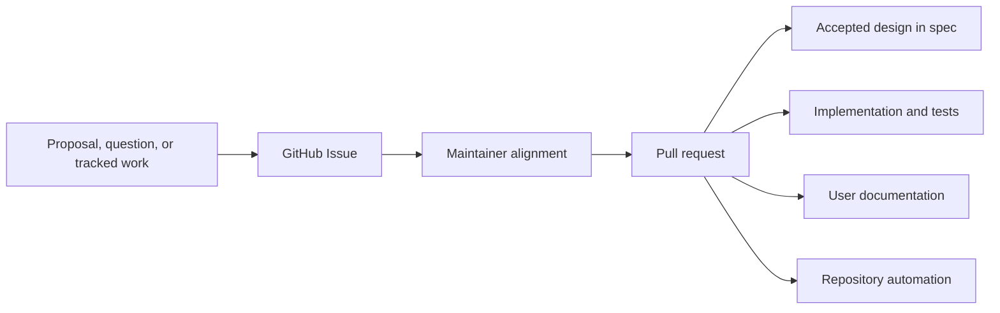

# Repository Model

## Purpose

This document defines the normative content and workflow boundaries of the Agent Foundation repository. It separates published documentation, accepted design, collaborative discussion, implementation, and contributor operations so that each durable fact has one clear home.

## Repository Surfaces

| Surface           | Responsibility                                                                                                          | Excludes                                                                                                          |
| ----------------- | ----------------------------------------------------------------------------------------------------------------------- | ----------------------------------------------------------------------------------------------------------------- |
| `docs/`           | User-facing documentation written as Markdown and published as the project documentation site                           | Design drafts, issue history, progress tracking, and implementation planning                                      |
| `spec/`           | The current accepted product and architecture design                                                                    | Discussions, RFC drafts, alternatives still under debate, meeting notes, issue transcripts, and progress tracking |
| GitHub Issues     | Primary venue for proposals, open questions, design discussion, coordination, and progress tracking                     | Normative design or implementation state                                                                          |
| Pull requests     | Reviewed mechanism for changing specifications, documentation, code, tests, and repository automation                   | Long-running discussion that belongs in an issue                                                                  |
| `CONTRIBUTING.md` | Contributor setup, local development, validation, and pull-request workflow                                             | Product or architecture design                                                                                    |
| `DEVELOPMENT.md`  | Repository-wide code quality principles and engineering conventions with explicit component scope                       | Product semantics, package-specific commands, and rollout history                                                 |
| `AGENTS.md`       | Concise operational guidance for coding agents working in the repository                                                | Detailed design owned by `spec/` or engineering standards owned by `DEVELOPMENT.md`                               |
| `frontend/`       | Private pnpm workspace: application sources under `apps/`, shared UI sources under `packages/`                          | Python/Rust workspaces, standalone SDKs, generated assets, and independently published npm libraries              |
| `deploy/`         | Reviewed deployment assets by platform: `docker/` image builds and Compose, `kubernetes/` Helm Chart, and `monitoring/` | Application source, generated images, credentials, and environment-specific secrets                               |
| `e2e/`            | Opt-in end-to-end tests against deployed processes; Service owns `e2e/service/`                                         | In-process package tests, manual review tools, and production dependencies                                        |
| `dev/`            | Local development tools, manual review launchers, and shared external-service fixtures                                  | Automated end-to-end suites and production packages                                                               |
| `examples/`       | Runnable, tested developer examples of public integration and extension boundaries                                      | Normative design, published user documentation, production packages, and release artifacts                        |
| `packages/`       | Python 3.13 uv workspace packages whose distribution names use the `a13n-` prefix                                       | Design discussion and unrelated generated artifacts                                                               |
| `crates/`         | Rust workspace crates, including the native `a13n-envd` daemon                                                          | Python packages and local reference repositories                                                                  |
| `sdk/`            | Ignored optional checkouts of independently maintained Service SDK repositories                                         | Root language workspace membership, service implementation, and generated release artifacts                       |
| `proto/`          | Language-neutral protocol IDL and the Service contract exports                                                          | Handwritten language-local implementations, release artifacts, and normative design prose                         |

There is no repository-local `issues/` directory. "Issues" means the repository's GitHub Issues.

Workspace membership does not by itself select a release group. The Harness release group contains `packages/a13n-harness` and `packages/a13n-stream-protocol`; one `release/a13n-harness-v<version>` tag assigns the same version to both Python distributions and publishes them through one workflow. The published Stream Protocol artifact requires the exact Harness version. `packages/a13n-harness-ui` releases independently through `release/a13n-harness-ui-v<version>` and its published artifacts consume a bounded compatible Harness release line. Source manifests keep workspace dependencies unversioned and project versions at `0.0.0` so uv resolves local members during repository development. Release versions follow the stable and RC forms defined by [Release Automation](#release-automation). a13n Service releases exclude these packages and select their own compatible published Harness release.

`packages/a13n-logging` is a shared library with an independent `release/a13n-logging-v<version>` release channel. Its workflow versions and publishes only the `a13n-logging` Python distribution through the existing `foundation-pypi` environment. a13n Service releases neither version nor republish logging. Consumers retain unversioned source workspace dependencies and consume published logging independently of their own release versions.

`packages/a13n-envd-client` participates in root Python development and validation but is versioned and published with `crates/a13n-envd` by the a13n-envd release workflow. Harness and Harness UI consume a compatible published version. The client owns only EIP transport/session behavior and never discovers, downloads, installs, or launches the native executable. Other release-group exceptions require an explicit owning specification and release workflow rather than inference from directory placement.

a13n-envd native releases publish immutable archives for Linux, macOS, and Windows x86_64/ARM64 plus `SHA256SUMS`. Repository-owned POSIX shell and Windows PowerShell installers select and verify one release archive and publish the executable to an absolute user-selected directory; they do not define a self-updater, service installation, or install database. The detailed installer contract is owned by [Protocol Source, Client, and Generation](a13n-envd/08-protocol-source-client-and-generation.md#executable-distribution-and-installation).

Harness UI resolves its native a13n-envd version from the installed `a13n-envd-client` distribution, which is co-versioned with the daemon. Its wheel and sdist contain neither a separate native version resource nor per-target asset metadata, hashes, or native binaries. The application lazily acquires only the current target for Local EIP; Native and extension Providers do not use this Host runtime cache. The detailed ownership is defined by [Projects, Threads, and Environments](a13n-harness-ui/04-projects-threads-and-environments.md#local-eip-runtime).

a13n Service SDKs live in the independent `converge-ai-labs/a13n-sdk-{python,go,rust,typescript}` repositories. Optional local checkouts can live under ignored `sdk/{python,go,rust,typescript}` directories, but are not tracked entries, submodules, workspace members, or inputs to main-repository build, test, documentation, and release gates. The Rust SDK repository also owns the companion `a13n-service-cli` project and its independent release channel.

Service owns its exported OpenAPI document and thread-stream schema under `proto/a13n-service/`, specified by the [Service API contract](a13n-service/10-api.md). Each SDK repository owns its language-specific specification, concrete public API, implementation, SHA-pinned Service snapshot, generators, validation, and release automation. The main specification does not prescribe language-specific signatures, implementation structure, or CLI command design; applications retain business workflow ownership.

Projects under `examples/` may carry their own manifests and lock files when realistic packaging is part of the integration being demonstrated. They remain outside production package workspaces and release groups; example distribution names and artifacts are not platform packages.

`a13n-harness-ui` is the independently versioned Python library/distribution supplying the `a13n-harness-ui` executable. Bare invocation starts the native full-terminal CLI; `a13n-harness-ui webui` starts the foreground browser server over the same reusable `HarnessUiApp` boundary. Its wheel and sdist contain both adapters, the compiled browser asset tree and hash manifest, and the project license. `frontend/apps/a13n-harness-ui` is private frontend build input, not an independent npm package. Repository/release asset preparation requires Node.js; installed runtime and wheel rebuilds from the sdist do not.

The [Harness UI development image](a13n-harness-ui/webui/03-distribution.md#docker-development-image) is a container delivery of the same workbench, including its bundled browser. Its build and deployment definitions belong under `deploy/`. It creates neither an independent frontend release line nor an Agent Environment Provider; existing Harness UI version and cross-group dependency ownership remain unchanged.

Maintained component source directories and public distributions use the same canonical `a13n-` name, such as `packages/a13n-harness` and `a13n-harness`. Python imports normalize hyphens to underscores, such as `a13n_harness`; the same rule applies to Harness UI, Stream Protocol, Envd client, Service, and logging. Independent Service SDK repositories own their package identities and publication metadata.

## Frontend Workspace

`frontend/` owns one private pnpm workspace and lockfile. `frontend/apps/a13n-console` is the React/TypeScript/Vite Service Console with English as the default and fallback language and Simplified Chinese translation resources. It consumes the public Service contract through its own private client and uses the shared design system; its product navigation and interaction boundary are owned by [Console](frontend/console.md). `frontend/packages/a13n-ui` owns shared React components, design tokens, and its independent development showcase, as defined by the [frontend design system](frontend/design-system.md). Its private source exports exclude the showcase.

`frontend/apps/a13n-harness-ui` is build input of the Harness UI Python distribution, and `frontend/apps/a13n-console` of the Service distribution and image, which serve them; neither has a release identity of its own, and neither distribution carries a frontend runtime. Both applications use the workspace build tooling; standalone SDK projects remain outside this workspace. The root Make targets integrate frontend installation, checks, and builds. Compiled assets and dependency directories are not committed.

## Change Flow

Issues preserve discussion and progress. A conclusion becomes normative only when a pull request updates the relevant specification or implementation and is merged. Specifications describe the accepted state directly rather than embedding the discussion that led to it.

Trivial corrections may start as a pull request when no material discussion or tracking is needed. Any change with unresolved product, architecture, security, compatibility, or scope questions starts in an issue.

## Documentation System

Documentation sources live in `docs/` as Markdown pages with front matter; each language's navigation JSON owns its navigation order. English sources keep their existing paths; Simplified Chinese translations use `.zh-CN.md` or `.zh-CN.mdx` with `meta.zh-CN.json` navigation and the same logical page slugs. Markdown is the single content source: the same pages read correctly on GitHub and in the bundled Harness UI configuration Skill, and the site renders a few portable forms (GitHub alerts, fence titles and tabs, Mermaid) as richer components. `.mdx` is reserved for composed pages such as `docs/index.mdx`, the site home page. The canonical public site is `https://a13n-docs.converge.ai/`.

- `frontend/apps/a13n-docs` is the private Fumadocs (Next.js) application in the frontend workspace that owns site layout, theme, and search, and generates the Service API reference from `proto/a13n-service/openapi.json`. It has no release identity.
- English human pages retain their existing URLs; Simplified Chinese pages use `/zh-CN/`. Navigation, search, page metadata, and site controls follow the page language. Corresponding headings retain the English source IDs so section links remain stable across languages.
- `llms.txt`, `llms-full.txt`, `/md/`, and the bundled Harness UI configuration Skill consume English sources only. Published OpenAPI and Schema downloads retain the canonical machine contract; translations of API descriptions apply only to the human-facing reference.
- `make docs-serve` runs the local documentation server.
- `make docs-build` performs the static export into `frontend/apps/a13n-docs/out/` and fails on any broken internal link or anchor.
- `.github/workflows/docs.yml` builds pull-request artifacts and deploys `main` to Cloudflare Pages through Wrangler.

Site configuration and generated output do not live in `docs/`, which holds only pages and navigation JSON.

The main site owns Service guides and the Service HTTP API reference. The Service overview points readers to the independent SDK and CLI repositories; the site does not generate or vendor language-specific SDK API references.

## Specification Discipline

A specification states the design that implementations and reviews must follow. It uses present-tense, testable language and identifies ownership and system boundaries explicitly.

Do not add the following to `spec/`:

- RFCs or proposal drafts;
- unresolved alternatives or open-question logs;
- implementation checklists, roadmaps, or status matrices;
- review transcripts, meeting notes, or issue summaries;
- temporary migration planning that is not part of the accepted design.

Keep those materials in GitHub Issues. When discussion changes the accepted design, update `spec/` through a pull request and make the resulting document internally consistent without requiring readers to reconstruct issue history.

## Development Standards

`DEVELOPMENT.md` owns [code quality and design principles](../DEVELOPMENT.md#code-quality-and-design) for libraries, services, SDKs, CLIs, frontends, and tooling across repository languages. It also owns engineering conventions within their stated component scope, including service async I/O, database session and transaction lifetimes, migration generation and locking, streaming endpoint resource safety, logging, process roles, and container construction.

The development guide does not establish product semantics or subsystem ownership; those remain in `spec/`. It also does not replace package-local setup and command documentation or the contributor workflow in `CONTRIBUTING.md`. `AGENTS.md` may summarize high-risk rules and link to the guide, but must not become a second complete copy.

## Release Automation

### Dependency Compatibility Lines

Each consuming package owns its cross-release-group Python requirements in its `pyproject.toml` under `[tool.a13n.release-dependencies]`: a mapping from distribution names to bounded Python specifiers of the form `>=MIN,<MAX`. Release preparation injects these requirements into publishable manifests without changing unversioned source workspace dependencies or committing release versions. Dependencies within a release group remain pinned to the exact shared release version.

The current cross-group requirements are:

| Consumer                     | Dependency               | Published requirement                |
| ---------------------------- | ------------------------ | ------------------------------------ |
| Harness UI                   | Harness, Stream Protocol | `>=0.4.0,<0.5.0`, identical for both |
| Service                      | Harness, Stream Protocol | `>=0.3.0,<0.4.0`, identical for both |
| Harness UI, Harness, Service | `a13n-logging`           | `>=0.2.0,<0.3.0`                     |
| Harness, Harness UI          | `a13n-envd-client`       | `>=0.1.0,<0.2.0`                     |

Independent release lines do not force consumer releases or lower-bound bumps for every dependency patch. Raise the minimum when the consumer needs newer APIs or behavior; a breaking compatibility change crosses the declared line and requires an explicit consumer update. These bounded requirements are reviewed compatibility policy, not a general semantic-versioning guarantee for all `0.x` releases. Python prerelease resolution follows standard package-manager rules.

### Release Identity

Every release channel accepts a canonical stable `X.Y.Z` identity or RC `X.Y.Z-rc.N` identity, where `N` is a positive integer without leading zeroes. The canonical identity appears in release tags, GitHub Release titles, Rust package metadata, binary archive names, and exact container tags. Python package metadata, lock entries, and artifact names use the PEP 440-normalized `X.Y.ZrcN` spelling for the same RC identity.

The Service release channel also publishes the `a13n-docker-environment` companion image at the same exact canonical tag for `linux/amd64` and `linux/arm64`, before publishing the Service Python distribution that defaults to it. This companion has no independent release channel or `latest` selector; `main` development builds continue publishing `dev`. Installed Service metadata owns default selection as specified by [Service environment providers](a13n-service/08-providers.md#environment-providers); the independently released Harness default is unchanged.

An RC runs the owning release workflow, publishes its normal immutable artifacts to the owning registries, and creates a GitHub prerelease. It never advances a stable mutable selector: a13n Service and a13n-envd RCs do not modify the corresponding container `latest` tag. A stable release creates a normal GitHub Release and advances only the mutable `latest` selectors defined by its owning channel. Standalone a13n-envd installers resolve only stable `release/a13n-envd-v*` releases by default; an RC requires an explicit canonical version.

Release notes are generated automatically when a component tag is published; no separate notes file or preparation step is required. Entries are selected from first-parent Git history by changed paths belonging to that component, including its shipped assets and component documentation, rather than repository-wide pull-request activity. PR labels at generation time determine categories and exclusions; unlabelled PRs and direct commits fall back to Conventional Commit titles and explicit breaking-change markers. PR labels are automatically inferred from titles and breaking-change markers on opening and readiness, preserving existing type labels without introducing a merge gate. Draft PRs skip code CI; readiness and subsequent code updates trigger the applicable checks independently of label presence. Optional reviewed notes may supplement the generated entries. The Full Changelog link remains a repository-wide comparison, not a component-filtered view.

Comparison bases are canonical tags in the same component channel that are ancestors of the release tag. A stable release compares with the preceding stable tag, excluding RC tags as comparison bases. An RC compares with an earlier RC for the same target version when available, otherwise with the preceding stable tag. The first release without a comparison base uses initial-release notes rather than repository-wide history.

## Repository Automation

The root `Makefile` is the stable local entry point. `pre-commit` provides fast file hygiene and formatting across repository languages and applications. Local contributors and CI use the same commands:

- `make install` prepares the locked Python environment and Git hooks;
- `make format` applies repository formatting hooks;
- `make lint` runs non-mutating file, Markdown, Ruff, and configuration checks;
- `make typecheck` runs Pyright over Python package sources;
- `make test` runs the Python workspace test suite;
- `make examples-check` validates independent example locks, style, and types;
- `make examples-check-all` additionally runs example tests, offline smoke paths, and builds;
- `make service-contract-check` verifies Service exports and Console generated types without requiring SDK checkouts;
- `make build` builds every workspace package and private browser application, preparing generated package assets before Python distribution builds;
- `make check` applies the repository formatting hooks, then verifies lint, static analysis, and types without running tests;
- installed pre-commit hooks apply the same supported formatters to changed files before accepting a commit;
- `make check-all` runs the complete EIP, example, browser application, Python, Rust, and Service contract gates, including tests and builds.

As implementation packages are added, their focused lint, type-check, test, and build commands must be added behind these stable Make targets rather than requiring contributors to discover unrelated tool-specific commands.
