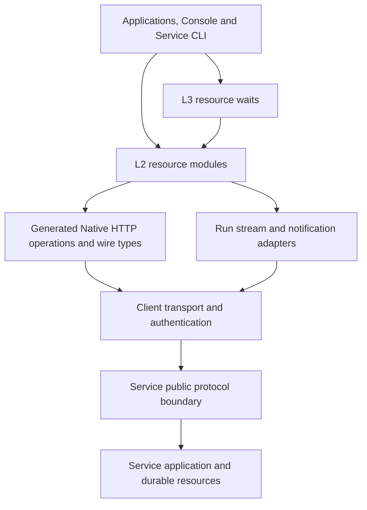
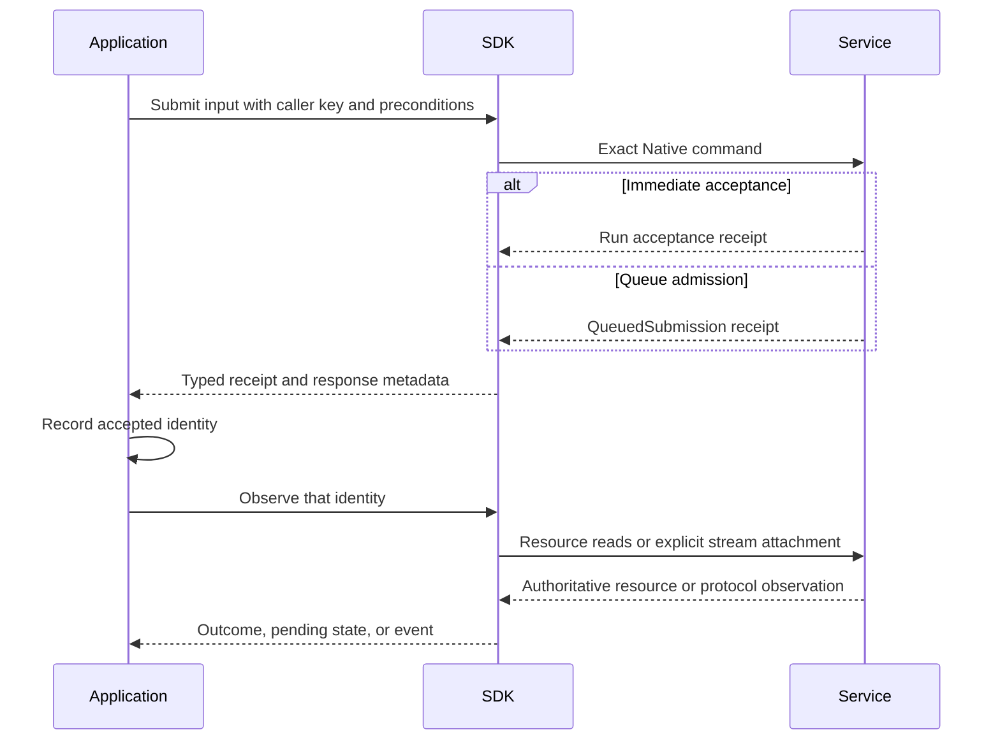

# Service SDK Architecture

## Design Position

The SDKs expose a running Service as language-native resource clients. Python, Go, Rust, and TypeScript share the same resource relationships, command meaning, and recovery boundaries; none is the reference runtime that the others must call. The SDK is not an Agent execution engine, a replacement Service application layer, or a workflow scheduler.

The dominant surface is L2: typed resource queries and explicit commands. L1 supplies the generated HTTP bindings and shared transport/protocol machinery. L3 consists of small, explicitly invoked observation helpers attached to their resource modules. These are responsibilities inside each language package, not three distributions.

## Core Model

| Concept                        | Meaning                                           | Lifetime and authority                                       |
| ------------------------------ | ------------------------------------------------- | ------------------------------------------------------------ |
| Client                         | Connection owner and root operation entry         | Process-local; closes its own network resources              |
| Workspace/Organization binding | A selected collection scope over a Client         | Borrowed transport; selection grants no authority            |
| Resource module                | Typed operations over one Service resource family | Stateless with respect to Service lifecycle                  |
| Resource value                 | A decoded Service representation                  | A snapshot, not an active object or execution controller     |
| Command request                | Explicit user intent and applicable preconditions | Owned by the caller; serialized under the exact operation    |
| Receipt                        | Evidence of what Service accepted or committed    | Returned by Service; not inferred from local progress        |
| Observation attachment         | A Run stream or notification connection           | Local delivery and checkpoint state, not execution ownership |
| Wait                           | Bounded reads of one retained resource identity   | Ends without mutating the observed resource                  |

Managed Agent identity, AgentRevision, Session, Thread, Run, RunAttempt, and QueuedSubmission retain the meanings of the [Service interaction model](../a13n-service/10-agent-interaction-and-execution-model.md). A convenience method does not merge these identities into an SDK task or job.

## Architecture and Dependency Direction

Resource modules use the common request boundary; none owns another connection pool, credential cache, HTTP error hierarchy, or retry policy. A resource module can consume a value produced by another module but does not reimplement that module's Service-side resolution. For example, Agent publication consumes Model and Skill references; it does not discover or provision them implicitly.

The generated low-level API remains available for complete exported HTTP access. Named modules improve discovery and composition while preserving the same request and response types. [Types and Requests](02-types-and-requests.md) owns the generated/handwritten boundary; module files do not duplicate complete wire schemas.

## Module Boundaries

| Module group                      | Primary responsibility                                           | Detailed owner                                   |
| --------------------------------- | ---------------------------------------------------------------- | ------------------------------------------------ |
| Client                            | Transport, authentication, scope binding, request lifetime       | [Client Contract](01-client-contract.md)         |
| Types and requests                | Wire mapping, presence, errors, concurrency evidence, pagination | [Types and Requests](02-types-and-requests.md)   |
| Agents and Models                 | Authoring references, immutable Agent revisions, Model selection | [Agents and Models](03-agents-and-models.md)     |
| Sessions, Threads and Runs        | Invocation, accepted work, outcomes, feedback and control        | [Interaction](04-interaction.md)                 |
| Queued submissions                | Editable delayed intent and consumption observation              | [Queue](05-queued-submissions.md)                |
| Streams and notifications         | Applied progress, attachment recovery, durable reconciliation    | [Observation](06-streams-and-notifications.md)   |
| Environments                      | Provider/template management, logical targets and commands       | [Environments](07-environments.md)               |
| Assets and Skills                 | Binary transfer and managed content publication                  | [Content](08-assets-and-skills.md)               |
| Tools and integrations            | Provider accounts, connections, tools and Memory references      | [Integrations](09-tools-and-integrations.md)     |
| Identity and administration       | Principals, organizations, memberships, grants and API keys      | [Identity](10-identity-and-administration.md)    |
| Hooks and diagnostics             | External delivery configuration, Trace and audit reads           | [Operations](11-hooks-and-diagnostics.md)        |
| Language and client compatibility | Release boundaries, conformance, CLI and standard clients        | [Compatibility](12-compatibility-and-clients.md) |

Each module owns its user-visible composition and failure handling, not the Service resource's implementation. The physical source-file organization is language-specific. The [subsystem index](README.md) is the complete document catalog.

## Main Execution Path

1. The caller constructs a Client and resolves or explicitly selects the authorized Workspace.
2. The Agent module reads a managed Agent; optional authoring and resource provisioning happen as separate operations.
3. The Run module starts work, or the Thread module submits input to an existing Thread.
4. Service returns either Run acceptance or queue admission. The application records that evidence before starting a long wait.
5. A wait reads the exact Run, or first observes the queued submission's consumption. Detailed streaming is a separate observation choice.
6. A waiting outcome exposes pending actions. The application performs its chosen human/tool interaction and explicitly submits feedback, which accepts a successor Run.
7. A completed, failed, or cancelled Run remains readable according to Service retention. Closing the Client releases local resources only.

Acceptance, queue consumption, execution outcome, event delivery, and application processing are independent completion boundaries. The SDK never uses success at one boundary as evidence of another.

## State and Recovery Position

Service owns durable work and application state. The application owns persisted receipt IDs, applied stream checkpoints, pending-action handlers, and deduplication of its external side effects. The SDK owns only live clients, iterators, request cancellation, and attachment-local progress.

A process restart constructs a new Client and reads stored resource identities. It does not recover an unsaved key, callback, tool result, or cursor. Worker replacement within a Run is a Service concern; terminal Run Retry is an explicit new command. There is no SDK database, scheduler, or hidden background interaction loop.

## Boundaries and Trade-offs

The explicit request/receipt model requires a few more calls than an all-in-one Agent runner, but preserves which work was accepted and how to recover it. Small waits remove repeated polling code without assuming approval or tool-execution policy. Resource values remain portable and straightforward to serialize because they contain no transport or callback bindings.

Service owns Native resource semantics and [wire observation](../a13n-service/21-native-streaming-and-notifications.md). Harness owns process-local execution. Standard AG-UI and A2A clients consume their protocols directly. The remote Service CLI composes the Rust SDK and owns no second Service transport or process-management behavior.

## Invariants

1. Every resource operation preserves one public Service operation's meaning and authority boundary.
2. Module scope selection never replaces Service authorization.
3. A receipt is returned before an optional wait and keeps its accepted identity.
4. Closing local delivery never submits an execution command.
5. No module manufactures a Run for queued intent or reopens a sealed Run.
6. Generated types, common transport, and domain modules have one-way dependencies; helpers depend on resource operations.
