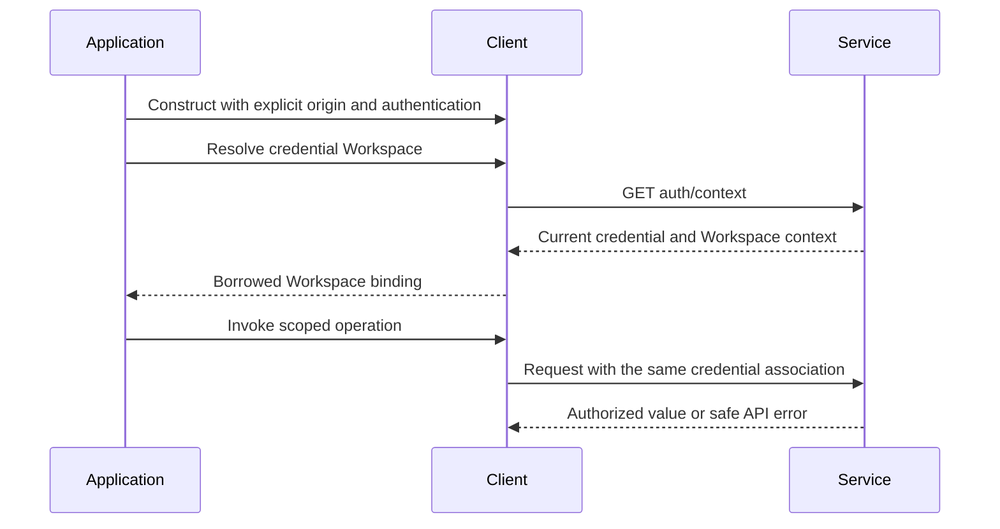

# Client, Authentication, and Transport

## Design Position

A Client owns one Service origin, authentication configuration, and set of pooled HTTP and long-lived protocol transports. It is the shared process-local foundation for all SDK modules. Scope bindings and resource references borrow that foundation instead of creating parallel clients.

[Architecture](00-overview.md) owns the component map. [Types and Requests](02-types-and-requests.md) owns serialization, safe errors, and replay eligibility; [Observation](06-streams-and-notifications.md) owns stream/subscription state. This document owns construction, credential association, dispatch lifetime, cancellation, and shutdown.

## Client Model

The following is a conceptual language-neutral model, not a serialized schema or a required class hierarchy:

```python
class Client:
    service_origin: ServiceOrigin
    authentication: Authentication
    http: GeneratedNativeAPI

    async def workspace() -> WorkspaceClient: ...
    def workspace(selection: WorkspaceIdOrKey) -> WorkspaceClient: ...
    def organization(selection: OrganizationId) -> OrganizationClient: ...
    async def close() -> None: ...
```

Construction records configuration and creates local collaborators. Credential-derived `workspace()` is an explicit asynchronous operation because it reads `/api/v1/auth/context`. Explicit scope selection constructs a binding; it does not claim that the caller can access that scope. The same Client can carry multiple explicit bindings when its authentication permits them.

| Value                    | Owned by                             | Meaning                                                                    |
| ------------------------ | ------------------------------------ | -------------------------------------------------------------------------- |
| Service origin           | Client configuration                 | Public Service endpoint, not an object-store, provider, or Worker endpoint |
| Authentication           | Client's process-local configuration | Supported bearer credentials or browser-session transport configuration    |
| Bound Workspace identity | Workspace binding                    | Stable ID resolved from credential context or explicit selection           |
| Request options          | Caller                               | Deadline, cancellation, and optional correlation for that call             |
| Connection resources     | Client                               | Pools and live response/attachment resources closed by Client shutdown     |
| Resource snapshot        | Caller                               | Last decoded representation; not a cached authorization decision           |

Credential values never enter serialized resource models or normal diagnostics. Configuration does not discover credentials by reading arbitrary project files or falling back between unrelated identities.

## Scope Binding

A resource family's endpoints determine its public entry:

- `workspace.<module>` supplies `/workspaces/{workspace}` collection/configuration scope.
- `organization.<module>` supplies Organization scope where that route exists.
- `client.<module>` supplies ID-addressed operations and public type catalogs without either path prefix.

Thus `workspace.runs.start(...)` and `client.runs.get(run_id)` are different route sets in the same logical Run module. A root-client method does not make its selected resource globally owned. Service resolves actual ownership and authorizes every request.

An API-key caller can resolve its Workspace once from authentication context and then invoke the bound modules without repeatedly supplying that Workspace. Bindings use the resolved stable identity, not a mutable current-Workspace field on Client. Changing credentials to a different principal or Workspace requires a new binding; a stale binding cannot silently switch tenants. Organization/browser callers retain explicit scope selection and low-level paths.

A bound resource reference is optional language ergonomics: it stores Client plus resource identity and forwards methods. It owns no current Run, metadata cache, automatic refresh policy, or private state machine. A decoded resource value itself remains transport-free.

## Authentication Flow



Bearer and browser authentication follow [Service IAM](../a13n-service/33-identity-and-access-management.md). Browser cookie, CSRF, origin, and WebSocket constraints remain those of the public Service boundary; SDK convenience does not put credentials in resource selectors or invent query-string authentication. Languages expose only authentication modes their environment can implement correctly. A failure to authenticate does not trigger a fallback to anonymous or another account.

Session authentication uses the deployment-configured cookie name consistently with Service authentication and CSRF; an adapter does not hard-code the default as a second authority. Changing that deployment setting does not let the SDK migrate or revoke existing server sessions implicitly.

Credential expiration/revocation surfaces through the owning request or attachment. Refresh supplied by an established authentication source preserves the intended identity; neither a successful previous read nor an old subscription acknowledgment bypasses current authorization.

## Request Lifetime

Each call has one logical lifetime covering connection acquisition, dispatch, permitted replay/backoff, response decoding, and cleanup. The caller's total deadline constrains every phase; a transport retry cannot restart the deadline. A binary response or live attachment additionally remains owned until explicitly closed or cancelled.

Generated calls made through Client use its same authentication and pool as named L2 methods. A directly constructed generated client outside this facade has a separately explicit lifetime; it is not a hidden secondary mode of the managed Client. Modules do not allocate a new pool per request.

Independent calls can share a Client within the language transport's supported asynchronous execution context. Scope selection is not mutable per-request global state. The contract does not require sharing one client object across unrelated threads, event loops, or processes where its transport does not support that use.

## Cancellation and Shutdown

| Action                                 | Local effect                                                 | Does not imply                                              |
| -------------------------------------- | ------------------------------------------------------------ | ----------------------------------------------------------- |
| Cancel one request                     | Stop that call's wait/I/O and release its owned response     | The request was not dispatched or the server rolled it back |
| Close a page iterator                  | Stop future page requests                                    | Resource deletion or collection snapshot completion         |
| Close a stream/notification connection | Stop local delivery/reconnect                                | Run interrupt or subscription-resource mutation             |
| Release a scope binding                | Release that borrowed view                                   | Shutdown of sibling bindings or the parent Client           |
| Close Client                           | Stop new dispatch and close its owned live network resources | Cancellation of any accepted Service work                   |

Repeated close is safe. Work racing with shutdown either finishes with its real result or ends with distinguishable local shutdown/cancellation; it is not resubmitted. A closed Client is not reopened implicitly. Caller-owned binary sources remain caller-owned; [Content](08-assets-and-skills.md) defines transfer-specific ownership.

The language surfaces are native: Python async contexts/iterators, Go contexts and explicit Close, Rust futures/streams and shutdown, and TypeScript AsyncIterable/AbortSignal. A synchronous convenience is permitted only when it preserves the same operation and explicit lifetime and does not hide a blocking call inside an async path.

## Failure Semantics

Authentication-context lookup failure yields no successfully resolved binding. An explicit selection can still be constructed locally, but use fails under the normal request contract when unauthorized or absent. The SDK never equates local construction with authorization.

A timeout before known dispatch is distinguishable from uncertainty after possible dispatch when the transport can establish that fact. When it cannot, the SDK reports uncertainty rather than claiming non-execution. Cleanup failure cannot replace an already known command receipt with a fabricated execution outcome. Errors retain the safe correlation available from the request boundary.

## Invariants

1. Scope bindings share the parent's transport and never mutate its credential-to-Workspace association.
2. Resource reads and attachment changes remain subject to current Service authorization.
3. Local shutdown and cancellation never generate Run interrupt, queue deletion, or provider lifecycle commands.
4. Requests do not outlive their caller's total deadline through automatic replay.
5. Secrets are absent from resource representations and ordinary diagnostics.
