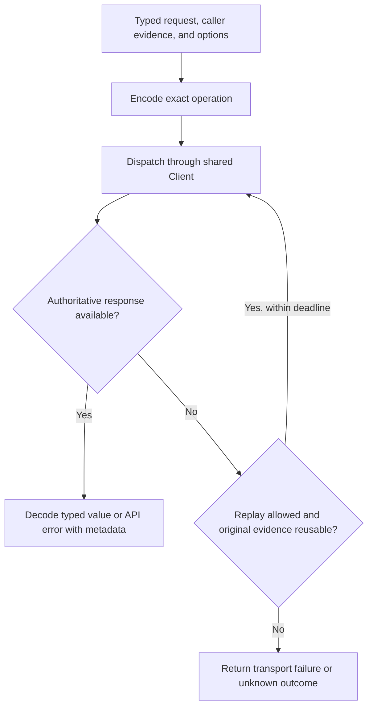

# Public Types, Requests, and Generated Bindings

## Design Position

The SDK exposes one coherent Native operation model through generated HTTP bindings and named resource modules. Service OpenAPI owns the wire contract; the SDK owns language-native access to its values, metadata, and failure evidence. A handwritten facade does not maintain a second complete copy of every request/resource schema.

[API Conventions](../api-conventions.md) and [Data Conventions](../data-conventions.md) own wire presence, versions, concurrency, and compatibility. [Client](01-client-contract.md) owns connection and credential lifetime. Resource modules own the meaning of each command and read; they use this common call contract rather than inventing per-module wrappers or retry rules.

## Public Value Model

| Value family               | Represents                                      | Client responsibility                                                  |
| -------------------------- | ----------------------------------------------- | ---------------------------------------------------------------------- |
| Resource                   | Service's current authorized representation     | Preserve identity, version, nullable state, and additive response data |
| Request                    | Complete input for one operation                | Preserve structured types and exact supplied-field presence            |
| Receipt                    | Commit or acceptance evidence                   | Return the original resource/command identities and outcome branch     |
| Page                       | One bounded collection read                     | Preserve original continuation, ordering, metadata, and scope          |
| API error                  | Service-reported failure of this HTTP operation | Expose stable status/code/details/request ID                           |
| Transport/protocol outcome | Failure or uncertainty in local delivery        | Do not convert it into a Service resource status                       |

The following pseudocode expresses access, not a universal JSON envelope or mandatory class:

```python
class Response[T]:
    data: T
    metadata: ResponseMetadata

class RequestOptions:
    deadline: Deadline | None
    cancellation: Cancellation | None
    request_id: str | None
```

Service returns a resource/receipt directly on the wire. A language may return a response object or a value plus metadata, but successful bodyless responses still preserve status and applicable headers. Safe metadata includes request ID, ETag, and retry guidance; it does not require exposing credential-bearing headers. `RunResource(status="failed")` remains a successfully read resource, not an API exception.

Conceptual pseudocode in module specifications omits only explicitly noted common options. Exact field spelling, required inputs, response branches, header/query/body placement, and media type follow the selected generated operation. Generator-specific input/output suffixes can be normalized without changing their type distinctions.

## Presence and Configuration

Requests preserve three independent states where the operation permits them:

| Caller value                               | Wire meaning | Example consequence                                                                   |
| ------------------------------------------ | ------------ | ------------------------------------------------------------------------------------- |
| Not supplied                               | Field absent | Inherit a Run option or leave mutable metadata unchanged                              |
| Explicit null                              | JSON null    | Clear an optional selection or disable inherited inline Hook attachment               |
| Supplied value, including empty collection | Exact value  | Replace the selected configuration, including clearing a category with an empty array |

A language can use an omission sentinel, option wrapper, builder presence tracking, or equivalent native representation. It cannot use one nullable field that loses omission. Default serialization does not fill omitted configuration from a cached Agent, filter all nulls, or flatten a typed union into arbitrary JSON.

Pure constructors such as text-to-`AgentInput` or an Asset-reference input value are local conveniences. They emit the canonical supported schema and do not upload files, read a resource, validate an external account, or publish configuration implicitly. Credential wrappers reveal data only at the authorized request-serialization boundary; normal diagnostics and resource responses remain redacted/write-only as defined by the owning module.

## Generation Boundary

Service exports one reproducible OpenAPI 3.1 contract without starting Service resources. Operation identity is HTTP method plus normalized path, not a Python handler or generated symbol. Low-level operations and structured wire models derive from that contract in all four languages.

Generated ownership includes HTTP method/path, path and query fields, request/response schemas, success/error status variants, and media types. Handwritten ownership includes shared transport integration, resource naming/grouping, ergonomic local constructors, pagination traversal, and the [stream protocols](06-streams-and-notifications.md). An exported SSE route does not generate correct replay or notification state handling.

A named method is traceable to its generated operation. It reuses the same serializer/transport rather than constructing another HTTP request independently. Unconstrained JSON remains JSON; known structured fields, discriminators, and unions remain typed. Re-exporting a generated model is preferable to copying it into a facade model that can drift.

Service contracts and exported operations must agree before an SDK claims conformance for that operation. A mismatch is resolved by the owning Service contract/implementation, not by a language-specific translation, an invented endpoint, or a widened success union. This document does not treat observed implementation behavior as authority to redefine Service semantics.

## Mutation Evidence

Concurrency and replay answer different questions. The SDK exposes both where the operation requires them:

- Required `Idempotency-Key` is a required caller argument; it is not hidden in optional generic request options.
- Strong representation concurrency is an explicit `if_match` value associated with the read representation.
- Versioned command preconditions remain in the generated body/query, including independently qualified Thread, Run, and queue versions.
- No concurrency token is added to an operation whose owning contract does not need one.

The SDK sends the caller's evidence unchanged. A `409` or `412` does not trigger a reread-and-overwrite loop. The application decides whether newer state represents the same intended command and whether to submit a new operation. Lost acknowledgment instead preserves the original key, canonical request, field presence, and target under the server's retained replay rules.

## Request and Replay Flow



Replay is limited to bounded reads permitted by their owner, explicit observation reconnect, and commands whose owning contract permits the same key and canonical request to replay. Binary source repeatability is an additional requirement, not inferred from the existence of a key. Safe `Retry-After` is honored within the caller's total deadline. Terminal Run Retry is never the retry engine's recovery action.

## Error Model

| Failure                                | Exposed evidence                                           | Caller action boundary                                                  |
| -------------------------------------- | ---------------------------------------------------------- | ----------------------------------------------------------------------- |
| API rejection                          | HTTP status, stable code, safe message/details, request ID | Act on the owning error; no assumed durable mutation                    |
| Transport loss after possible dispatch | Original target/key association and uncertainty            | Replay only with authoritative eligibility or reconcile a known receipt |
| Decode/protocol failure                | Bounded failure and correlation                            | Do not reinterpret bytes or resource outcome to make the call succeed   |
| Replay gap                             | Protocol-specific gap and available recovery information   | Rebuild from the owning resource/event API                              |
| Cancellation/deadline                  | Selected operation identity and last known evidence        | Stop local work; do not infer rollback                                  |

Stable subclasses/enums distinguish actionable categories, not every server message. Unknown response fields and enum values follow the additive compatibility contract. A control helper that cannot interpret an unknown state stops explicitly; the decoder does not map it to a familiar state.

## Collection Traversal

A list operation returns the owning collection schema. An optional iterator requests further pages with the exact scope, query, and opaque continuation. It does not sort already returned pages into a new global order, compute a total, cache a snapshot, or restart after a scope/filter change.

Cursor pagination, queue state/limit reads, bounded complete catalogs, resource lifecycle sequences, and provider-backed Trace continuations have distinct contracts. Only cursor-paged resources gain ordinary next-page iteration. A failed page is visible and closes or suspends traversal according to the caller's explicit control; already returned values are not reported as a complete collection.

A page cursor is not a durable application checkpoint. Processing acknowledgment for lifecycle events and Run streams belongs to [Observation](06-streams-and-notifications.md), not to generic pagination.

## Invariants

1. Named operations and low-level bindings use the same wire model and transport.
2. Omission, null, and empty values are never silently collapsed.
3. Requests carry the caller's original replay and concurrency evidence.
4. HTTP acceptance, resource outcome, and local delivery failure stay distinguishable.
5. A generated operation or successful format check alone does not prove cross-language behavioral conformance.
