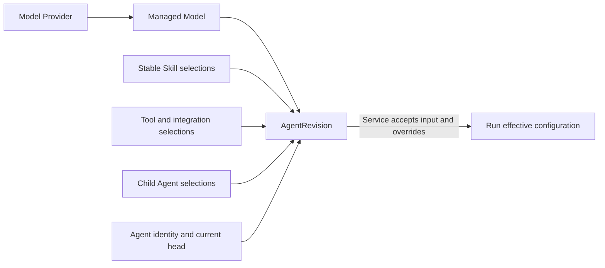

# Agents and Models

## Design Position

This module group exposes the authoring side of hosted execution: managed Agents and immutable AgentRevisions, managed Models and Model Providers, and the typed selections used when accepting work. It separates configuration publication from resource administration and execution acceptance.

[Service Agents](../a13n-service/28-agent-management.md) and [Service Models](../a13n-service/30-model-management.md) own resource semantics. [Content](08-assets-and-skills.md), [Integrations](09-tools-and-integrations.md), and [Environments](07-environments.md) own referenced resources. The SDK does not build a local Harness Agent, resolve a complete execution graph, or validate external credentials during an ordinary Agent save.

## Configuration Model



| Object               | Retained meaning                                                     | Client must not conflate                                   |
| -------------------- | -------------------------------------------------------------------- | ---------------------------------------------------------- |
| Agent                | Workspace identity, metadata, lifecycle and current revision pointer | Mutable draft configuration                                |
| AgentRevision        | Immutable authored configuration and resolved stable bindings        | Every mutable dependency value at execution time           |
| AgentRunOverride     | Typed differences for one accepted Run                               | Persistent Agent editing or arbitrary recursive JSON merge |
| EffectiveAgentConfig | Exact Service-owned accepted execution configuration                 | A client-generated cache of current dependencies           |
| ModelProvider        | Scoped connection/configuration and write-only credentials           | A Model identity or Model version                          |
| Model                | Managed upstream/API/default selection under one Provider            | An immutable ModelRevision resource                        |
| Catalog/candidate    | Available type/API metadata or discovery suggestion                  | A saved Model or successful test result                    |

Agent metadata and lifecycle can change independently from its authored revision version. Model and ModelProvider mutable settings use their own representation concurrency. There is no universal configuration-version axis spanning them.

## Public Modules and Scope

`workspace.agents` owns Agent collection/item operations and the Agent-scoped revision publication/list/restore/duplicate/lifecycle routes. `client.agent_revisions` reads an exact retained revision. A lookup by key is a Service-supported locator; the returned stable Agent ID is distinct from that mutable lookup key.

`workspace.models`, `organization.models`, and the corresponding `model_providers` modules expose their scoped operations. Global type/base-model catalogs remain read-only entries. Workspace visibility of an Organization resource does not let a Workspace mutation update the parent resource; callers use the authorized owning scope.

Pseudocode illustrates the primary boundaries, using generated request/result types:

```python
workspace.agents.create(CreateAgentRequest, idempotency_key) -> Response[AgentRevisionCreateResult]
workspace.agents.get(agent_id_or_key) -> Response[Agent]
workspace.agents.revisions.create(agent_id_or_key, CreateAgentRevisionRequest,
                                  idempotency_key) -> Response[AgentRevisionCreateResult]
client.agent_revisions.get(agent_revision_id) -> Response[AgentRevision]
```

Other module operations are named for their actual command: metadata update, revision restore, duplicate, enable, disable, archive, unarchive, Model test, Provider test, and discovery. They are not flags on one universal save call. Full exact request types, headers and result branches follow [Types and Requests](02-types-and-requests.md).

## Agent Authoring Flow

1. The caller reads or provisions the managed dependencies it intends to select.
2. It submits complete Agent configuration to create the Agent and first revision, or publishes a replacement under the current Agent version.
3. Service resolves and validates the configuration, then returns the actual Agent/revision publication result.
4. The caller records that result independently from any later invocation.
5. The Run module accepts input with either the current revision policy or an exact revision selector and optional separate current-pointer precondition.

A semantically unchanged publication can return the existing current revision; the SDK does not assume every successful create-revision call increments version. Restoring historical content is a publication action validated against current conditions, not direct assignment of `current_revision_id` to an old record. Failed publication does not create a successful local draft or advance a cached head.

| Change                   | Client evidence                   | Result boundary                                   |
| ------------------------ | --------------------------------- | ------------------------------------------------- |
| Create/duplicate Agent   | Caller idempotency key            | Stable identity and initial revision result       |
| Publish/restore revision | Required version evidence and key | Validated revision publication result             |
| Metadata/avatar change   | Strong If-Match                   | Mutable representation, not new authored revision |
| Lifecycle command        | Applicable If-Match and key       | Lifecycle state, not a Run interrupt              |

The exact evidence for each operation remains generated. The SDK does not auto-disable before archive, enable after unarchive, or cancel Runs after disable. It returns Service eligibility errors so the caller chooses the separate operation explicitly.

## Model Provisioning and Testing

Model type metadata describes supported calling APIs and configuration. A caller can save a Provider, explicitly test or discover candidates, then save/test a Model. Discovery results are suggestions, not automatically persisted catalog revisions. Bounded complete discovery results do not gain an invented pagination cursor.

Provider save, Provider connectivity test, model discovery, Model save, and Model test are distinct results. Test `success=false`, unsupported discovery, and transport/API failure remain distinguishable. A later failed test does not roll back an earlier saved resource. Tests/discovery that consume external quota or have no replay evidence are not automatically retried after uncertainty.

A Model's Provider identity is stable; changing targets follows the Service's resource rules, not a client fallback. Mutable Model/default/configuration patches preserve ETags and do not create ModelRevision objects. There is no automatic alternate Model, Provider or calling-API selection when the chosen one fails.

## Resolution and Invocation Time

Agent revision publication freezes the selections that its owning contract defines. Run acceptance subsequently freezes effective Model settings, exact Skill locks and execution configuration. Current Provider credentials and lifecycle eligibility remain subject to Service's runtime checks. The SDK does not flatten those different times into an all-inclusive immutable client snapshot.

Agent input types preserve distinct configuration families: builtin keyed Toolsets, external connection-tool selections, managed Skill references, child configuration, plugins, output contracts and Memory selection. Overrides keep each field's own replacement/inheritance/null rules; there is no generic deep-merge algorithm. Unsupported Toolsets, permissions, provider capabilities or child references are not dropped to make publication succeed.

Environment is an invocation selection outside Agent execution configuration; mutable Agent default-template metadata seeds new Thread selection only. Local file paths, callables and embedded credentials cannot be smuggled into a managed Agent through convenience constructors.

## Failure Semantics

| Failure                                           | Client-visible outcome                       | Not an allowed recovery                                 |
| ------------------------------------------------- | -------------------------------------------- | ------------------------------------------------------- |
| Agent version or metadata conflict                | Specific safe conflict and original evidence | Reread and overwrite without caller decision            |
| Historical revision unavailable/ineligible        | Revision-specific failure                    | Fall back to current revision                           |
| Dependency validation fails                       | No successful publication result             | Save a partially resolved revision locally              |
| Test/discovery fails                              | Separate test result or request error        | Delete saved resources or switch providers              |
| Invocation rejected after earlier successful save | Run acceptance error                         | Treat configuration publication as invocation authority |

## Invariants

1. Agent publication, metadata mutation, Model mutation, and Run acceptance retain separate version/completion boundaries.
2. Revision restore does not rewrite history or bypass current validation.
3. Effective execution configuration is resolved by Service, not synthesized by the SDK.
4. Tests and discovery never silently persist or roll back resources.
5. Typed configuration families retain their own presence and replacement rules.
