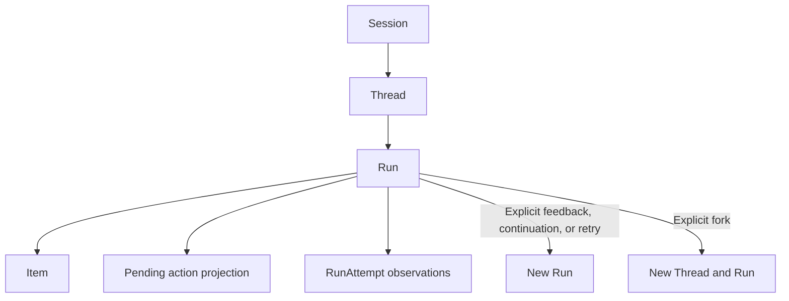
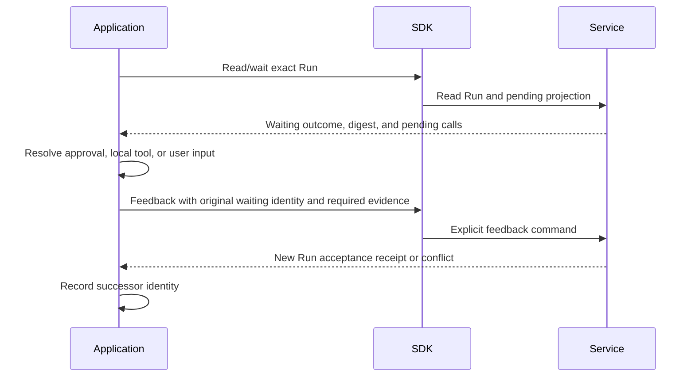

# Sessions, Threads, and Runs

## Design Position

The interaction module exposes hosted work as Service resources rather than a local Agent object with hidden execution. It owns Session/Thread discovery, Run submission and reads, explicit continuation/control, and the bounded `runs.wait` helper. Service remains the authority for acceptance, configuration inheritance, scheduling, and outcome.

[Service Interaction](../a13n-service/10-agent-interaction-and-execution-model.md), [Thread Persistence](../a13n-service/11-thread-persistence.md), and [Input and Continuation](../a13n-service/18-agent-control-input-and-continuation.md) own the domain. [Queue](05-queued-submissions.md) owns the SDK's delayed-intent branch; [Observation](06-streams-and-notifications.md) owns delivery attachments. No callback registration or automatic tool runner is part of these resources.

## Resource Model



| Value              | Client-facing meaning                                                                   | Not equivalent to                                             |
| ------------------ | --------------------------------------------------------------------------------------- | ------------------------------------------------------------- |
| Session            | Service-owned grouping for authorized interaction discovery                             | A local chat history or separately allocated SDK session      |
| Thread             | Persistent advancing history with current/head references and independent queue version | The latest Run or a permanently fixed execution configuration |
| Run                | One accepted unit of hosted work with stable identity and outcome                       | An HTTP attempt, waiting helper, or entire conversation       |
| RunAttempt         | Service execution-generation observation within a Run                                   | A command the SDK can restart or schedule                     |
| Item               | Retained interaction content in the owning Run view                                     | Proof that every token/event was delivered                    |
| Pending action     | Authorized projection of a waiting Run's required resolutions                           | An independent mutable task resource                          |
| Acceptance receipt | Exact Session/Thread/Run identity accepted by Service                                   | Execution completion or output                                |

Resource responses are snapshots. `current_run_id` and `head_run_id` retain their different Service meanings; the SDK does not use either as a substitute for a previously accepted Run ID. A Thread's Environment default can change between accepted Runs, while each accepted Run fixes its own selection under [Environments](07-environments.md).

## Module Surface

| Entry                 | Operations and role                                                                             |
| --------------------- | ----------------------------------------------------------------------------------------------- |
| `workspace.sessions`  | Authorized Session listing and supported filters                                                |
| `client.sessions`     | Thread collection and Session label operations                                                  |
| `workspace.threads`   | Empty Thread creation with optional Service-owned Session selection                             |
| `client.threads`      | Thread read, Run collection, label operations, input submission                                 |
| `workspace.runs`      | Root Run start and Workspace Run listing                                                        |
| `client.runs`         | Exact reads, Items, pending actions, lineage, attempts, labels, controls, observations and wait |
| `client.run_attempts` | Exported RunAttempt reads and lifecycle events only                                             |

There is no invented Session create/get operation or generic pending-action resolve endpoint. Read collections retain their full operation-specific queries. RunAttempt reads do not expose Worker private interfaces or execution authority.

The principal submission interfaces use the common [request contract](02-types-and-requests.md):

```python
workspace.threads.create(CreateThreadRequest, idempotency_key) -> Response[Thread]
workspace.runs.start(StartRunRequest, idempotency_key) -> Response[RunAcceptanceReceipt]
client.threads.submit(thread_id, ThreadRunSubmissionRequest,
                      idempotency_key) -> Response[ThreadRunSubmissionReceipt]
client.runs.get(run_id) -> Response[RunResource]
```

The pseudocode names generated request types, not a reduced field set. Agent selectors, exact revision/current-revision preconditions, typed overrides, Environment presence, Hook presence, labels, and AgentInput remain expressible.

## Start and Subsequent Input

`runs.start` atomically accepts the root Thread and first Run. `threads.create` creates no Run and is useful when the caller needs a retained Thread/Environment selection before input. An Agent supplied during empty-Thread creation does not become an implicit invocation binding; the first Thread submission still supplies the required Agent selector.

The caller supplies an operation key, receives acceptance evidence, and records it before optionally waiting. The SDK does not block the start/submit HTTP call until execution finishes. It also does not upload inputs, create Agents, or provision providers implicitly.

For an existing Thread, `threads.submit` sends the observed `expected_thread_version` and complete intent. Service decides immediately accepted versus queued under its authoritative admission rules. The SDK does not first query busy state and then choose a different route. A version conflict is returned without substituting a newer version. Queue-only admission and immediate Run acceptance have different effects on Thread version; the client preserves the returned queue generation and outcome branch.

## Continuation and Control

| Operation                    | Principal input/evidence                                                       | Returned fact                                          |
| ---------------------------- | ------------------------------------------------------------------------------ | ------------------------------------------------------ |
| Thread submit                | AgentInput, Thread version, options, key                                       | New Run acceptance or queue admission                  |
| Continue from historical Run | Selected source Run, full continuation request, key                            | A new Run on the selected Thread lineage               |
| Feedback                     | Waiting Run, sealed-state digest, Thread version, complete resolutions, key    | A successor Run, not a reopened source                 |
| Waiting Continue             | Thread submission's explicit `waiting_resolution` branch and required evidence | A successor using Service default-resolution semantics |
| Fork                         | Selected source Run, full fork request, key                                    | A new Thread and Run                                   |
| Terminal Retry               | Failed/cancelled source, required Thread evidence, key                         | A new Run with Service retry lineage                   |
| Steer                        | Selected Run, AgentInput, key                                                  | Steer receipt and separately queryable delivery status |
| Interrupt                    | Selected Run, exact interrupt request, key                                     | Interrupt receipt with its own completion meaning      |

The SDK uses the exported command names and types; interrupt is not renamed into an operation that implies arbitrary external work was stopped. Steer is not another Run submission. The user-visible Run controls do not accept RunAttempt IDs.

For successors, omitted inline Hook configuration inherits according to Service, null opts out, and a supplied object replaces. The SDK never reads and copies a mutable Hook subscription to emulate inheritance. [Hooks](11-hooks-and-diagnostics.md) owns the client-facing delivery model; the Service owns precise successor inheritance.

## Explicit Pending-Action Flow



The application owns local handlers, approval policy, external tool side effects, and persistence of resolutions. The SDK validates/serializes the canonical feedback type but does not execute local callables because it observed a pending event. If feedback conflicts, the application reconciles Service state; the SDK does not rerun a tool or move the result to a different waiting Run.

Partial pending resolution, default resolution, and state-digest validity follow the owning Service request, not per-language helper policy. Waiting Continue is explicit even when the user supplies new text. Child Agent work remains ordinary authorized Thread/Run discovery and feedback; there is no recursive client-side Agent engine.

## Run Outcome and Read-Only Wait

```python
client.runs.wait(run_id, options: WaitOptions) -> Response[RunResource]
```

A wait immediately reads the selected Run, then performs bounded reads while its state is `accepted` or `running`. It returns that same resource at `waiting`, `completed`, `failed`, or `cancelled`. It neither resolves waiting actions nor follows a successor. Run output, output_text, failure, and pending remain Service values, not a new success-only Result schema.

`WaitOptions` carries an overall deadline, optional cancellation, and a positive poll interval bounded by remaining time. Notifications can wake a read but are not required for correctness. SSE close alone is not an outcome. The helper returns an unknown-state/protocol outcome if an additive state cannot be interpreted rather than mapping it to completion or waiting forever.

Timeout/cancellation reports the selected identity and any last observed resource without changing Service work. Missing/concealed resources, lost access, non-retryable API errors, and decode failure remain distinguishable. A failed Run is returned as a resource; it is not automatically retried or raised as an HTTP failure. A text accessor cannot turn absent output into a successful empty string.

## Failure and Recovery

| Situation                                   | SDK behavior                                                        | Recovery owner                                               |
| ------------------------------------------- | ------------------------------------------------------------------- | ------------------------------------------------------------ |
| Lost submission response                    | Preserve original key/intent association; use only permitted replay | Application and Service idempotency evidence                 |
| Stale Thread/digest/revision                | Return the owning conflict                                          | Application decides whether newer state still matches intent |
| Waiting feedback accepted but response lost | Replay the same feedback, not execute its local tool again          | Application persists tool effects and original evidence      |
| Process restart                             | Construct Client and read stored receipt IDs                        | Application restores handlers and checkpoints                |
| Run replaced internally by later attempt    | Keep observing the same Run                                         | Service owns attempt scheduling                              |
| Stream loss or replay gap                   | Handle through observation contract                                 | Application may reconcile Run/Item/pending reads             |

## Invariants

1. Root start, empty Thread creation, and Thread input submission have distinct outcomes.
2. Queue admission never manufactures a Run ID.
3. Feedback, Fork, and terminal Retry preserve new-resource identities and source lineage.
4. Pending-action observation never invokes application code automatically.
5. Wait stops on the selected Run's sealed outcome and never submits another command.
