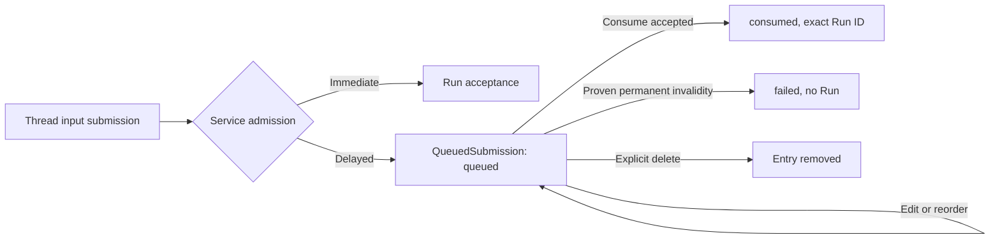

# Queued Submissions

## Design Position

The queue module represents editable intent that Service admitted before it could accept a Run. It exposes queue reads and explicit mutations, and a small wait for consumption or permanent failure. It is not a client-side scheduler, preallocated Run, or automatic busy-state workaround.

[Service Queued Submissions](../a13n-service/20-agent-control-queued-submissions.md) owns admission, ordering, authority, consumption and failure classification. [Interaction](04-interaction.md) owns the Thread submission that produces queue admission. [Types and Requests](02-types-and-requests.md) owns how each exported mutation carries its exact request and response.

## Queue Model

| Concept             | Meaning                                                    | Changes independently from                      |
| ------------------- | ---------------------------------------------------------- | ----------------------------------------------- |
| QueuedSubmission ID | Exact retained delayed intent                              | Any eventual Run ID                             |
| Submitted intent    | Full Agent input/configuration/options awaiting acceptance | Command-time Thread version                     |
| Entry version       | Concurrency for one editable entry                         | Thread advancement and whole-queue version      |
| Queue version       | Concurrency for order and membership                       | Thread version                                  |
| Position            | Current order among queued entries                         | Stable identity or historical rank              |
| Consumed Run ID     | Exact Run created by consumption                           | Thread current/latest Run                       |
| Failure evidence    | Permanent invalidity established by Service                | Transient delivery error or recoverable blocker |

The queue resource retains its original authority principal. A client editing an entry does not choose a replacement identity on whose behalf the later Run executes. Delete/reorder/consume authorization remains with Service and does not change the stored intent's authority.



The diagram summarizes client-visible outcomes, not a second owner of the Service state machine. Transient failure and recoverable blockers leave intent queued. Deletion introduces no cancelled Run or fabricated queue tombstone.

## Module Surface

`client.queued_submissions` owns exact ID reads/edits/deletion and Thread-scoped list/reorder/consume operations. Its logical inputs are:

| Operation | Selection and evidence                                    | Result to preserve                                                |
| --------- | --------------------------------------------------------- | ----------------------------------------------------------------- |
| List      | Thread, explicit state and bounded limit                  | Original Service order and queue collection metadata              |
| Get       | QueuedSubmission ID                                       | Exact retained state/version/consumed identity                    |
| Update    | Entry ID, expected entry version, replacement intent, key | Mutation response and updated queue generation                    |
| Delete    | Entry ID, expected entry version, key                     | Exported delete status/body; no invented terminal queue state     |
| Reorder   | Thread, expected queue version, exact ordered set, key    | Resulting queue generation                                        |
| Consume   | Thread, expected Thread and queue versions, key           | Run acceptance or submission failure branch                       |
| Wait      | Entry ID and bounded wait options                         | Retained consumed/failed resource or distinguishable read failure |

The table is a conceptual operation contract, not a wire declaration. Header/query/body placement and response media/status are taken from the corresponding exported operation. Accepted Service and OpenAPI disagreement is not resolved by a language-specific delete adapter; [Types and Requests](02-types-and-requests.md#generation-boundary) owns the conformance rule.

List is a state/limit collection, not cursor pagination. An SDK cannot promise complete queue history through an invented next-page cursor or treat current position as a stable resume token.

## Admission and Editing

A Thread submission contains a complete intent and its immediate `expected_thread_version`. On queue admission, the SDK preserves the returned queued identity and queue generation, not a delayed claim that the same Thread version will be used later. The application can record the receipt and use the queue module without holding a local Thread handle alive.

An edit replaces the complete retained intent under its entry version. The SDK does not implement a JSON merge over a cached entry or fill omitted fields from a previous Agent snapshot. Reorder submits the entire intended order and observed queue version; a concurrent membership change is a conflict, not permission to drop unfamiliar entries.

The queue owns relative order. Explicit consume asks Service to select the first eligible queued entry under the owning rules, not to execute an arbitrary queue ID. Choosing another queued entry requires a separate authorized reorder. No helper performs those mutations implicitly.

## Consumption and Resolution Time

Queue acceptance records intent, not execution configuration. Omitted Environment and then-current revision choices are resolved by Service at consumption according to their domain rules. The SDK must not eagerly freeze those choices by reading and copying them at enqueue time. Exact selectors remain exact.

Consumption has independent outcomes:

- Run accepted: the queue resource becomes consumed and names that exact Run.
- Permanent intent invalidity: the queue resource becomes failed with bounded evidence and no Run.
- Recoverable blocker: the same entry remains queued and can become eligible later.
- Transient error/control race: no queue failure is inferred from transport or preparation failure.

The application follows `consumed_run_id`, even if the Thread has already advanced again by the time it observes the consumed entry. Reading Thread.current_run_id to guess the consumed work is incorrect.

## Read-Only Wait and Composition

```python
queued = (await client.queued_submissions.wait(queued_id, wait_options)).data
if queued.state == "consumed":
    run = (await client.runs.wait(queued.consumed_run_id, wait_options)).data
else:
    handle_queue_failure(queued.failure)
```

`queued_submissions.wait` immediately reads and continues only while state is queued. It returns the retained consumed/failed resource, never directly a Run outcome. It uses an overall deadline, optional cancellation, and positive bounded polling interval. It performs no update, reorder, delete, consume, or successor traversal.

A missing/inaccessible entry ends with the owning read error; it does not prove cancellation or successful deletion. Timeout can indicate a still-blocked queued entry and is not permanent-invalidity evidence. Unknown additive states stop explicitly rather than being guessed. Original queue identity and last observed state remain available on local timeout/cancellation.

## Failure and Recovery

Losing a mutation response preserves the original entry/Thread target, key, preconditions and replacement/order data for permitted reconciliation. The SDK does not generate a new key or silently reread a current version to repeat a logically different edit. A received queue generation describes that commit, not a lock over subsequent callers.

If the process restarts, the stored queue ID is sufficient to resume authorized observation. Unrecorded original intent/key cannot be reconstructed from a different queue entry or from the Thread's latest Run. The application handles external deduplication before sending new input.

## Invariants

1. Entry, queue, and Thread concurrency axes remain distinct.
2. Queue-only observation and waiting never mutate admission or order.
3. Only authoritative permanent invalidity is returned as queue failure.
4. Consumed identity comes from the selected queue resource, not latest-Run inference.
5. Deletion does not create a second durable cancellation model.
