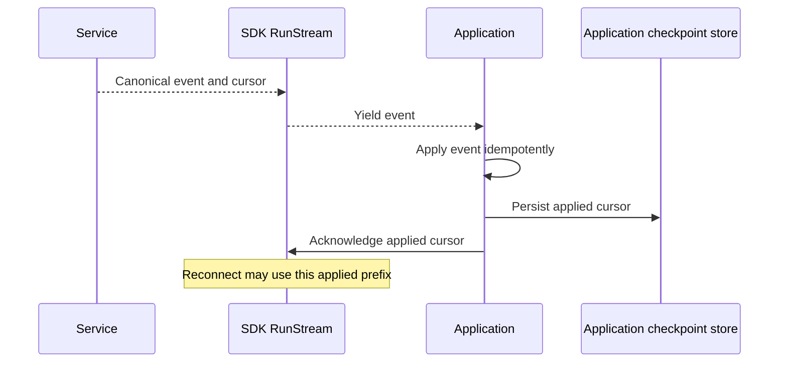

# Streams, Notifications, and Reconciliation

## Design Position

The observation module makes Service delivery protocols usable without changing their replay or authority guarantees. It exposes detailed Run SSE, durable Workspace/resource lifecycle reads, and best-effort notification WebSockets as distinct interfaces. It owns attachment-local processing progress and reconnection; it does not own Run execution or an application projection database.

[Native Streaming and Notifications](../a13n-service/21-native-streaming-and-notifications.md) owns the wire formats, cursor domains, subscription semantics, retention and replay errors. [Client](01-client-contract.md) owns authentication/connection lifetime. [Interaction](04-interaction.md) and [Hooks](11-hooks-and-diagnostics.md) consume observation but do not redefine its protocol.

## Observation Model

| Surface                        | Data and order                                       | Continuation                                                | Authority                                              |
| ------------------------------ | ---------------------------------------------------- | ----------------------------------------------------------- | ------------------------------------------------------ |
| Run SSE                        | Detailed observations for one Run                    | Opaque Run stream cursor                                    | Retained/live Run stream, not every application effect |
| Workspace lifecycle collection | Durable Workspace lifecycle facts                    | Workspace event cursor                                      | Service lifecycle event collection                     |
| Resource lifecycle collection  | Contiguous lifecycle sequence for one Run/RunAttempt | Numeric resource sequence and retained floor/high watermark | That resource's event collection                       |
| Notifications                  | Lightweight resource-change wake-ups                 | No durable replay cursor                                    | Current authorized subscription; wake-up only          |

Run cursors, Workspace cursors, resource sequence numbers, and notification IDs are not interchangeable strings. There is no combined Workspace token stream, Organization notification subscription, tree-wide cursor, or detailed Run WebSocket protocol.

## Public Entries and Local Objects

`client.runs.stream(run_id, after, options)` opens one Run attachment. `workspace.events.list(...)`, `client.runs.events(...)`, and `client.run_attempts.events(...)` expose their owned durable collections. `client.notifications.connect(options)` opens a connection whose explicit subscribe/unsubscribe calls return correlated acknowledgments.

```python
# Conceptual local model, not a replacement wire event schema.
class RunStream:
    run_id: RunId
    received_cursor: RunStreamCursor | None
    applied_cursor: RunStreamCursor | None
    def ack(cursor: RunStreamCursor) -> None: ...
    def events() -> AsyncIterator[RunEvent]: ...
    async def close() -> None: ...
```

A language can supply an applied-cursor callback instead of an `ack` method. Local connection-state observations are distinguishable from Service event/notification frames. Stream options carry cancellation/deadline and bounded attachment policy; they contain no execution continuation or tool-handler policy.

## Run Attachment and Applied Progress

The caller supplies its last fully applied checkpoint, or no checkpoint. The SDK authenticates, opens `GET /runs/{run_id}/stream`, validates the protocol, and decodes complete canonical SSE frames in order. Each exposed event preserves its type, Run correlation, parsed payload, identity and received cursor.

Receiving, decoding, buffering or yielding an event is not application processing. Acknowledgment advances only through a delivered, contiguously applied prefix of the selected Run stream. It cannot acknowledge unseen events, jump over an earlier unapplied event, or switch Run identity. The SDK does not compare opaque cursors lexically to invent ordering. Acknowledgment is local; it is not an HTTP write or durable checkpoint.



If the application crashes after applying but before recording progress, recovery may redeliver the event. Durable exactly-once application effects are outside SDK ownership. A caller that pauses consumption does not authorize advancing its checkpoint. SDK buffering is bounded; if delivery cannot continue within bounds, the attachment fails visibly rather than silently dropping events or growing without bound. Reattachment uses known applied progress and remains subject to retention.

## Reconnect and Replay Gap

On an eligible transport disconnect, reconnect uses `Last-Event-ID` with the last fully applied cursor, the same Run, bounded backoff, safe retry guidance and remaining caller deadline. Authentication, authorization, protocol/schema, or replay-gap errors stop automatic reconnect. Local close also stops reconnect and never interrupts the Run.

Service can reject attachment with a replay-gap error before SSE starts or terminate an open attachment with its canonical gap observation. Both become an explicit typed gap. A protocol control frame without a replay-advancing ID does not advance the application cursor.

The application reconciles current Run, Items and pending actions. That rebuild can restore current presentation but does not establish a complete missing event history. Stream end alone does not prove completion; an authoritative Run read or its valid final outcome projection supplies that fact. Observing a waiting outcome does not auto-submit feedback.

## Notification Subscription Model

A new connection negotiates the exact Service subprotocol and begins with no subscriptions. Each selected subscription contains its client-chosen identity, thread/workspace scope, resource ID and allowed topic selection. The SDK maintains caller-desired subscription intent separately from what the current connection acknowledged.

Subscribe/unsubscribe requests correlate responses by request ID. An atomic rejected change leaves the prior acknowledged set intact. Local enqueue or successful socket write is not subscription acceptance. Reconnect replays only caller-selected subscriptions; it does not broaden to all resources or retain a previously allowed subscription as current authorization.

If a connection is lost while a subscription change is unacknowledged, its old-connection outcome is unknown. The new connection starts empty, reestablishes the caller's explicit desired set, and obtains fresh acknowledgment. This does not replay missed product notifications. The SDK reports an observation gap and keeps connection-state messages separate from resource updates.

A notification is a reason to reread, not a patch that authoritatively sets resource status or version. Unknown frame structure follows the strict negotiated protocol; an additive topic is tolerated only where that profile allows it. The SDK does not turn protocol tolerance into generic acceptance of arbitrary frames.

## Durable Reconciliation

For Workspace recovery, the caller reads lifecycle pages from its applied Workspace checkpoint with the same authorized scope and filters. For a Run or RunAttempt resource, it reads events after the last applied `resource_seq`, following returned sequence progress through its chosen target or the observed high watermark.

Generic next-page iteration does not imply that the application has applied the events. A consumer can ignore an event's business payload but still must advance its sequence consistently before declaring a gap recovered. Hook-name selection does not filter out required intermediate lifecycle events from resource recovery.

A cursor below retention yields the owning replay-gap error. The caller may rebuild from current resource state and record that complete history was unavailable; the SDK does not manufacture missing events. Concurrent new events can arrive during catch-up, so a finite recovery pass uses its explicit target/high watermark rather than claiming the system is permanently caught up.

## Failure Semantics

| Failure                           | SDK outcome                                    | Recovery boundary                                                 |
| --------------------------------- | ---------------------------------------------- | ----------------------------------------------------------------- |
| Temporary disconnect              | Bounded reconnect from applied progress        | May redeliver received but unapplied events                       |
| Authentication/authorization loss | Stop attachment or subscription change         | Requires current caller authority, not old acknowledgment         |
| Invalid event/frame               | Protocol error                                 | No silent payload reinterpretation                                |
| Retention gap                     | Typed replay gap                               | Application rebuilds current state and records incomplete history |
| Notification disconnect           | Observation-gap signal and fresh subscriptions | Durable event/resource reads, not notification replay             |
| Consumer close/deadline           | Release local delivery                         | No execution or resource mutation                                 |

## Invariants

1. Applied progress is never advanced by receive/yield alone.
2. Each continuation value remains tied to its own resource/protocol.
3. Notifications never become durable lifecycle facts.
4. Subscription acknowledgment is distinct from request dispatch and old-connection state.
5. Replay gaps and bounded-buffer failures cannot be hidden by silent dropping.
6. Closing an observer never grants or exercises execution-control authority.
