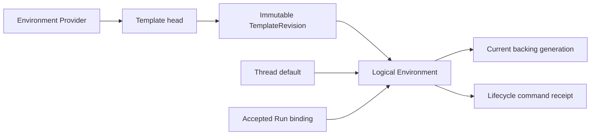
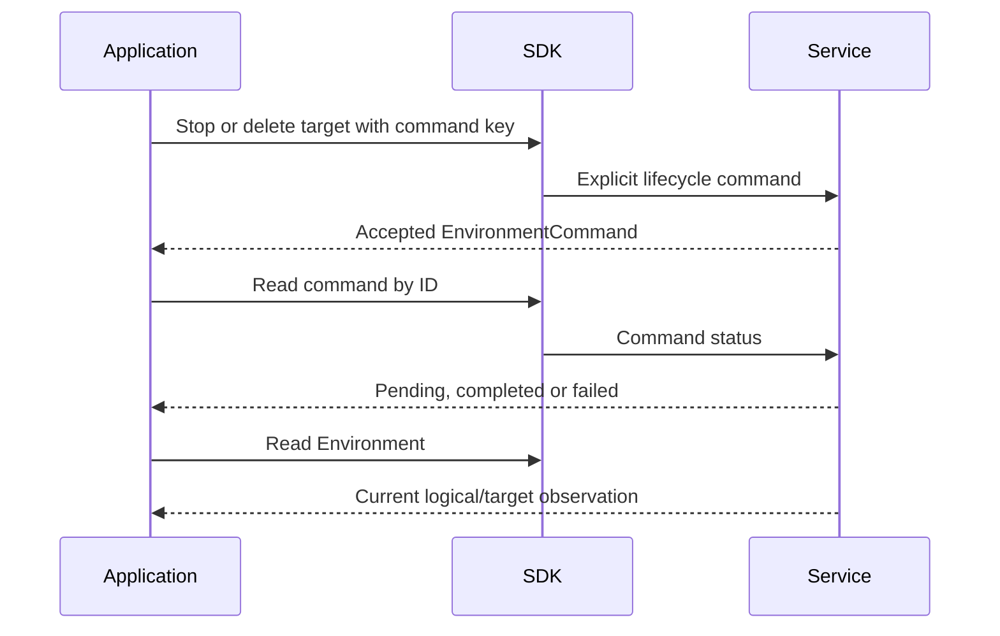

# Environment Management and Selection

## Design Position

The Environment module exposes Service-managed Providers, Templates, actual Environment records, and lifecycle commands. It is a remote resource client, not the process-local `a13n-environment` package, an Envd/EIP client, or a provider provisioning engine.

[Service Environment Management](../a13n-service/29-environment-management.md) owns selection, target generations, preparation, retention and commands. [Interaction](04-interaction.md) uses its typed selection in Thread/Run requests. The SDK never calls a Provider or Envd directly to complete a Service operation.

## Resource Model

| Resource/value       | Meaning                                                              | Must remain distinct from                              |
| -------------------- | -------------------------------------------------------------------- | ------------------------------------------------------ |
| Provider             | Configured backend identity and current credential association       | A concrete target or universal mutable provider config |
| Template             | Mutable head over a versioned recipe                                 | An allocated Environment                               |
| TemplateRevision     | Exact recipe, Provider and policy                                    | Current Provider credentials                           |
| Environment          | Stable Workspace logical environment and current target observation  | One particular native process or backing generation    |
| Generation           | Target replacement history within the logical identity               | Template revision or ETag                              |
| EnvironmentCommand   | Accepted stop/delete-target work and its outcome                     | Completion of the initial HTTP request                 |
| EnvironmentSelection | Existing identity or new-template selection, with presence semantics | AgentConfig or client-side provisioning instruction    |

Provider and Template resources can be Organization- or Workspace-owned where supported. Actual Environments are Workspace-owned. An authorized visible parent template is not a Workspace-owned copy.

## Public Modules

Scoped `environment_providers`, `environment_templates`, and Workspace `environments` modules own their collection/configuration operations. Root-client Provider/Template/Environment ID operations follow actual paths. `client.environment_template_revisions` reads exact recipes; `client.environment_commands` observes accepted lifecycle commands. Public Provider type catalogs describe supported inputs and do not authorize provisioning.

The SDK preserves separate operation types for Provider administration, Template metadata, Template revision publication, Environment creation/registration, and lifecycle command submission. It does not wrap them in a create-or-connect operation that can change identity after failure.

## Configure, Allocate, Prepare

Configuration and allocation do not imply external readiness:

1. The caller selects a configured Provider and publishes a Template recipe.
2. It explicitly creates an Environment or passes a new-template selection during Thread/Run acceptance.
3. Service accepts a logical Environment record and records exact references without provisioning during the acceptance transaction.
4. Service execution performs preparation according to the recipe's `on_run` or `on_use` policy.
5. Reads show the actual Environment/command state; the SDK does not infer readiness from allocation success.

A new-template selection always allocates a new logical record; equal template IDs do not imply reuse. Existing-Environment selection intentionally reuses an authorized identity. Provider target-defining configuration changes require the owning domain's new-resource path rather than copying ModelProvider's mutable configuration policy. Credentials can rotate within the supported same-target boundary.

## Thread and Run Selection

Presence is part of the public invocation contract:

| Entry                        | Omitted                      | Explicit null  | Supplied selection                            |
| ---------------------------- | ---------------------------- | -------------- | --------------------------------------------- |
| Root Thread/root Run         | Service Agent default if any | No Environment | Existing Environment or new recipe allocation |
| Ordinary subsequent Run      | Thread default               | No Environment | Select existing or allocate new               |
| Historical continuation/fork | Source Run selection         | No Environment | Apply the explicitly allowed choice           |

The SDK preserves these values rather than reading defaults and rewriting the request. Queue admission stores selection intent only; it does not allocate a target or freeze an omitted default at enqueue time. Consumption resolves it under [Queue](05-queued-submissions.md).

Each accepted Run fixes its Environment identity/access independently from future Thread defaults. Feedback, waiting continuation, terminal Retry, and Worker replacement retain the source selection under their owning Service rules; the SDK does not insert a caller's new preferred Environment into those paths.

## Lifecycle Commands

Stop and delete-target commands return durable `EnvironmentCommand` acceptance. The application records its ID, reads command status, and separately reads the Environment when it needs the resulting target observation.

The SDK does not turn command submission into an unbounded wait, issue a Run interrupt to make a target idle, or treat a timeout as target absence. No new generic Environment wait is required by the small helper surface; callers can use explicit bounded reads.

A target status of deleted means confirmed backing-target absence, not loss of the logical Service resource. A later authorized use can rebuild a managed target from its frozen recipe, preserving Environment ID and changing generation. An external missing target does not authorize automatic recreation. Rebuild does not restore lost files or prove whether an interrupted native command had effects.

## Mutation and Failure Boundaries

Provider/Template/Environment mutable representations preserve their own ETags. Revision publication uses its versioned request. Allocation and lifecycle commands carry only the idempotency evidence their exported operation supports; Provider create or Template publication must not gain invented replay guarantees from a generic resource base class.

| Failure                                             | SDK behavior                                                   |
| --------------------------------------------------- | -------------------------------------------------------------- |
| Provider/template absent, disabled or unauthorized  | Surface selection error; no backend fallback                   |
| Stale representation or recipe version              | Return conflict; do not select current silently                |
| Allocation acknowledged but preparation later fails | Preserve logical identity and failure observation              |
| Active-use lifecycle rejection                      | Return command rejection; do not stop Agent work automatically |
| Command response uncertain                          | Reconcile original command key/receipt where permitted         |
| Target status unknown                               | Preserve uncertainty; do not create a replacement client-side  |

## Invariants

1. Template, logical Environment, target generation, and command identity stay separate.
2. Allocation success is not preparation success.
3. SDK selection does not duplicate Service default/inheritance resolution.
4. Local close never stops or deletes a target.
5. Target rebuild grants no replay permission for unknown file/process effects.
