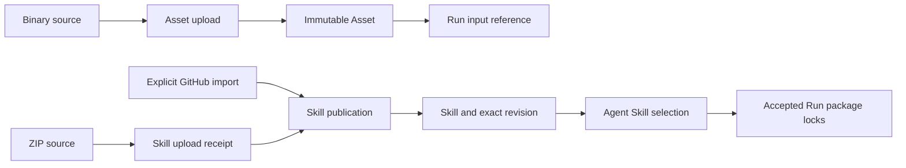

# Assets, Skills, and Binary Transfer

## Design Position

The content modules expose two different publication models: immutable Asset publications and stable Skills with immutable package revisions. They share bounded binary transport, not a generic filesystem or a common mutable file resource.

[Service Assets](../a13n-service/32-asset-management.md), [Service Skills](../a13n-service/31-skill-management.md), and the [Managed Skill Package Contract](../managed-skill-packages.md) own content identity and validation. [Client](01-client-contract.md) owns connection lifetime; [Agents](03-agents-and-models.md) consumes managed Skill references, and [Interaction](04-interaction.md) consumes input/output references.

## Publication Model

| Value                | Meaning                                                       | Completion boundary                                        |
| -------------------- | ------------------------------------------------------------- | ---------------------------------------------------------- |
| Asset                | One immutable Workspace binary publication                    | Upload publishes metadata/identity for exact content       |
| Asset reference      | Authorized resource reference usable in an input/output value | Reference construction does not upload or grant access     |
| Skill upload receipt | Temporary staged ZIP acquisition                              | Not yet a published Skill or executable package            |
| Skill                | Stable Workspace identity/key and current revision pointer    | Separate from its package content and mutable display name |
| SkillRevision        | Exact normalized package manifest/content and provenance      | Publication validated and committed by Service             |
| Skill selection      | Stable Skill plus pinned/current policy                       | Accepted Run later records its exact package locks         |



Identical Asset bytes do not merge independent publications into one identity. A Skill's normalized package digest can make a publication a semantic no-op, but that is Skill-specific behavior and not a generic deduplication rule for Asset uploads.

## Public Modules

`workspace.assets` exposes upload and listing; `client.assets` exposes exact metadata/content reads and deletion. There is no Asset rename, PATCH, replacement, revision, restore, or object-store key API.

`workspace.skill_uploads` stages package bytes. `workspace.skills` exposes scoped discovery and create/import; Skill ID/revision modules expose the actual metadata, content, publication, references, and deletion operations. A managed Skill is content, not an installed trusted Harness plugin or permission to execute its package in the SDK process.

Binary helpers accept language-native asynchronous byte sources, streams, or browser byte objects. A local-path convenience opens a source only in environments that provide filesystem access. It does not reinterpret a remote URL as a local path or promise filesystem support in browsers.

## Asset Upload and Use

The caller supplies exact upload metadata, a byte source, and an idempotency key. Transport sends bounded chunks; the SDK returns the Service Asset and response metadata after publication. Digest or content ETag represents content identity, not mutable-resource concurrency or access authority.

Uploading an Asset and submitting a Run are separate commands. The caller can persist the Asset receipt and retry/reconcile a later input submission without reuploading. Submission rejection, Run cancellation, or execution failure does not delete the published Asset. The SDK does not compensate by automatically deleting an upload that another consumer may already reference.

A pure input constructor creates the canonical Asset reference from the returned metadata/identity. Service reauthorizes use and applies binary input rules at acceptance/delivery; the SDK does not expose storage keys, generate object-store URLs, or fetch provider-private content to bypass that boundary.

## Transfer Ownership and Replay

| Object                        | Owner                       | Close/cancellation behavior                                                         |
| ----------------------------- | --------------------------- | ----------------------------------------------------------------------------------- |
| Caller-provided upload source | Caller                      | SDK stops consuming but does not silently close caller's independently owned source |
| SDK-opened path source        | SDK operation               | Close on completion, failure or cancellation                                        |
| Download response/body        | Explicit SDK response scope | Close when scope exits or caller cancels                                            |
| Service publication           | Service                     | Local transfer close does not undo a committed Asset                                |

Downloads expose headers and a closable byte stream; they do not route through a buffered JSON success decoder. Error responses retain the common safe JSON API error contract. Mid-body failure is incomplete delivery, not successful complete content.

Automatic upload replay requires both the operation's idempotency guarantee and a source that can reproduce the same bytes. A nonrepeatable stream is not made replayable by having a key. After unknown dispatch, the SDK does not upload different bytes under that key, select another key, or report no publication merely because acknowledgment was lost.

Asset deletion follows its own semantics: it does not undo bytes already delivered or automatically remove input references in historical Runs. Repeated not-found is not manufactured into a successful mutation receipt. Physical cleanup is not performed by the SDK.

## Skill Staging and Publication

A ZIP upload creates a bounded-lifetime staging receipt. Publication then consumes that receipt under the Service's validation and idempotency rules. An explicit GitHub source requests Service acquisition; the SDK does not clone the repository and invent an equivalent package on the caller's behalf.

The first normalized package establishes the stable Skill key from its root metadata and creates v1. Later packages must retain that key. Publishing distinct content advances version and current revision atomically; equality with current content can return `already_current`. Restoring historical content is a new publication when it differs from current, not pointer reassignment.

```python
staged = await workspace.skill_uploads.create(zip_source, idempotency_key=upload_key)
published = await workspace.skills.create(create_request_for(staged), idempotency_key=create_key)
# The application keeps publication evidence before separately publishing an Agent selection.
```

This pseudocode describes the two boundaries, not helper-owned request generation. Expired/consumed staging, package invalidity, or failed acquisition remain explicit. The SDK does not restage automatically, reuse a different package under the old key, or fall back to an unpinned remote branch.

Skill publication carries its required version/key evidence. Mutable display metadata and deletion use the owning ETag rules rather than advancing package version. Reference queries help a caller plan deletion but do not reserve the reference set; deletion still performs current Service checks. The SDK does not archive dependent Agents to force it through.

## Accepted Use and Failure

Agent revision authoring identifies the stable Skill and pinned/current policy; Run acceptance records exact locks. A mutable Skill head or later deletion does not tell the SDK to change an already accepted Run's selected package. Worker materialization remains server-side, not a client unpack/copy operation.

| Failure                              | Preserved distinction                                                   |
| ------------------------------------ | ----------------------------------------------------------------------- |
| ZIP staged but publication failed    | Acquisition receipt versus absent publication                           |
| Package digest matches current       | Successful semantic no-op versus new revision                           |
| Skill key/package invalid            | Whole-publication rejection, not partial content save                   |
| Reference-aware deletion rejected    | Current Service dependency conflict, not stale client cleanup           |
| Content unavailable after deletion   | Resource/content failure, not permission to fetch private backing bytes |
| Partial download or uncertain upload | Delivery uncertainty, not revised publication identity                  |

## Invariants

1. Assets and Skills share transport but retain different identity/version models.
2. Staging, publication, Agent selection, and Run acceptance remain separate receipts or operations.
3. Binary transfer is bounded and explicit about ownership/repeatability.
4. SDK helpers neither publish by inference nor delete as implicit compensation.
5. Skill content never becomes trusted executable SDK code.
