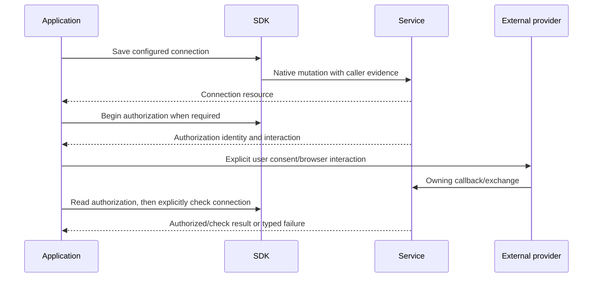

# Tools and External Integrations

## Design Position

Integration modules expose the managed configuration and authorization needed for Service-side tools, external accounts, Web access, and Memory. They make provider setup and selection explicit without becoming vendor SDKs or executing Agent tools locally.

[Connectivity](../a13n-service/40-connectivity/README.md), [Web Providers](../a13n-service/41-web-provider-management.md), and [Memory](../a13n-service/42-memory.md) own the domain. [Agents](03-agents-and-models.md) consumes typed selections; [Identity](10-identity-and-administration.md) supplies Service principals and grants. A catalog entry describes an installed capability, not permission to use it or a promise that every provider supports generic CRUD.

## Integration Model

| Concept               | Meaning                                                      | Not interchangeable with                                            |
| --------------------- | ------------------------------------------------------------ | ------------------------------------------------------------------- |
| Provider type catalog | Installed implementation/schema metadata                     | Saved account or executable tool                                    |
| Configured Provider   | Scoped configuration/credential association                  | Exact connection or resource grant                                  |
| Connection            | Stored external account/MCP connection identity and state    | Ephemeral authorization exchange                                    |
| Authorization         | Retained progress of an explicit external login/consent flow | Permanent connection readiness or access token value                |
| Tool discovery        | Current remote/local schema observation                      | Immutable Agent revision content                                    |
| Application Account   | Real external identity plus reception settings               | Ordinary selected connection tools or a standalone ingress resource |
| Web Provider          | Saved search/scrape account                                  | Fetch/download operation or arbitrary fallback                      |
| Memory Provider       | Stable backend/namespace selection                           | Memory record or permission to every subject                        |

The SDK preserves these differences rather than introducing `Provider<T>` with one mutation/test/delete implementation.

## Module Entries and Composition

| Family               | Public entry and scope                                                   | Operations that remain distinct                                                     |
| -------------------- | ------------------------------------------------------------------------ | ----------------------------------------------------------------------------------- |
| Builtin Toolsets     | `workspace.toolsets`                                                     | Catalog and candidate validation                                                    |
| Connector Providers  | Workspace/Organization provider modules and public catalogs              | Configuration, credential and lifecycle operations as exported                      |
| Connections          | Workspace collection and root ID modules                                 | Create/read/update, authorization, check/discovery, credentials, supported deletion |
| MCP connections      | Connection and MCP setup/catalog entries                                 | Client registration/configuration, authorization exchange, remote discovery         |
| Application Accounts | Workspace collection, account and target ID operations                   | Identity/credentials, reception settings, exact target configuration                |
| Web Providers        | Workspace/Organization accounts and type catalog                         | Save/update, saved-account test, references                                         |
| Memory               | Scoped Provider management plus Workspace/provider/subject content entry | Provider administration, references, subject/content queries and writes             |

Method names retain resource meaning and use the shared [scope and request contract](01-client-contract.md). A module does not add provider deletion, provider test, generic tool invocation, MCPServer CRUD, or Secret CRUD when no exported operation exists.

## Configure, Authorize, Discover, Select

The principal connection flow is explicit:

1. Read the installed provider type and its required configuration/authentication schema.
2. Save the configured resource in its actual owning scope.
3. If required, begin a separate authorization operation and give the application the returned browser/capability interaction.
4. Observe authorization through its exact retained identity; Service completes credential association.
5. Run the supported connection check/discovery operation.
6. Select authorized resources/tools in an Agent revision or Run override.

A successful save is not proof that authorization or remote discovery succeeded. An authorization callback or token exchange is not blindly replayed after uncertainty. Connection, Authorization, and a remote MCP client's configuration retain separate identities and mutation rules; clearing a client configuration is not implicitly deleting a connection.

The application chooses when to present a browser interaction. Capability-scoped authorization launch/receive operations retain their Service authentication rules rather than being forced through ordinary bearer semantics. The SDK does not start a listener, host a callback, scrape a login page, or persist external tokens as an unrequested convenience.

## Tool Selection and Validation

Builtin keyed Toolsets and external managed source selections are different fields with different schema/override rules. All request types come from the selected Agent/Run schema. The SDK does not translate removed alias forms, put inline credentials into Agent configuration, or collapse omission, category replacement and per-tool selection.

Candidate validation is a separate Service call, not a side effect of serializing a Toolset. It can return a typed invalid result and safe errors without publishing an Agent. Remote discovery can change between reads; the SDK does not present discovered tools as an immutable catalog snapshot owned by an Agent revision.

Tool permissions, reviewer selection, source authorization and Environment access retain separate authorities. Choosing an allowed Tool permission does not grant Service IAM or expand provider scopes. Application Account tools supplied from trusted Run context are not converted into ordinary connection-tool overrides.

## Application Accounts and Reception

An Application Account identifies a real external account. Its reception settings and exact AccountTargets belong to that account; the SDK does not invent a parallel Ingress resource. Reception setup can reference a default Agent and a Workspace Service Account, but saving those references does not bypass current eligibility checks.

Account disable, reception disable, target changes, credential replacement and deletion are explicit operations. Disabling new reception does not cancel already accepted Runs or retract sent replies. Target/address identifiers never become Service authorization by possession.

Versioned account/connection mutations use their generated evidence. Different commands may place expected versions in body or query and may or may not support an idempotency key. A check command, credential replacement and authorization setup are not assigned one shared retry policy merely because they share a module.

### Bot Setup and Observation

`workspace.bots` lists the exported Account-backed Bot projection; Account-ID Bot methods expose setup, summary, discovery, checks, activation, tests, conversation history and reply observations. These are operation groups over Application Accounts, not a second Bot resource identity or credential store. Exact target configuration remains in the Account module.

Setup reads describe configuration; discovery returns candidates; checks provide timestamped installation/conversation evidence. None enables reception or proves a message was delivered. Explicit pilot activation supplies the Account and target versions and execution selections. Service performs current verification and the canonical Account update; the SDK does not emulate activation by chaining target and Account writes. A lost activation response is reconciled through the current Account, not a blind repeat with newly read versions.

Reception scope distinguishes all-accessible admission from configured-target admission. The client preserves the selected scope and complete target override semantics rather than converting a missing target into an enabled default. Account enablement, reception, setup condition and test stage are independent fields.

Test preparation returns a retained test marker without sending a message or invoking an Agent. The application presents the user-sent test interaction and reads its observations explicitly. Event receipt, execution acceptance and provider-confirmed reply remain separate; staleness and expiry do not imply Agent failure. Conversation history links to canonical interaction resources, and reply queries preserve the exact Run filter. Reading either surface never retries an uncertain reply or supplies permission missing from the referenced execution.

## Web Providers

Web Provider management exposes installed type definitions, scoped saved accounts, safe resource reads, ETag-protected changes, saved-account tests and authorized references. Credentials are write-only and redacted; configuration schemas can include provider-defined JSON without erasing known structured selection types.

Saving configuration, validating authored selection, testing a saved account, and publishing an Agent revision are independent completion boundaries. Static authoring validation does not contact a vendor unless the owning operation explicitly says so. Tests can consume quota and do not establish indefinite execution availability.

Search/scrape Provider selection is distinct from fetch/download behavior. The SDK does not change scrape to fetch when domain restrictions or provider capabilities are unsupported. Environment-requiring delivery remains a Service execution concern, not an automatic local download in the management client.

## Memory Providers and Content

Memory Provider identity participates in content isolation. Management configuration/type identify the backend target; supported metadata/credential changes do not migrate content or retarget storage. Disable retains remote records and references. Provider administration and memory-content grants are independent.

Ordinary memory-content calls explicitly select Workspace, Provider and subject scope. Thread/Agent scopes use the required stable subject identity. User scope selects the authenticated human and does not accept an arbitrary user ID; a Service Account cannot acquire user-scoped Memory through a helper. The SDK never derives a subject namespace hash, provider filter or private backend endpoint itself.

A record ID is an opaque backend identifier scoped through the Service request, not authority or a globally unique locator. The client can continue addressing an explicitly selected old Provider after an Agent changes its Memory selection; it must not silently replace the Provider from current Agent configuration.

Memory writes preserve the Service's verification boundary. A write that may have happened but cannot be confirmed is returned as an unconfirmed outcome, not retried automatically. A missing backend capability does not trigger fallback to another Provider. Memory pagination retains its native descriptor: absent pagination can mean a bounded result without traversal guarantees, whereas a present pagination object's null continuation means that traversal ended.

### Bot Memory Documents and Sharing

The `bot-memory` operation group addresses Account-owned conversation scopes, not arbitrary Thread/Agent/User records. Its scope, directory, index, document, operation, publication and sharing-policy entries use the exported Account/scope/Provider identities. An exact target filter remains bound to the returned scope and continuation; the SDK does not enumerate every conversation or derive a private namespace to resolve one target.

Directory entries are navigation metadata; document bodies are fetched on explicit read. Confirmed document publication, unconfirmed Provider work, deletion and publication withdrawal retain separate outcomes. Immutable Bot documents are not adapted to ordinary mutable Memory update methods. A document operation with uncertain completion is inspected or explicitly reconciled through its retained operation identity, not recreated with a new key. Directory pagination is not substituted with ordinary Memory's bounded native search results.

Document creation, publication to another audience and continuing sharing are separate caller commands. Policy updates carry their version and preserve Service-owned participation/history boundaries; the SDK does not recompute eligibility timestamps or automatically re-enroll participants after a conflict. Removing one grant does not imply that all other access was revoked. Provider document capability is explicit and never triggers fallback to an ordinary memory backend.

[Bot memory management authority](../a13n-service/33-identity-and-access-management.md#bot-memory-management) is human Workspace-Admin authority, not Account read access, ordinary memory grants or Service Account execution authority. Management visibility does not widen an accepted Bot Run's retained conversation binding. Runtime recall remains Service-owned and reauthorized; the SDK neither injects administrator-readable bodies into a Run nor changes its binding through a helper.

## Failure Semantics

| Failure                                          | Required separation                                               |
| ------------------------------------------------ | ----------------------------------------------------------------- |
| Saved account but test/discovery fails           | Resource commit remains; check outcome is separate                |
| Authorization pending, expired, rejected or lost | Retained flow state is not connection readiness                   |
| Credential replacement uncertain                 | No implicit second replacement or new login flow                  |
| Tool/source unsupported                          | Typed validation failure, not silently dropped selection          |
| Memory write unconfirmed                         | Possible external effect, not safe automatic retry                |
| Scope/reference inaccessible                     | Current Service authorization error, not direct provider fallback |

## Invariants

1. Provider configuration, connection identity, authorization, discovery and Agent selection have separate completion boundaries.
2. Module convenience never grants remote scopes or executes Agent tools locally.
3. Mutable external discovery is not an SDK-owned immutable schema lock.
4. Provider-specific mutation and pagination semantics survive generic transport integration.
5. Memory content is always addressed through explicit Service scope and Provider identity.
