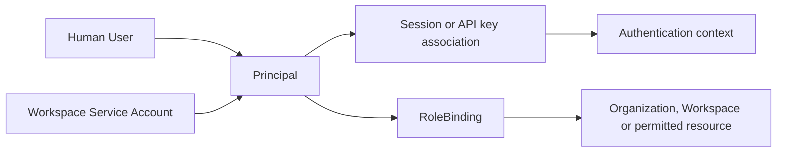
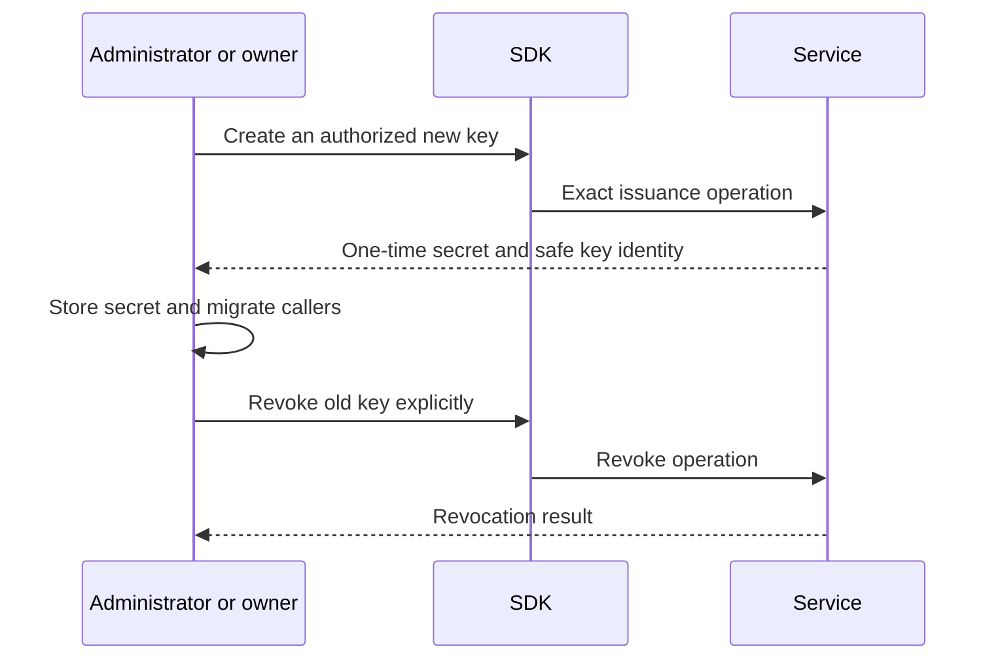

# Identity and Administration

## Design Position

The administration modules expose Service identity, scopes, grants, credentials and account-management operations. They do not calculate an alternative authorization policy, act as an identity provider, or turn client-side resource possession into permission.

[Service IAM](../a13n-service/33-identity-and-access-management.md) owns principals, grants, authentication and product authorization. [Client](01-client-contract.md) owns use of configured credentials; this document owns their explicit administrative management through exported APIs. An SDK authentication configuration is not an administrative session that can bypass the normal Service boundary.

## Identity Model

| Concept                | Meaning                                           | Client distinction                                 |
| ---------------------- | ------------------------------------------------- | -------------------------------------------------- |
| Principal              | Human User or Workspace-owned Service Account     | Not the credential authenticating it               |
| Credential             | Session/API key and its allowed boundary          | Not an independent source of product grants        |
| RoleBinding            | Current grant of a role to a Principal in a scope | Not a membership profile or client-side ACL        |
| Organization/Workspace | Managed ownership and authorization scopes        | Not a mutable global Client default                |
| Member/User view       | Authorized projection of identity/grant facts     | Not independent membership CRUD                    |
| Invitation             | Pending onboarding/grant workflow                 | Not a completed grant or successful email delivery |

Grant combination and eligibility remain server-side. The SDK does not introduce deny rules, specificity overrides, or a local effective-permission cache used to authorize mutations. Permission reads can inform UI presentation but do not replace the authorization performed by the later request.

## Module Surface

| Module family        | Public responsibility                                                                                       |
| -------------------- | ----------------------------------------------------------------------------------------------------------- |
| `client.auth`        | Configuration/context, CSRF and exported login/logout/recovery operations                                   |
| Organization modules | Discovery, metadata/icon, users, permissions, Workspaces, invitations, grants and audit collections         |
| Workspace modules    | Metadata/icon/lifecycle, member/permission views, invitations, grants, service accounts and key collections |
| Role bindings        | Exact grant reads, role changes and removal                                                                 |
| Invitations          | Exported issue, acceptance, resend and revoke flows                                                         |
| Service accounts     | Workspace creation/listing and exact metadata/lifecycle/key operations                                      |
| API keys             | Issuance at the authorized owning collection; metadata read and explicit revoke                             |
| Current User/profile | Self-service profile/avatar, password/email, auth-session and security-activity operations                  |

This is not generic CRUD over every noun. Organization create/delete, arbitrary User CRUD, an independent Membership resource, key rotation, and Agent-scoped grant routes are not inferred from the domain if they are absent from the public API. Backend bootstrap/process administration does not become a remote SDK operation.

## Scope and Credential Association

An Organization-owned Provider can be visible in its Workspaces without becoming Workspace-owned. A Workspace API key can consume authorized resources in its own scope; it does not gain Organization administration because such resources are visible. The credential-derived binding in [Client](01-client-contract.md) preserves this boundary.

Service Accounts have fixed Workspace ownership and the roles allowed by the IAM contract. A client cannot impersonate a human, select a user-scoped Memory subject, or elevate the account by constructing an Organization binding. Personal key issuance remains self-service; an administrator's metadata/revoke rights do not imply permission to retrieve another user's secret or issue a key as that user.

Bot memory management is a distinct human Workspace-Admin surface, including the established Organization-Admin inheritance. Ordinary Memory grants, Account read access and Service Account execution authority do not imply access to Bot directory metadata, documents or sharing. The [integration module](09-tools-and-integrations.md#bot-memory-documents-and-sharing) preserves this distinction without implementing its own permission evaluator.

## Invitation Flow

Invitation issue, delivery/resend and acceptance are separate phases. The issue result identifies pending intent. Sending an email occurs under Service's delivery contract; delivery failure does not let the SDK delete or recreate the invitation automatically.

Acceptance uses the exact invitation flow and current authentication/validation requirements. Service rechecks inviter/grant authority; a locally stored invitation is not proof that its original permissions remain valid. Existing-user verification, additive-grant behavior, expiration, revoke and resend rules remain distinct outcomes.

The SDK exposes the exported acceptance request rather than merging invitation acceptance with login, profile creation and arbitrary role mutation. Applications choose presentation and follow-up navigation after the Service response.

## Credential Issuance and Replacement

API key creation returns a secret only at the allowed issuance boundary. Subsequent key resources expose safe metadata, not a recoverable secret. Normal diagnostics, response summaries and serialization must not accidentally include the issuance secret; the application chooses secure storage for the intentional result.

This is an application-managed replacement flow, not an SDK `rotate` transaction. The SDK does not revoke the old key immediately after issuing a new one or claim all callers have migrated. Lost one-time-secret delivery is reported honestly; it does not trigger fabricated recovery from metadata or silent issuance of another key.

Service Account disable/re-enable, account deletion, key revocation and authentication-session revocation remain separate operations. Re-enabling an account does not revive revoked keys. Local Client close is none of these actions.

## Mutation and Concurrency

Mutable profiles, scopes and metadata use their exact ETag or versioned operation contract. Role and lifecycle mutations preserve required evidence and preconditions; no universal administrative force-update bypass is added. The SDK does not emulate an operation by chaining grant deletion and recreation unless the public operation itself defines that behavior.

Requests retain caller identity and correlation. Failure messages expose only safe Service data; invitation tokens, passwords, reset values, API secrets and cookies are not rendered as ordinary object diagnostics. Exported capability-scoped flows retain their own authentication requirements rather than being forced through the current Client's bearer identity.

## Failure Semantics

| Failure                                                  | SDK behavior                                                                     |
| -------------------------------------------------------- | -------------------------------------------------------------------------------- |
| Resource concealed or absent                             | Preserve the owning not-found/authorization result                               |
| Grant/profile changed concurrently                       | Return conflict, not client-side permission reconciliation                       |
| Invitation revoked/expired or inviter no longer eligible | Return acceptance failure without creating a substitute invitation               |
| Key secret delivery lost                                 | Report uncertainty and available key evidence; no metadata-based secret recovery |
| Current Client credential revoked                        | Later calls/attachments fail normally; no fallback identity                      |
| Delivery or downstream migration fails after issuance    | Preserve issued resource; application chooses compensation                       |

## Invariants

1. Principal, credential, grant and membership projection remain distinct.
2. Resource visibility and scope construction never imply administrative authority.
3. One-time secrets remain explicit issuance results, not fields of later resource reads.
4. Replacement/revocation are explicit operations, not Client lifetime effects.
5. The SDK does not implement a parallel grant evaluator or identity impersonation layer.
