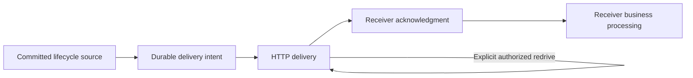

# Hooks, Trace Queries, and Audit Reads

## Design Position

These operational modules expose external delivery configuration and authorized diagnostic reads. Hook subscriptions configure Service-owned delivery; Trace/audit interfaces read their own observations. None is an alternative source of Run execution authority or a background workflow engine in the SDK.

[Service Hooks](../a13n-service/26-hook-notifications.md), [Trace Query](../a13n-service/39-trace-query.md), [Observability](../a13n-service/38-observability.md), and [IAM audit](../a13n-service/33-identity-and-access-management.md) own the domains. [SDK Observation](06-streams-and-notifications.md) owns resource/Workspace lifecycle recovery used by consumers.

## Operational Model

| Object or surface             | Meaning                                                                     | Not evidence of                                                 |
| ----------------------------- | --------------------------------------------------------------------------- | --------------------------------------------------------------- |
| HookSubscription              | Managed selection of delivery events, endpoint and signing-secret reference | A live WebSocket subscription or verified receiver availability |
| Subscription version/revision | Service-owned selection used for delivery work                              | Run version or retry count                                      |
| Inline Run Hook               | Subscription associated with accepted Run selection                         | Local SDK callback or process listener                          |
| HookDelivery                  | Retained delivery identity/work                                             | Exactly-once business processing                                |
| Trace descriptor              | Supported query provider capabilities/history/filters                       | A complete local telemetry database                             |
| Trace/observation page        | Authorized provider-backed telemetry projection                             | Durable Run outcome, output or usage ledger                     |
| Security audit record         | Authorized security-action evidence                                         | Product permission for a subsequent command                     |

These modules share the common request layer but do not merge events, telemetry and delivery into one history or status field.

## Hook Modules and Selection

`workspace.hook_subscriptions` owns scoped collection/create operations. Root subscription methods expose the exported update/lifecycle/delete behavior. Delivery redrive is exposed only through its actual operation. The presence of a delivery ID or a signing-secret reference does not imply delivery list/get, Hook catalog, Secret value reads, or Secret CRUD endpoints.

A subscription's endpoint, selected Hook names, signing-secret reference, enabled state, inline ownership and expiry retain their Service meanings. Metadata/configuration changes use the required subscription version and idempotency evidence. Enablement, expiry and deletion are not collapsed into one boolean.

The SDK does not test an endpoint during ordinary subscription serialization, deliver Webhooks itself, or start a receiver. A caller that needs to receive deliveries owns its HTTP endpoint, verification, deduplication and application processing.

## Inline Successor Flow

A Run acceptance request can select an inline subscription. The acceptance receipt returns its actual identity when created; the SDK records it alongside the Run instead of allocating a client-only subscription.

For feedback, waiting Continue and terminal Retry, field presence is significant:

- omission delegates inheritance to Service;
- null explicitly selects no successor subscription;
- a complete object requests replacement under Service validation.

The SDK does not read a current mutable subscription and copy it into the successor body. A replay uses the same key, canonical request and original field presence, returning the original accepted Run/subscription identities. It neither recreates an expired subscription nor changes the source Run's subscription.

Inline expiry stops new matching as defined by Service; it does not cancel already committed delivery work or imply receiver processing. Disable/re-enable and delete remain explicit commands rather than consequences of closing the caller's Client.

## Delivery and Redrive

Each stage is independently meaningful. At-least-once delivery can duplicate and arrive out of order. Redrive preserves the owning original delivery identity/revision and does not create a new Run, lifecycle source, or business operation. The SDK does not turn a delivery error into terminal Run Retry.

Consumers recover missing resource lifecycle sequences through the corresponding Run/RunAttempt events API. Only committed lifecycle sources participate in durable delivery; live token/Item/AG-UI observations are not promoted into Webhook delivery by SDK convenience.

## Trace Query Modules

Workspace-scoped `trace_query` reads the query descriptor. `traces` exposes list, exact root read, and bounded observation pages. The sequence is descriptor/discovery, filtered list, selected root, then optional pages; a single read does not eagerly fetch every observation in a trace.

Trace identity/correlation and root/observation relationships come from the Service projection. The SDK does not synthesize a second root, aggregate usage into a new ledger, or reconstruct Run status from telemetry. Provider credentials, backend endpoints and native query clients remain server-side.

List and exact reads have distinct default views and history boundaries. The client preserves supported filters, timestamp bounds and backend continuation, including stable tie order. Exact Session/Thread/Run/RunAttempt filters and repeated bounded metadata key/value filters retain their Service encoding and AND semantics; metadata selection is not arbitrary provider query syntax. An empty or short page can still have a next cursor; only the owning null continuation terminates that traversal. Unsupported filters are rejected rather than silently removed, broadened or executed against a private backend.

Every page/read is reauthorized against current Trace and correlated resource access. A trace ID, source URL, cursor or prior permission read grants no access independently. Absence or temporary unavailability of telemetry is not execution failure and cannot trigger Run resubmission.

## Audit Reads

Organization/Workspace security-audit collections and current-user security activity remain within their exported scope. They expose bounded typed records and supported continuation, not unrestricted raw log access. Audit pagination does not share a cursor with Workspace lifecycle events or Trace pages.

The SDK preserves safe attribution and correlation without rendering secret values, tokens, provider exceptions or private storage identifiers. Administrative UI policy can consume audit/permission views, but the later mutation remains server-authorized.

## Failure Semantics

| Failure                                            | Correct boundary                                                         |
| -------------------------------------------------- | ------------------------------------------------------------------------ |
| Subscription mutation conflict                     | Configuration operation failed; original selection remains authoritative |
| Lost inline acceptance response                    | Same-key acceptance reconciliation, not subscription recreation          |
| Delivery retries exhausted or receiver unavailable | Delivery outcome, not Agent execution outcome                            |
| Trace backend/filter/version unavailable           | Typed query failure, not direct backend fallback                         |
| Trace not found/concealed                          | Exact read outcome, not proof of missing Run                             |
| Lifecycle retention gap                            | Explicit incomplete recovery through observation contract                |

## Invariants

1. Source commit, delivery, acknowledgment and receiver processing remain independent.
2. Inline Hook presence and accepted subscription identity survive request replay.
3. Diagnostics never replace durable execution/resource state.
4. Queries preserve supported scope/filter/order semantics without direct provider access.
5. SDK lifetime creates no receiver, delivery worker or external subscription cleanup policy.
