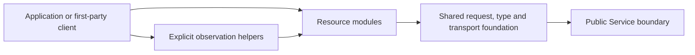

# Service SDK Specifications

## Overview

This directory defines the language-neutral architecture and module contracts for the Python, Go, Rust, and TypeScript Service SDKs and the companion remote `a13n-service-cli`.

The primary surface is typed resource operations (L2). Generated HTTP bindings and shared transports form L1; small read-only waits form L3. The SDK does not embed Harness execution, own durable Service state, or provide an automatic application workflow runtime.

Each detailed document owns the SDK behavior of a cohesive module: conceptual objects, operation boundaries, principal flows, local state, failures and invariants. Service specifications continue to own resource fields, state machines, authorization and wire protocols. Pseudocode illustrates that design; it is not a second OpenAPI schema or a requirement that every language use identical classes.

## Document Catalog

| Document                                                            | Owns                                                                                                                    |
| ------------------------------------------------------------------- | ----------------------------------------------------------------------------------------------------------------------- |
| [00 Architecture](00-overview.md)                                   | SDK position, core concepts, module dependencies, end-to-end interaction and recovery boundaries                        |
| [01 Client Contract](01-client-contract.md)                         | Client construction, authentication, scope binding, request lifetime, cancellation and shutdown                         |
| [02 Types and Requests](02-types-and-requests.md)                   | Generated/handwritten boundary, public values, field presence, errors, mutation evidence, replay and pagination         |
| [03 Agents and Models](03-agents-and-models.md)                     | Authoring objects, revision publication, metadata changes, Model provisioning/test and accepted configuration selection |
| [04 Interaction](04-interaction.md)                                 | Session/Thread/Run reads, submission, continuation, feedback, control and bounded Run waiting                           |
| [05 Queued Submissions](05-queued-submissions.md)                   | Delayed-intent identity, entry/queue concurrency, editing/order, consumption outcomes and queue waiting                 |
| [06 Streams and Notifications](06-streams-and-notifications.md)     | Run attachment progress, applied acknowledgment, reconnect, subscriptions and durable reconciliation                    |
| [07 Environments](07-environments.md)                               | Provider/template/target relationships, selection timing, allocation versus preparation and lifecycle commands          |
| [08 Assets and Skills](08-assets-and-skills.md)                     | Binary ownership/replay, immutable Asset publication, Skill staging/publication and accepted package references         |
| [09 Tools and Integrations](09-tools-and-integrations.md)           | Provider accounts, connection authorization/discovery, Tool selections, Application Accounts, Web and Memory            |
| [10 Identity and Administration](10-identity-and-administration.md) | Principal/credential/grant relationships, scopes, invitations, one-time keys and explicit administrative flows          |
| [11 Hooks and Diagnostics](11-hooks-and-diagnostics.md)             | Hook configuration and delivery boundaries, successor selection, Trace queries and audit reads                          |
| [12 Compatibility and Clients](12-compatibility-and-clients.md)     | Language adaptation, coverage/acceptance, independent releases, remote CLI, Console and standard protocol clients       |

## Reading Paths

### Implement a resource module

Read `00`, `01`, and `02`, then the module's detailed document and its linked Service owners. Use `12` for shared conformance. Generated operations establish exact wire types; the module document explains the relationships and client-visible behavior that a language adapter must preserve. An unexported concept does not authorize inventing a callable method.

### Build an Agent application

Read `03`, `04`, and `05` for managed Agent selection and accepted/queued work. Read `06` for streaming and restart checkpoints. Add `07`, `08`, and `09` only for the Environment, content, or integration resources the application actually uses. Local callbacks and external side effects remain application-owned.

### Build administration or operational clients

Read `10` with `01` for identity and scope. Use the owning management modules for configuration, and `11` with `06` for diagnostics and delivery reconciliation. The remote CLI and Console consume the same SDK contracts under `12` rather than implementing separate transport policy.

## Authority Rules

- [Service Management API](../a13n-service/16-management-api.md), the owning domain specifications, and Service OpenAPI define resources, exported operations, request/response shapes and authorization.
- [Native Streaming](../a13n-service/21-native-streaming-and-notifications.md) owns SSE, lifecycle and notification protocol semantics; SDK `06` owns their client-side consumption.
- [API Conventions](../api-conventions.md) and [Data Conventions](../data-conventions.md) own shared presence, identity, versions, errors and mutation safety.
- [Repository Model](../repository-model.md) and [Contributing](../../CONTRIBUTING.md#releases) own package boundaries and release workflow.
- Applications own durable receipt/checkpoint storage, local interaction handlers and external side-effect deduplication. SDK clients own only their local connections and observations.

A disagreement between the accepted Service contract and its exported implementation is resolved by that owner before claiming operation conformance; it is not an SDK-specific alternate protocol. Language implementation status, release support matrices and construction progress belong in SDK documentation, tests and Issues, not in this specification catalog.
